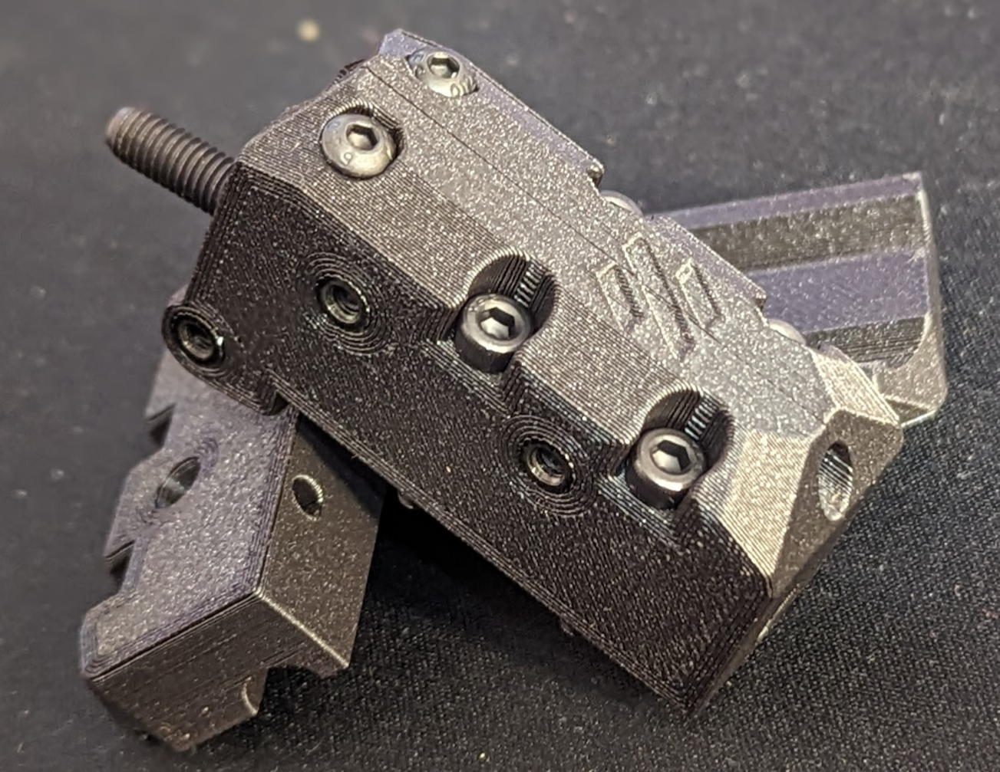
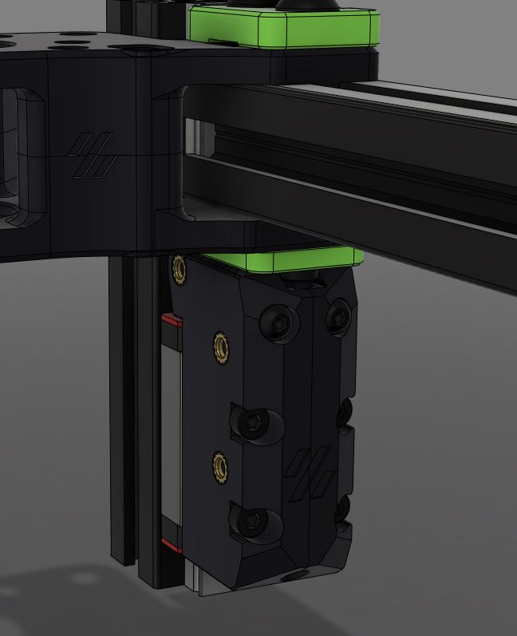
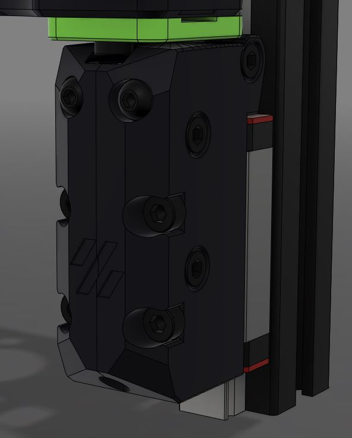
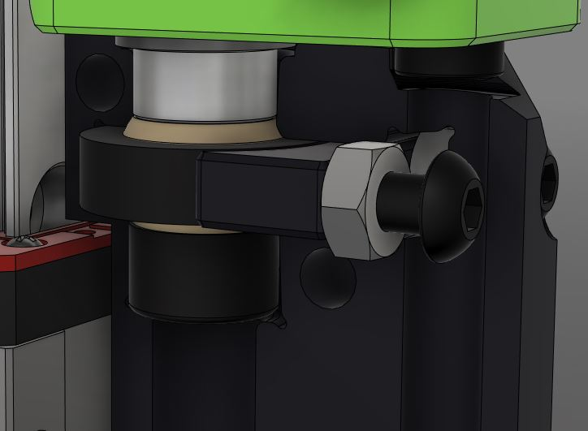

  
Zero offset GE5C/EGLM-05 Mod for your v2.4.  
I did my best to optimize it, so even non-perfectly tuned printers should get it working, which was a problem with my previous versions.  

## Why choose this mod?  
- Unlike Hartk's Ge5C Mod, this has no offset mounting to the A/B drives or front idlers, meaning it's a direct replacement for stock. ( You can make Hartk's version fit on stock its just not optimal. )  
- No possibility of the bearing sliding around; it's locked rigidly in place with adjustability in case the plastic creeps over time.
- Looks cool :)  

## BOM:  
4X GE5C/EGLM-05  
4X M5x10 1mm Shim  
4x M5x25 SHCS  
4x M3x12  
16x M3x20 SHCS  
12x M3x16 SHCS  
12x Heat inserts  
8x M3x6 BHCS (SHCS can be used but sticks out slightly)  
8x M3 Hex nut  
(Optional) 4x 5mm ID 8mm OD 4mm tall Aluminum spacers instead of printed. I bought mine here https://www.aliexpress.com/item/1005003018758421.html

# Instructions
For now, use the pictures below. Also, tighten the Ge5C clamping screws until everything is tight; they shouldn't be bottomed out.  
If you use EGLM-05 you can feel if you have tightened it too much because it starts to bind.  

Thank you NyxCode, jovdvyver, NotSoCreative and ReXT3D for Early testing and feedback!.

  
  

  
  

