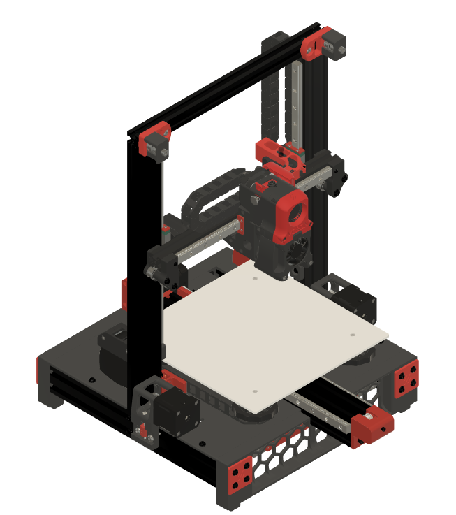

#  Ender 3 Pro and V2 to Switchwire Mod

This is a conversion of the Ender 3 Pro and V2 to a Switchwire type coreXZ printer.  My goal was to use most of the Ender 3 components while maintaining the core Voron design look and feel.
I had a lot of fun doing this and am willing to make any suggested changes.  I have incorporated some changes based on requests and will continue to maintain this as long as there is interest.

## Overview
- This mod uses most of the key components from the Ender 3 Pro (E3P) while providing a coreXZ capability.  The highlights of this include:
1. The frame is all E3P.
2. The electronics are the stock Switchwire ones, but the E3P 24V power supply is used.  I wanted to get all the electronics under the deck as this follows the Switchwire design.  I had to get a little creative with the mounts to make this work.  I did not include the LCD display.   Mainsail (MainsailOS) is so amazing, I never use the LCD on the Vowon 2.4 so I left it out.  I can easily be added.
3. The deck is easily printed in 4 sections.
4. The XZ and gantry are slightly modified from the Switchwire baseline.  The X axis rail is 300mm and is a tight squeeze on the shorteded 2020 extrusion.  I wanted to keep the standard rail length in case I wanted to build a stock Switchwire.
5. The Y axis uses 2 rails.  I liked the look of it and it seemed more stable that way.  It also simplified the Y belt routing through the extrustion.  I also removed the springs on the bed corners and replaced them with spacers.  The spacers come off the E3P V-wheels.  With the bed mesh probing, this seemsed like a better approach than worrying about the bed changing positions if the knobs rotated/loosened.
6. This configuration also worked without too much modification to the stock E3P wire lengths.
7. The E3P motors can be reused if you can pull of the gears.  You

## Images / CAD
I have included several images and the Fusion 360 CAD model.  Full disclosure, I am just learning CAD, so my skills are somewhat limited.

## BOM
A BOM has been added that is based on the baseline Switchwire.  This will not be perfect as the Ender 3's get a lot of mods by their owners.  It should help with most of the key items to make the MOD. 

## Config
Phalanx and Lord Derpson have shared their printer.cfg files.  I used a V1.2 board which has different pins.

## STL Files
This mod uses a combination of original Switchwire and modified parts.  Most of the parts are modified/new as the Switchwire and Ender 3 frames are much different.  I kept all the Voron naming conventions to provide consistancy. The following is a listing of the STL files, organized by location:

1. Deck:
	- [a]_deck_y_chain_anchor
	- deck_front_right
	- deck_front_left
	- deck_rear_right
	- deck_rear_left

2.	Electronics:
	- [a]_ps_clamp
	- [a]_ps_hanger
	- [a]_rpi3_mount
	- [a]_rpi3_shelf
	- [a]_rs_25_hanger
	- [a]_skr_mini_e3_mount
	- 2020_ziptie_clip (quantity as required to suit your wiring organization)

3.	Grill:
	- [a]_grill_endcap_x4
	- grill_front_left
	- grill_front_right
	- grill_rear_left
	- grill_rear_right

4.	XZ-Axis:
	- [a]_xz_cable_cover
	- keybak_mount_plate_a
	- keybak_mount_plate_b
	- x_motor_mount_a
	- x_motor_mount_b
	- xz_block_left_a
	- xz_block_left_b
	- xz_block_right_a
	- xz_block_right_b
	- z_bearing_block_left
	- z_bearing_block_right_generic
	- z_carriage_stop_x2
	- z_motor_mount_a
	- z_motor_mount_b
	- [a]_xz_tensioner_x2 **
	- [a]_upper_idler_support_b_right **
	- [a]_upper_idler_support_b_left **
	- upper_idler_support_a_right **
	- upper_idler_support_a_left	**
	- keybak_gantry_anchor **
	- keybak_idler_bracket **	
		
5.	Y-Axis:
	- [a]_y_axis_anchor_x2
	- [a]_y_axis_frame_chain_anchor
	- [a]_y_axis_ls_mount
	- [a]_y_front_belt_mount
	- [a]_y_front_belt_slider
	- [a]_y_motor_mount_a
	- [a]_y_motor_mount_b
	- y_axis_bed_carriage
		
6.	Misc:
	- 2020_rail_tool
	- 4040_rail_tool

** Denotes STL files that have not been modified from the baseline Switchwire design

