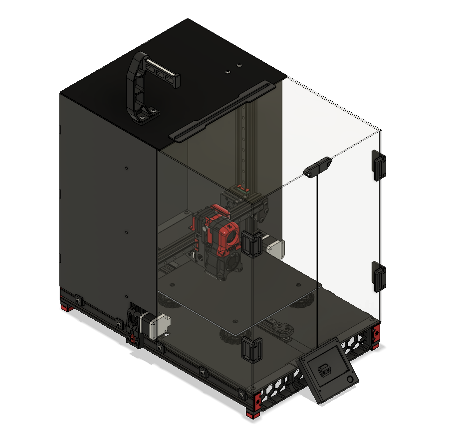

My Ender Switchwire

The goal of this build is to convert your Ender 3 (original version) to a Switchwire without changing the design too much.

Things to note:
1. This build can work with the Ender 3 pro (I have not tested this, as I don't have an Ender 3 pro)
2. You only have to cut 1 extrusion by yourself (gotta tap one yourself also, unless there's a different way you can mount extrusions)
3. You have to buy a few extrusions (they don't have to be from Misumi)
4. This design is made for 2020/2040 extrusions
5. You will be using a lot of parts from the original Ender 3
6. I have a BoM for all the parts you need
7. Hammerhead tnuts works just as well as those expensive sliding ones.
8. If you buy shorter M4 flathead screws, you can reduce the height of the bed, thus creating more z height.
9. This version allows you to enclose it without any problems
10. For now, the screen and door panel conflict with each other, I'll fix it when I find a solution
11. For parts z_motor_mount_a.stl and y_belt_anchor.stl have built in support, be sure to remove it after 

STL files:
This mod uses some combination of both [original STLs](https://github.com/VoronDesign/Voron-Switchwire/releases/tag/V1.0) and my own edited versions. The following list is parts that are unchanged. All electronic mounts except for the massive PSU are from the v2.2 
1. Enclosure parts
  - feed_slot
  - light_bar_x2
  - rear_panel_bracket_x6
  - side_strap_x4
  - top_door_latch
  - door_handle_a_x2
  - door_handle_b_x2
  - door_hinge_x4

2. Y axis
  - [a]_y_belt_clip
  - [a]_y_chain_bed_mount_igus
  - [a]_y_chain_bed_mount_generic
  - y_idler_lower
  - y_idler_upper
  - y_motor_mount_a
  - y_motor_mount_b

4. XY axis
  - [a]_xz_tensioner_x2
  - [a]_xz_cable_cover
  - keybak_mount_plate

5. X carriage (printheads, direct feed, and bowden folders are untouched)
  - [a]_xz_belt_clip_x2
  - [a]_blower_housing_front
  - hotend_fan_mount
  - blower_housing_rear
  
6. MISC
  - pool_holder
  - spool body

