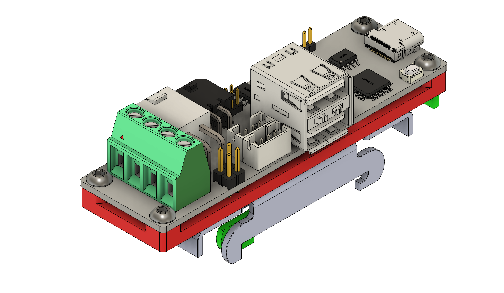
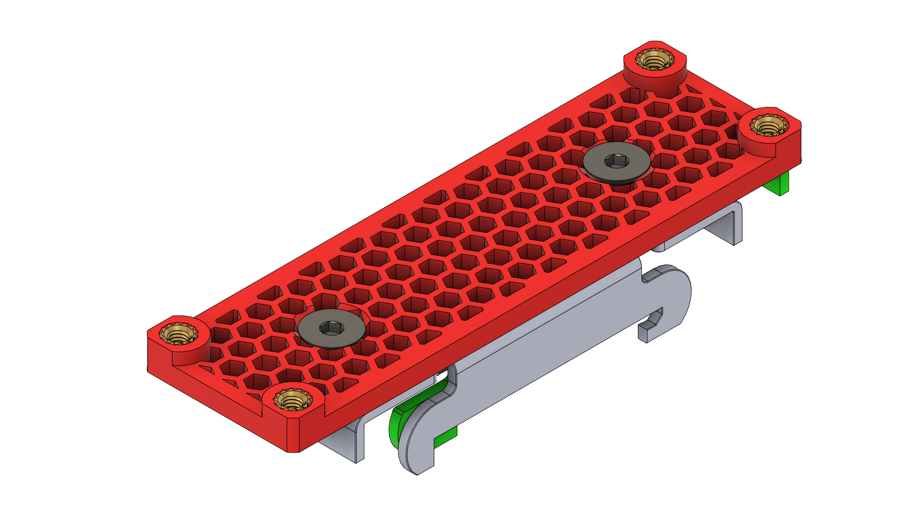
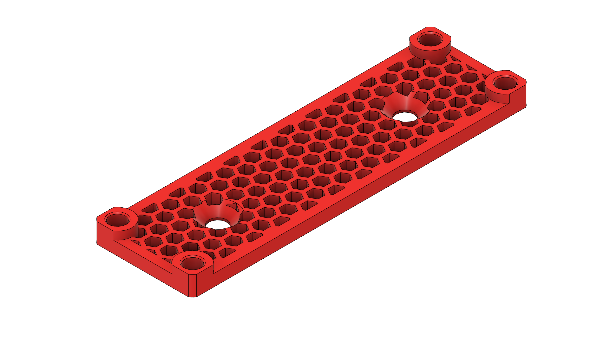

# BTT U2C DIN clamp mount
## BOM
- 1x Narrow SSR DIN Clamp mount [Aliexpress](https://www.aliexpress.us/item/3256802666650918.html)
- 4x M3 8mm Hex buttonhead screws
- 2x M4 6mm Hex flathead screws
- 2x Heat Inserts. Standard Voron size M3x4x5 [AliExpress](https://www.aliexpress.us/item/3256804429544538.html)
## Part pictures
Full assembly:

PCB carrier:

Printed part:
