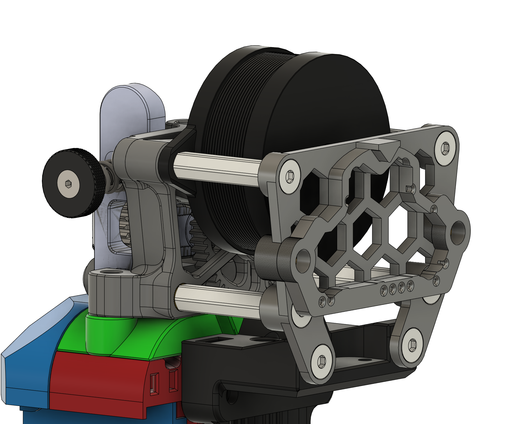
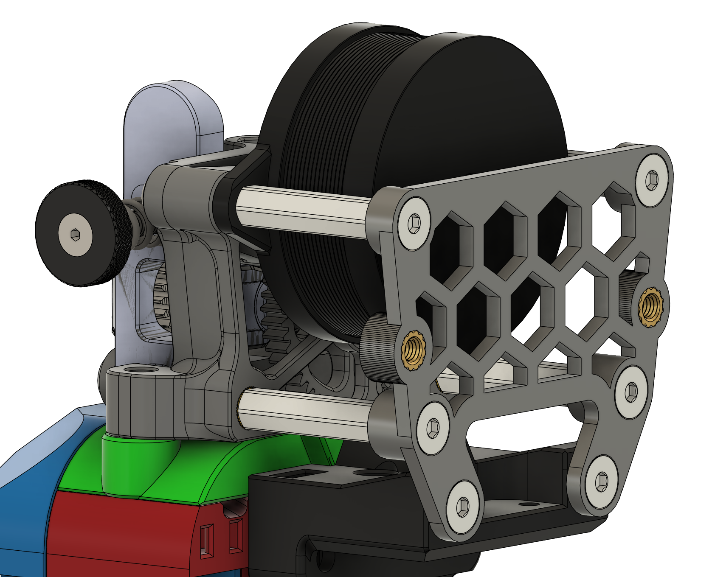
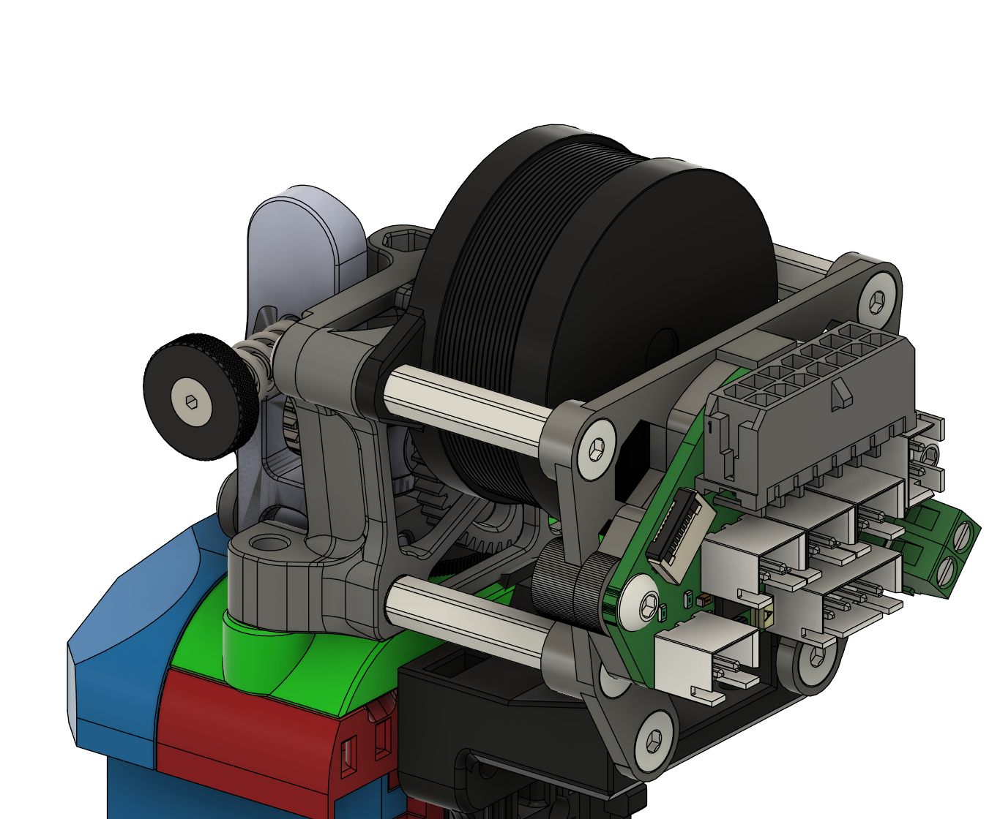

# 4-Post Picobilical toolhead PCB mount for Sherpa Mini
## BOM
- 4x M3 20mm standoffs
- 4x M3 8mm Hex Flathead screws
- 2x M3 5mm Hex Flathead screws
- 2x Heat Inserts. Standard Voron size M3x4x5 [AliExpress](https://www.aliexpress.us/item/3256804429544538.html)
## Part pictures
Mount:

Carrier:

Full assembly:
