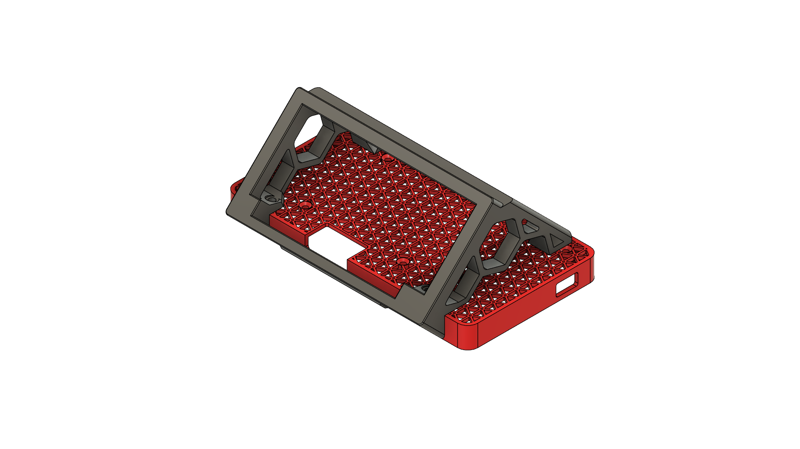
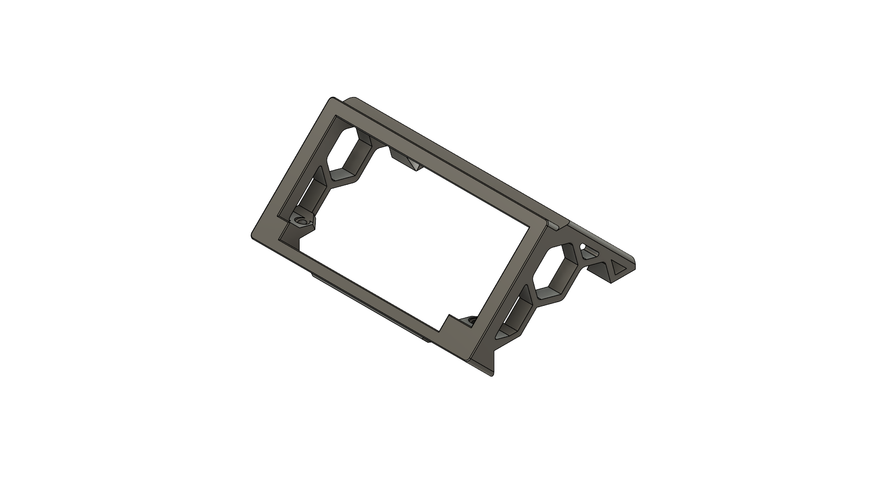
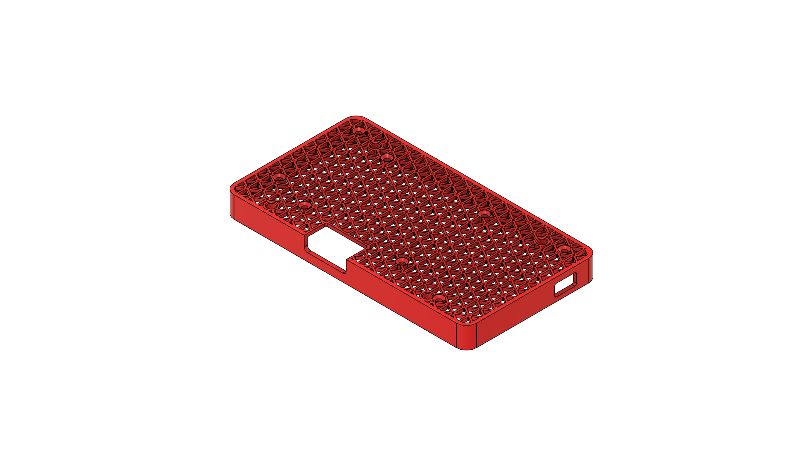
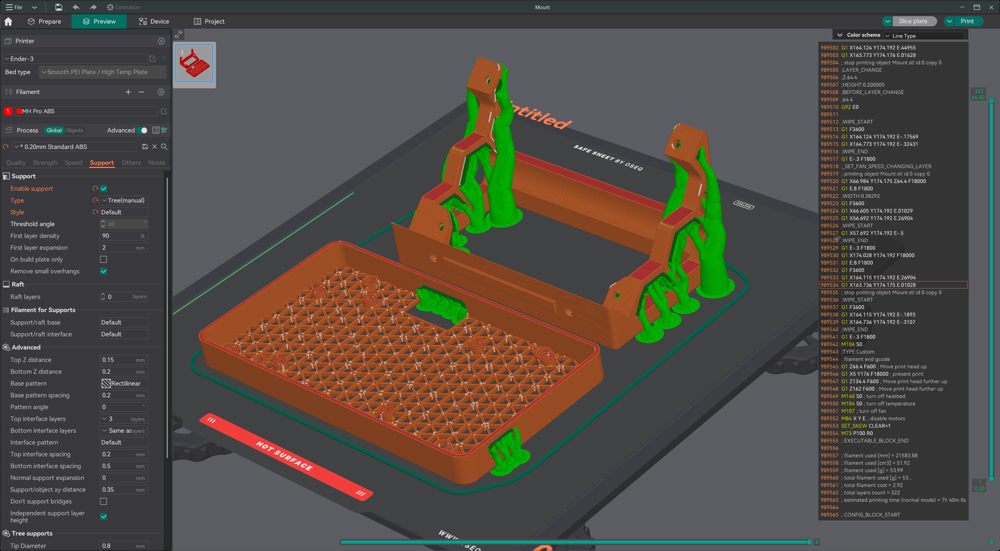
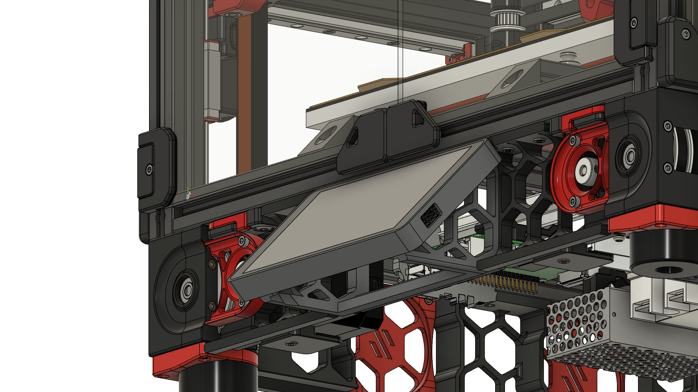

# 5.5" Waveshare screen mount
The frame mounting piece is a remix of [@CannedBass 45 degree mount](https://github.com/VoronDesign/VoronUsers/tree/main/printer_mods/CannedBass/PITFT50_45_degree_mount) 
The screen itself is a PITA to set up. I am ~80% there. The main trick was to add this to the /boot/firmware/cmdline.txt
```
video=HDMI-A-1:1440x2560M@60,rotate=90root@rpi5:/boot/firmware
```
I am still having a ton of trouble with the HDMI timings. The official Wiki provides the following timings string:
```
hdmi_timings=1440 0 10 10 140 2560 0 11 2 2 0 0 0 50 0 206000000 3
```
I tried this, it crashes the HDMI link. If you manage to make it work 100%, please let me know. 
## System setup
Add these two files to:
### /etc/X11/xorg.conf.d
#### 50-touchscreen.conf
This will set the touchscreen rotation:
```
Section "InputClass"
            Identifier "Coordinate Transformation Matrix"
            MatchIsTouchscreen "on"
            MatchDevicePath "/dev/input/event*"
            MatchDriver "libinput"
            Option "CalibrationMatrix" "0 -1 1 1 0 0 0 0 1"
EndSection
```
Other rotation options are:
 - 90-degree rotation: Option "CalibrationMatrix" "0 1 0 -1 0 1 0 0 1"
 - 180-degree rotation: Option "CalibrationMatrix" "-1 0 1 0 -1 1 0 0 1"
 - 270-degree rotation: Option "CalibrationMatrix" "0 -1 1 1 0 0 0 0 1"

#### 90-monitor.conf
```
Section "Monitor"
    Identifier "HDMI-1"
    Modeline "2560x1440_50" 190.872 2560 2568 2600 2640 1440 1460 1468 1474 +HSync -VSync
    Option "PreferredMode" "2560x1440"
    Option "Rotate" "left"
EndSection
```

## BOM
- 1x 5.5inch 2K Capacitive Touch LCD Display, HDMI Interface [WaveShare](https://www.waveshare.com/5.5inch-1440x2560-LCD.htm)
- 4x Button Head Hex Drive Screw, Black-Oxide Alloy Steel, M3 x 0.50 mm Thread, 6 mm Long [mcmaster](https://www.mcmaster.com/catalog/130/3432/91239A111)
- 8x Black-Oxide Alloy Steel Hex Drive Flat Head Screw, 90 Degree Countersink, M2.5 x 0.45 mm Thread, 6 mm Long [mcmaster](https://www.mcmaster.com/catalog/130/3473/91294A014)
- 4x Heat Inserts. Standard Voron size M3x4x5 [CNCKitchen](https://cnckitchen.store/products/made-for-voron-gewindeeinsatz-threaded-insert-m3x5x4-100-stk-pcs)
- 1x HDMI Ribbon Cable 90 Degree A1-A2 type. Custom length [AliExpress](https://www.aliexpress.us/item/3256802014452724.html)
- 1x Micro-USB cable. Flat cable would be easier to manage. [AliExpress](https://www.aliexpress.us/item/3256804492770527.html) W1-S1A for example
## Part pictures
Mount:


Without hardware:

Frame:

Screen Mount:


> [!NOTE]
> I had to use supports to print the frame. Here is a picture of the print bed, sliced with supports:
> 

> [!WARNING]
> This mod requires a modification for the front skirts. It will collide with the reference ones. Here is how it looks like in the full assembly:
> 
