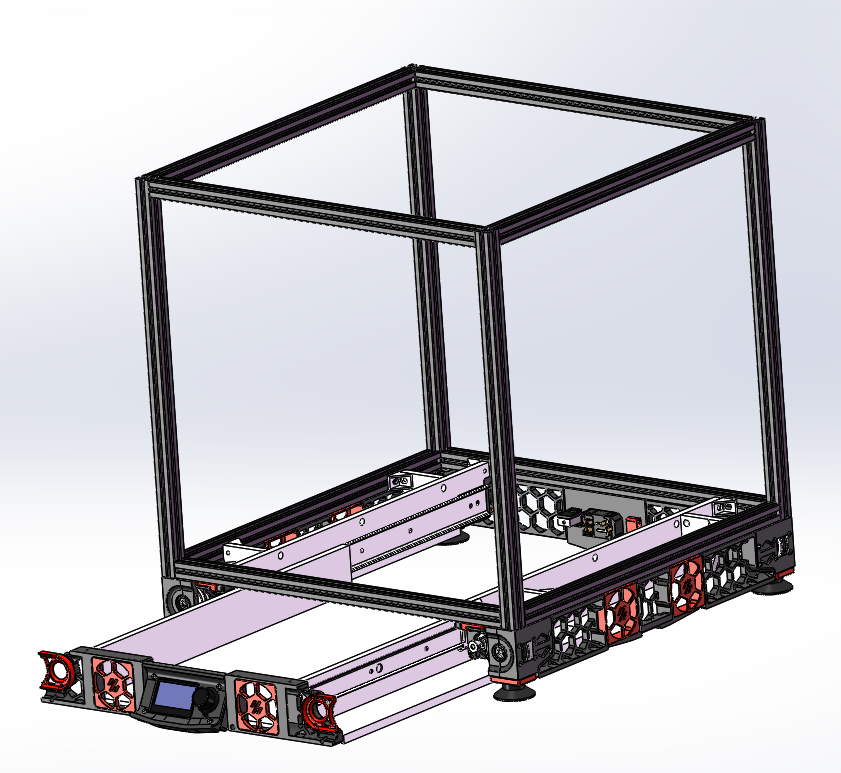
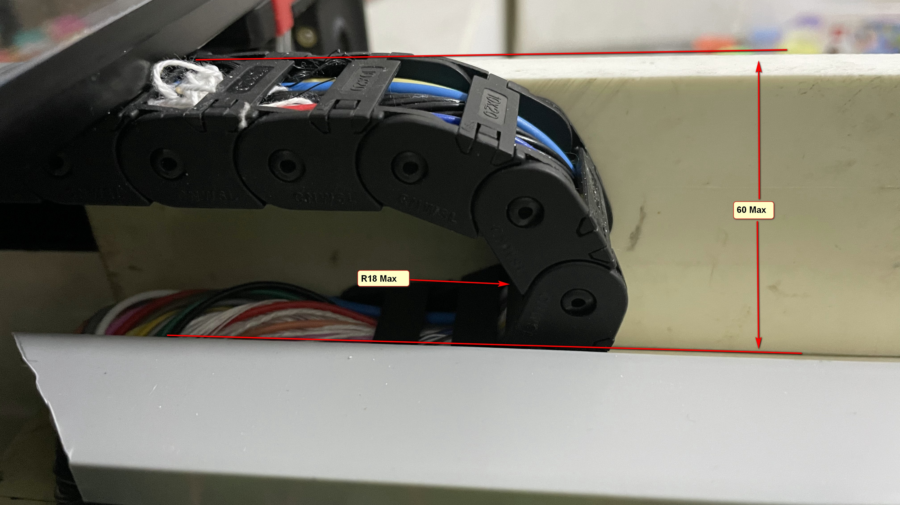
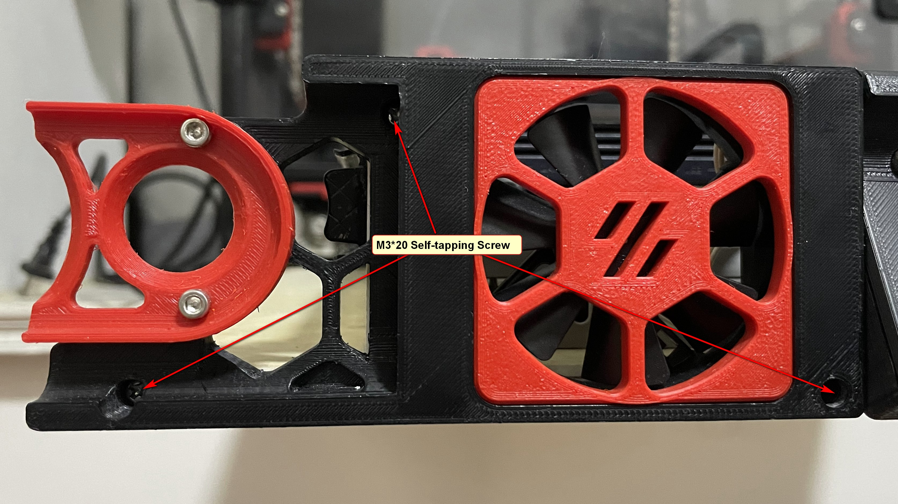
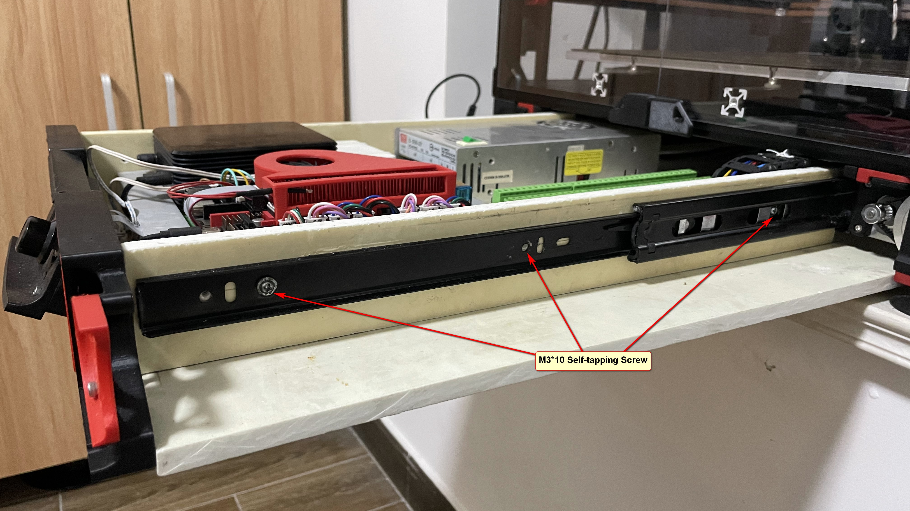
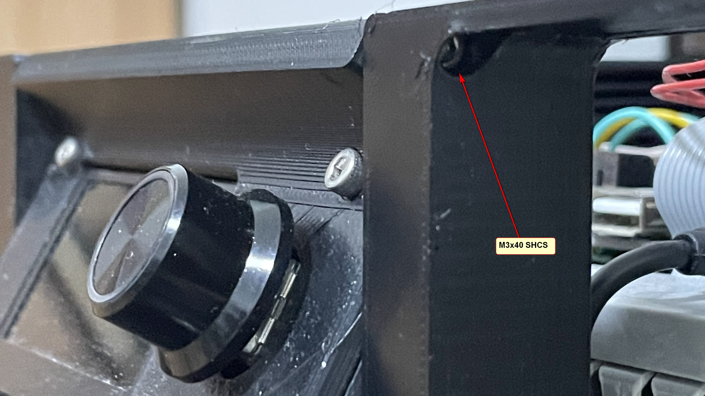

# Voron 2.4 Pull-out electrical Store [中文说明](./README_CN.md)

## Important Notice

**Only aimed at Voron V2.4 350mm printer now.**  
**This MOD is based on V2.4R1 and may not be perfectly compatible with V2.4R2**

* Due to the need to ensure a smooth drawer out, after using this MOD will reduce the space of the electrical store, please check the below table find the available space.

>| **Printer spec**|Inner space     |**Available space**|
>| ----------------| :------------: | :---------------: |
>| 350mm           | 470 * 285 * 77 | 470 * 257 * 60    |
>| 300mm           | 420 * 235 * 77 | 420 * 207 * 60    |
>| 250mm           | 370 * 185 * 77 | 370 * 157 * 60    |

* You will need about 30 metres of additional wire to connect the drawers.

Please use it according to the actual situation.

## Objectives

The objectives for this project are:

* Easily to open the electrical bin for debugging

## Overall

### Picture

### Video

https://www.youtube.com/embed/usf8aM6o3Y0

https://www.youtube.com/embed/9XUpTigEtQ4

### [3D Model](./3D)
 https://evercraft.co/share?key=E561A9
 
## Bill of Materials (BOM)

>| **Category**|Part Name |**QTY**|Remark
>| ----------------| :------------ | :--------------- | :--------------- |
>|Printed Parts|[Mini12864_Case](./STL)|X1||
>|Printed Parts|[Front panel L](./STL)|X1||
>|Printed Parts|[Front panel R](./STL)|X1||
>|Printed Parts|[Fan_decorative_panel](./STL)|X2||
>|Printed Parts|[Side panel L](./STL)|X1|Option **Incompatible with v2.4r2**|
>|Printed Parts|[Side panel R](./STL)|X1|Option **Incompatible with v2.4r2**|
>|Panels|[Bottom_plate](./Drawing)|X1|AS the Drawing*|
>|Panels|[Drawer_sides](./Drawing)|X2|AS the Drawing*|
>|Panels|[Drawer_Support](./Drawing)|X2|AS the Drawing*|
>|Panels|[Reinforcing_rib](./Drawing)|X4|AS the Drawing*|
>|Motion|[450mm Guide_rail](https://www.amazon.com/dp/B08C9PK2L8)|X1Pair||
>|Cables|[Cable Chain](https://www.amazon.com/Befenybay-Internal-Flexible-Machines-10mmX20mm/dp/B07SFFT1K5)|X1|10*20(Inner H x Inner W)  (R18max)|
>|Cables|24AWG Silicone Cable| X26M |Additional |
>|Cables|20AWG Silicone Cable| X4M |Additional |
>|Hardware|STEEL CORNER|X8||
>|Fasteners|M3x40 SHCS|X2| |
>|Fasteners|M3 Threaded Insert|X4| M3X5X4|
>|Fasteners|M3*20 Self-tapping Screw|X22| |
>|Fasteners|M3*10 Self-tapping Screw|X16| |
>|Fasteners|M5*10 Self-tapping Screw|X8| |
>|Fasteners|M5*6 BHCS|X8||
>|Fasteners|M5 1mm Spacer|X8||
>|Fasteners|M5 T-nut |X8| HNTAJ5-5|
>|Electronics |60x60x15 Fan |X2||

*You can use any type of sheet, epoxy sheet is recommended.
## Briefly instructions

## Donate
You want to donate something regarding this project? No, you can't. :)
