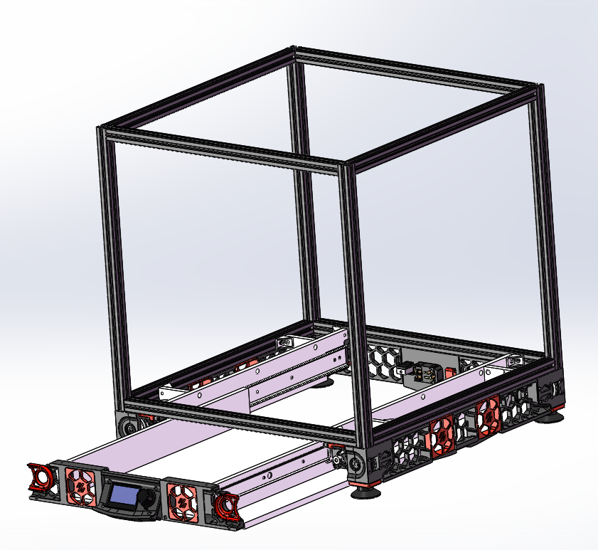
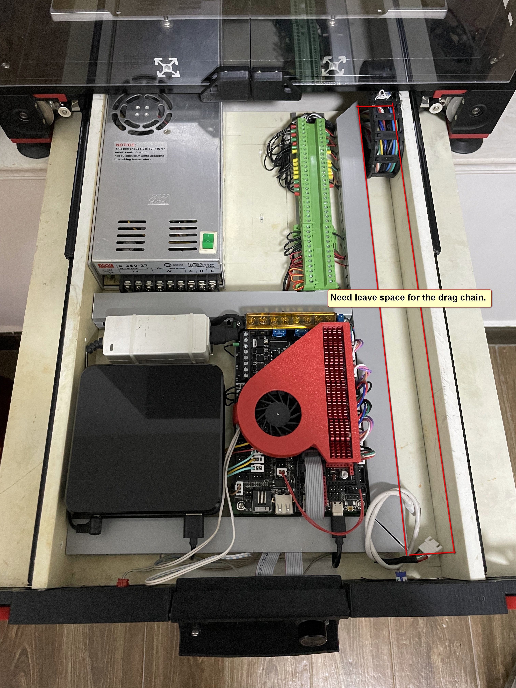
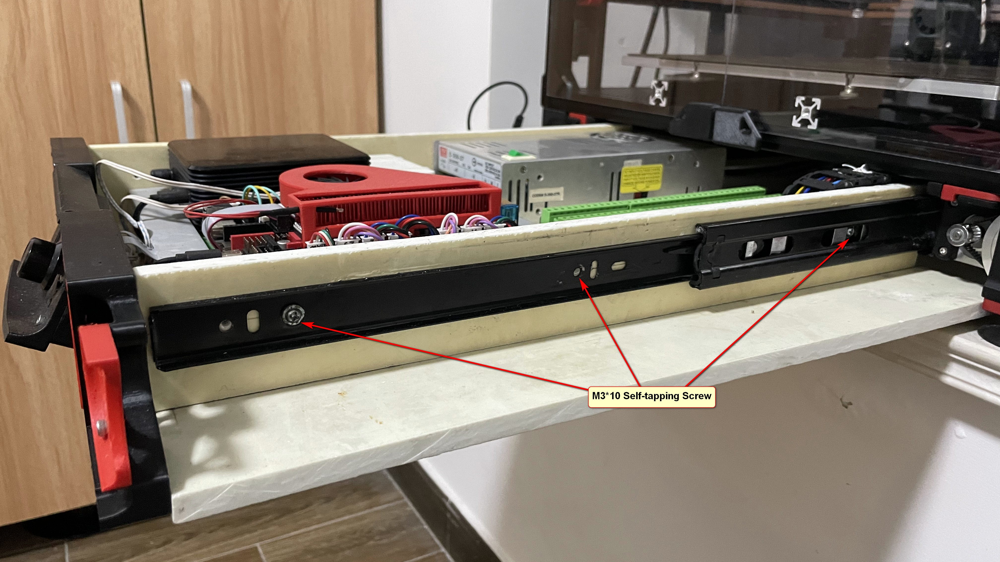
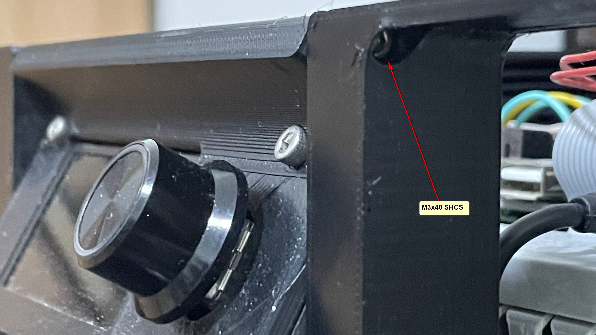

# Voron 2.4 抽拉式电器仓 [Back](./)

## 重要提示

**目前只适用于Voron 2.4 350mm机型**  
**本MOD基于V2.4R1,可能无法与V2.4R2完美兼容**
    

* 由于需要保证抽屉顺利抽出，使用这个MOD后会减少电器库的空间，请查看下面的表格找到可用空间。

>| **打印机规格**|内部空间    |**可用空间**|
>| ----------------| :------------: | :---------------: |
>| 350mm           | 470 * 285 * 77 | 470 * 257 * 60    |
>| 300mm           | 420 * 235 * 77 | 420 * 207 * 60    |
>| 250mm           | 370 * 185 * 77 | 370 * 157 * 60    |

* 你将需要增加大约30米长的电线来连接电器仓。

请根据实际情况酌情决定使用

## 目标

本项目目标为:

* 便于打开电气仓进行调试

## 总览

### 照片

### 视频

https://www.bilibili.com/video/BV1iS4y1w7My?share_source=copy_web

https://www.bilibili.com/video/BV12i4y1U7ux?share_source=copy_web

### [3D 模型](./3D)
 https://evercraft.co/share?key=E561A9
 
## 材料清单 (BOM)

>| **种类**|名称 |**数量**|备注
>| ----------------| :------------ | :--------------- | :--------------- |
>|打印件|[Mini12864_外壳](./STL)|X1||
>|打印件|[前面板 L](./STL)|X1||
>|打印件|[前面板 R](./STL)|X1||
>|打印件|[风扇装饰板](./STL)|X2||
>|打印件|[侧板 L](./STL)|X1|可选 **与v2.4r2不兼容**|
>|打印件|[侧板 R](./STL)|X1|可选 **与v2.4r2不兼容**|
>|板材|[底板](./Drawing)|X1|见图纸*|
>|板材|[抽屉侧板](./Drawing)|X2|见图纸*|
>|板材|[抽屉支架](./Drawing)|X2|见图纸*|
>|板材|[加强板](./Drawing)|X4|见图纸*|
>|板材|[450mm 抽屉导轨](https://www.amazon.com/dp/B08C9PK2L8)|X1Pair||
>|线材|[拖链](https://www.amazon.com/Befenybay-Internal-Flexible-Machines-10mmX20mm/dp/B07SFFT1K5)|X1|10*20(Inner H x Inner W)  (R18max)|
>|线材|24AWG Silicone Cable| X26M |Additional |
>|线材|20AWG Silicone Cable| X4M |Additional |
>|五金件|STEEL CORNER|X8||
>|紧固件|M3x40 SHCS|X2| |
>|紧固件|M3 Threaded Insert|X4| M3X5X4|
>|紧固件|M3*20 Self-tapping Screw|X22| |
>|紧固件|M3*10 Self-tapping Screw|X16| |
>|紧固件|M5*10 Self-tapping Screw|X8| |
>|紧固件|M5*6 BHCS|X8||
>|紧固件|M5 1mm Spacer|X8||
>|紧固件|M5 T-nut |X8| HNTAJ5-5|
>|电子 |60x60x15 Fan |X2||

*您可以使用任何类型的板材，建议使用环氧板材
## 简要说明
拖链内部半径最大18mm

需要留出拖链位置

## 捐赠
你想为这个项目捐点东西? 不行,要是愿意前去视频链接帮忙点个赞吧. :)
