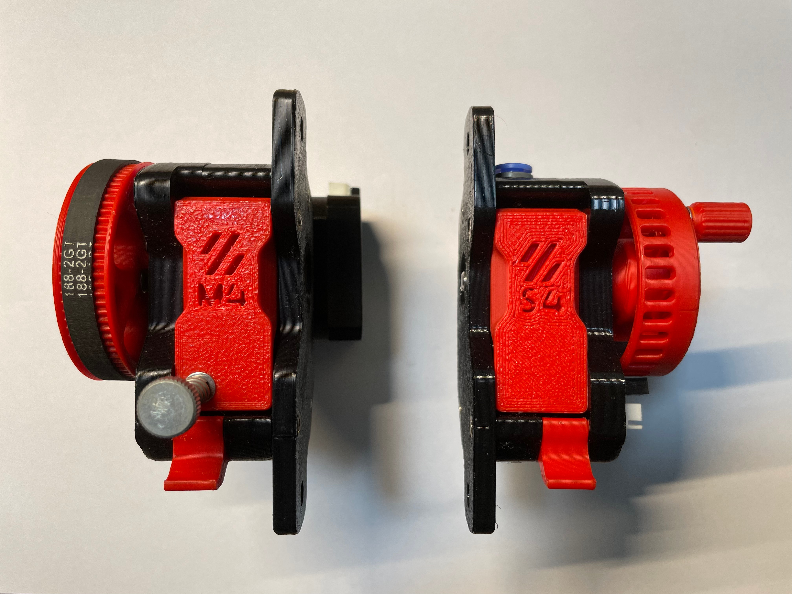
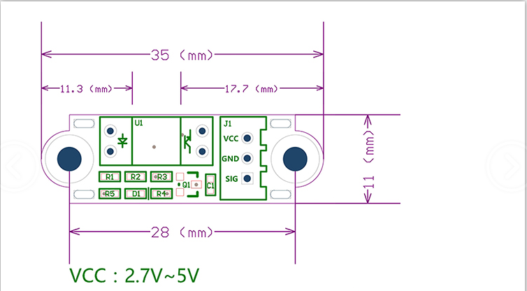

# S4_Filament_motion_sensor [Back](./)
### 此项目源于[# VORON M4 Extruder](https://github.com/VoronDesign/Mobius-Extruder)，感谢沃龙团队推动这些伟大的项目.

## 目标
### 本项目目标为:

1. 当耗材用尽或堵头时暂停打印，避免打印失败。
2. 换料时方便手动进料


## 总览

### 照片
### M4 vs S4


### 视频
 https://www.bilibili.com/video/BV1hd4y197tq?share_source=copy_web&vd_source=385151548cdde7762e546644f000bc2c
 https://www.bilibili.com/video/BV1W14y1s7bJ?share_source=copy_web&vd_source=385151548cdde7762e546644f000bc2c
 
### [3D 模型](./3D)
 https://evercraft.co/share?key=0AD7E8

## ## 材料清单 (BOM)
|序号	|种类	|名称	|数量	|备注
|--|--|--|--|--|
|1	|传动	|Shaft 5x48mm  D	|X1	|Option A*
|2	|传动    |Shaft 3x20mm	|X1|	
|3	|传动	|Bondtech Drive gear	|X1	
|4	|传动	|F695 2RS	|X2	
|5	|传动	|气动插头 ECAS04 v3	|X1	
|6	|紧固件	|M3x30 SHCS	|X4	
|7	|紧固件	|M3x16 BHCS	|X1	
|8	|紧固件	|M3X6 BHCS	|X2	
|9	|紧固件	|M3 Spacer	|X4	
|10	|紧固件	|M3 Threaded Insert M3x4x5	|X6	
|11	|杂	|磁铁 3x6mm	|X2	
|12	|杂	|铁氟龙管 (4mm OD 3mm ID) 14mm	|X1	
|13	|杂	|铁氟龙管 (4mm OD 3mm ID) 11.5mm	|X1	
|14	|电子	|[光学限位模块](https://www.amazon.com/Optical-Endstop-Photoelectric-Control-Printer/dp/B07MFT8NWJ)	|X1|
|15	|传动	|Shaft 5x54mm	|X1	|OptionB*
|16	|传动	|GT2 20T 5mm	|X1	|OptionB*
|17	|紧固件	|M3X8 BHCS	|X5	|OptionB*
|18	|紧固件	|M5X12 BHCS	|X2	|Option

* 两个版本

 版本A - 带GT2 20T 皮带轮
 
 版本B - 不带GT2 20T 皮带轮
 

## 简要说明


## 配置


### [filament_motion_sensor][¶](https://www.klipper3d.org/zh/Config_Reference.html#filament_motion_sensor "Permanent link")


耗材移动传感器。使用一个在耗材通过传感器时输出引脚状态会发生变化来检测耗材插入和耗尽。

更多信息请参阅[命令参考](https://www.klipper3d.org/zh/G-Codes.html#filament_switch_sensor)。

#### 拷贝下面配置到你的<Printer.cfg>文件中，你必须检查 **“switch_pin:”** 配置
```ini
[filament_motion_sensor S4]
detection_length: 7.0
##   触发传感器switch_pin引脚状态变化的最小距离。默认为 7 mm。
extruder: extruder
##   该传感器相关联的挤出机。必须提供此参数。
#   This parameter must be provided.
switch_pin:
##   连接到检测开关的引脚，必须提供此参数。
pause_on_runout: True
##  当设置为 "True "时，会在检测到耗尽后立即暂停打印机。请注意, 如果 pause_on_runout 为 False 并且没有定义runout_gcode的话, 
##  耗尽检测将被禁用。默认为 True。
#runout_gcode:
    #RESPOND TYPE=error MSG="Filament Runout!"   #respond a warning message 
##   Need enable the "M118" and "RESPOND" extended commands first. 
##   More infomation ：https://www.klipper3d.org/G-Codes.html?h=respond#respond
    #Bee_Mario_B                                 #Make a warning tone
    #M117 Filament Runout!                       #Sent a message to LCD
##   在检测到耗材耗尽后会执行的G代码命令列表。如果 pause_on_runout 被设置为 True，这个G-Code将在暂停后执行。
##   默认情况是不运行任何 G-Code 命令。
#insert_gcode:
##    在检测到耗材插入后会执行的 G-Code 命令列表。默认不运行任何 G-Code 命令，这将禁用耗材插入检测。
#event_delay: 3.0
##   事件之间的最小延迟时间（秒）。在这个时间段内触发的事件将被默许忽略。默认为3秒。
pause_delay: 0.5
##   暂停命令和执行 runout_gcode 之间的延迟时间, 单位是秒。如果在OctoPrint的情况下，增加这个延迟可能改善暂停的可靠性。
##   如果OctoPrint表现出奇怪的暂停行为，考虑增加这个延迟。
```

#### 下面配置是可选的，除非您想在检测到跳动时发出提示音。

1. 拷贝 ** <[Beeper.cfg](/Config/Beeper)>** 到 config 文件夹 

打开  <[Beeper.cfg](/Config/Beeper)> 检查**[output_pin BEEPER_pin]**中**pin:** 的配置

2.  拷贝下面配置到 **<Printer.cfg>** 
```ini
[include Beeper.cfg] 
```
3. 去除** <Printer.cfg>** 中 **[filament_motion_sensor S4] **下 **“runout_gcode:”**的注释
