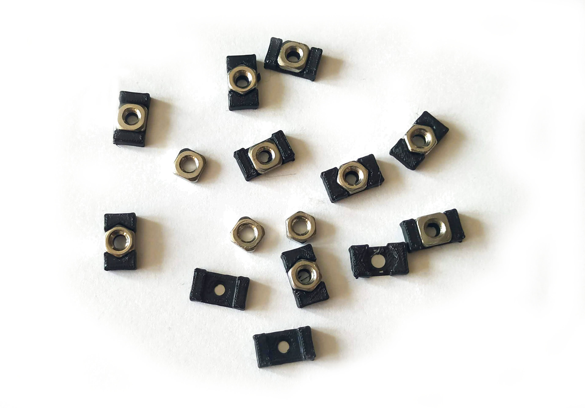
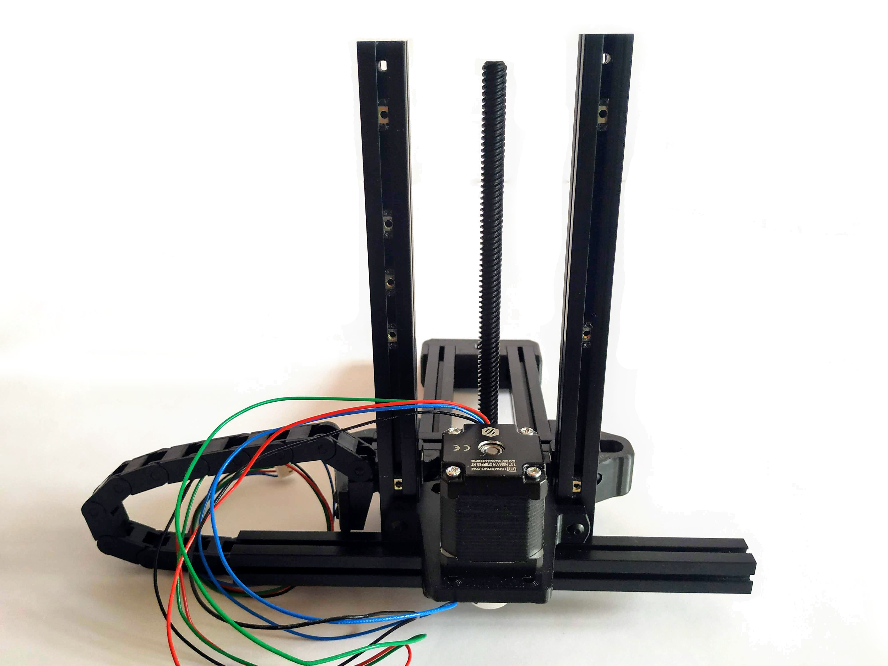

# Voron0 1515 T-Nut

It is a great help during installation to prevent the nuts from moving. During the construction of Voron0, it comes in very handy with the screws of Pocketwatch, TopHat, Bed_Mount.

## hardware:
- M3 Square Nuts from Aliexpress (5.5mm x 5.5mm x 2mm)

The hex nut is too high, it is difficult to print because only one or two layers get under the nut. (depending on the frame) But it also works.

The MakerBeam version is lower than the LDO version. 

## print settings:

- layer height: 0.2mm

