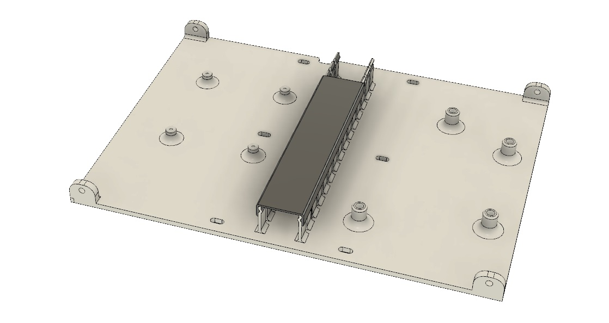
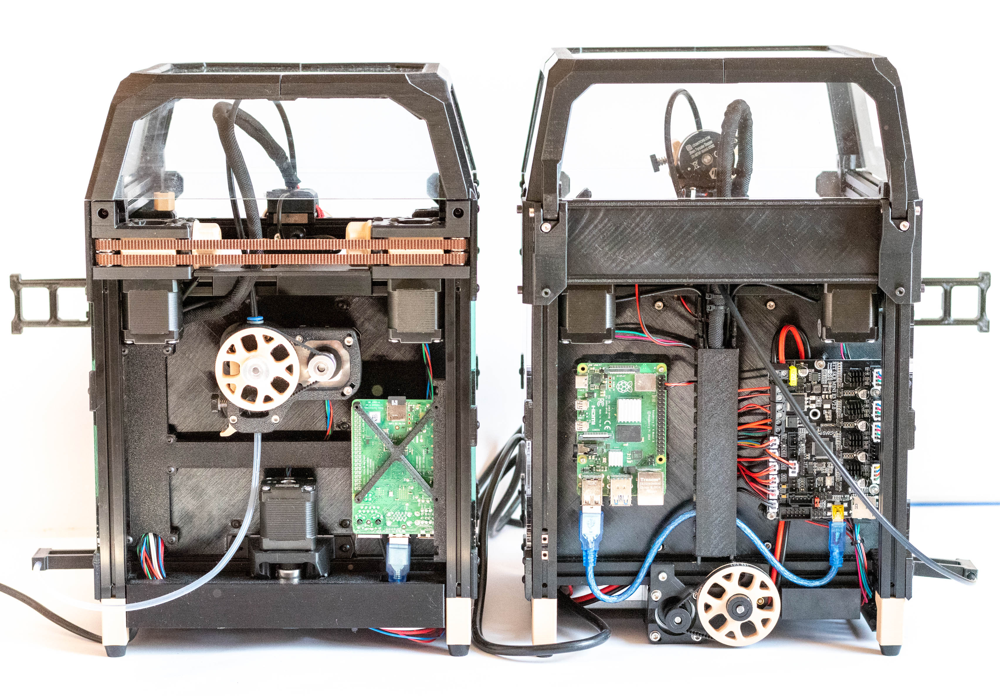

# Voron0 MidPanel with Hex pattern

## print settings:

- layer height: 0.2mm
- color change at 0.6mm / 2.2mm

## V0.1

### hardware:

- 4 x M3x8 BHCS
- 4 x M3 nut

## V0.1 R2 Raspberry PI, SKR E3 Mini mount and cable guide

## V0.0: 

Compatibility: 
 - Pocketwatch
 - [Z Belt mod](https://github.com/theFPVgeek/VoronUsers/tree/master/printer_mods/theFPVgeek/v0-zbelt-mod)

### hardware:

- 8 x M3x6 BHCS
- 8 x M3 Threaded Insert
- 4 x M3x8 BHCS
- 4 x M3 nut

