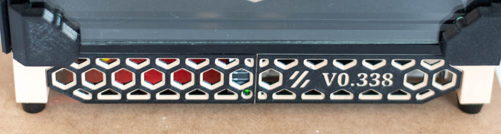
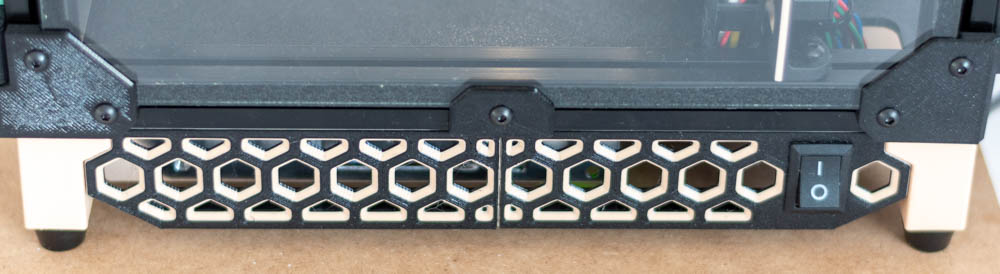
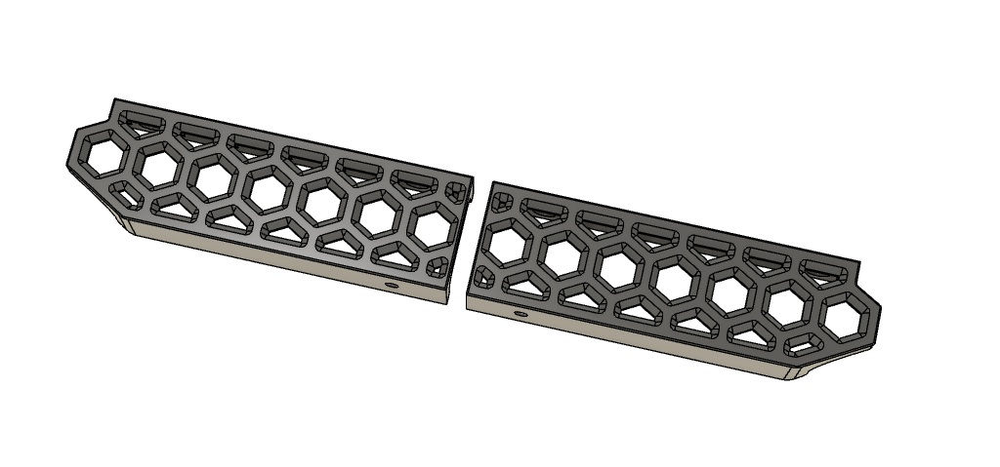
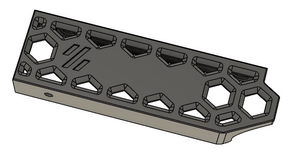
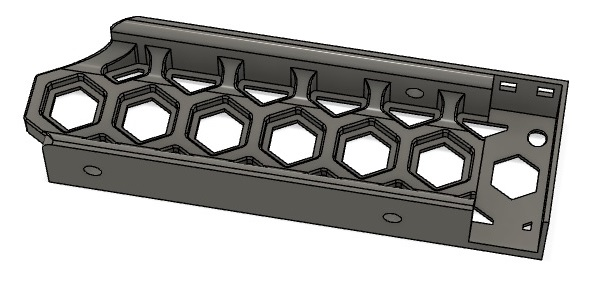
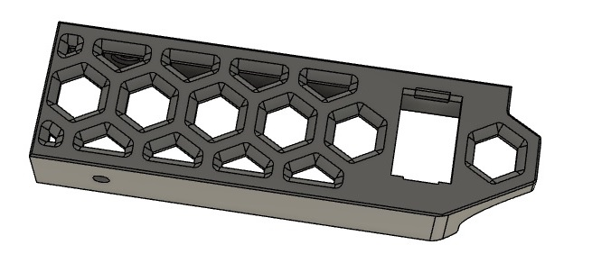
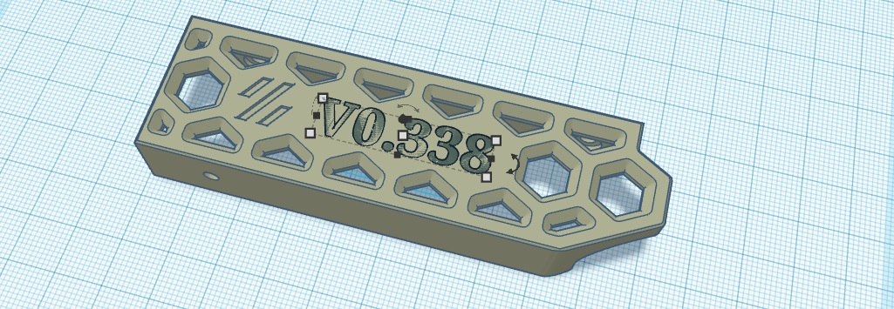
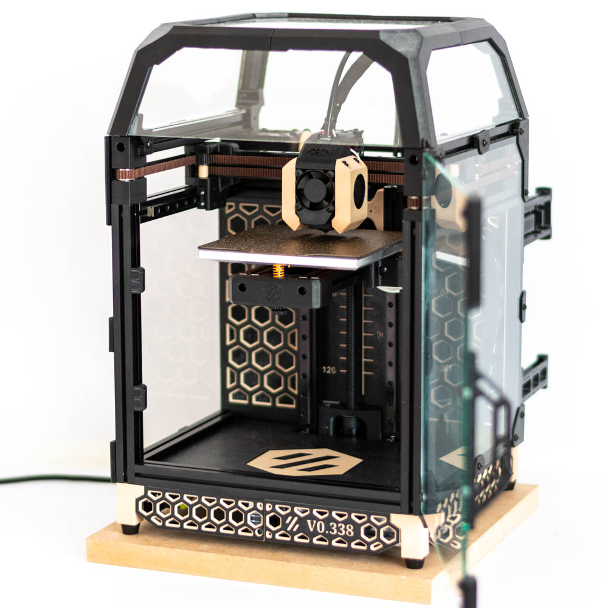

# Voron0 dual color skirt set (SSR, PowerSwitch, Nameplate)

To match the skirt with the [Midpanel with Hex Pattern](../V0_MidPanel_HexPattern)  by sterminatore's idea

## print settings:

- layer height: 0.2mm
- color change at 0.6mm / 2.2mm

## Skirt.stl, Skirt_mirror.stl

Left and right skirt part with 40 degree chamfers for color change printing. There is an extra hole for tightening the middle M3 screw.

## Skirt_EmptyNameplate.stl

Empty nameplate for serial number. For example, with Tinkercad you can easily put the number on it.

Here's a quick tutorial:

## Skirt_SSR.stl

SSR holder with led window.

## Skirt_PowerSwitch.stl

12mm x 19mm windows for power switch. 
- Example power switch on aliexpress: [On/Off Switch 6A-10A 110V 250V 21MM*15MM](https://www.aliexpress.com/item/32802764284.html)

## Skirt_Adxl.stl

Adxl connector, 6P microfit 3.0: https://www.digikey.com/en/products/detail/molex/0430200600/252492 

### Overview

