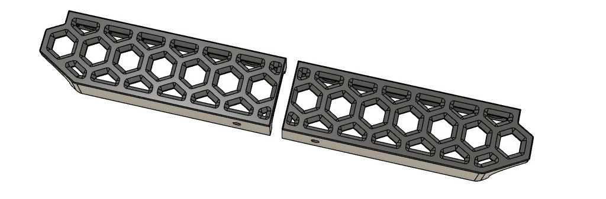
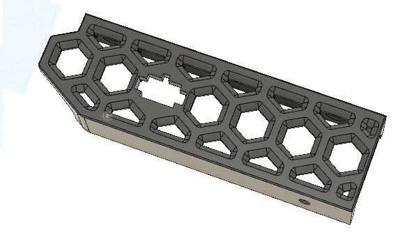

# Voron0 dual color skirt set (SSR, PowerSwitch, Nameplate)

To match the skirt with the [Midpanel with Hex Pattern](../V0_MidPanel_HexPattern)  by sterminatore's idea

## print settings:

- layer height: 0.2mm
- color change at 0.6mm / 2.2mm

## Skirt.stl, Skirt_mirror.stl

Left and right skirt part with 40 degree chamfers for color change printing. There is an extra hole for tightening the middle M3 screw.

## Skirt_EmptyNameplate.stl

Empty nameplate for serial number. For example, with Tinkercad you can easily put the number on it.

## Skirt_SSR.stl

SSR holder with led window.

## Skirt_PowerSwitch.stl

12mm x 19mm windows for power switch.

### Overview

