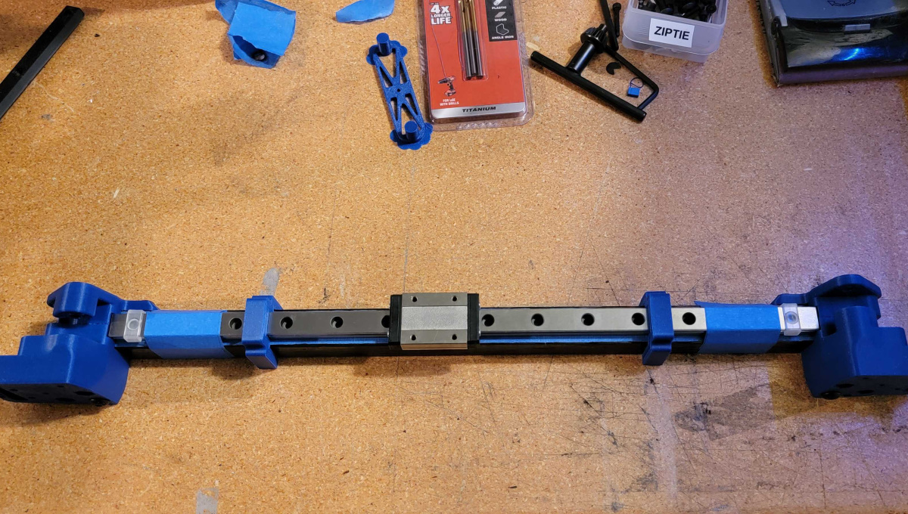
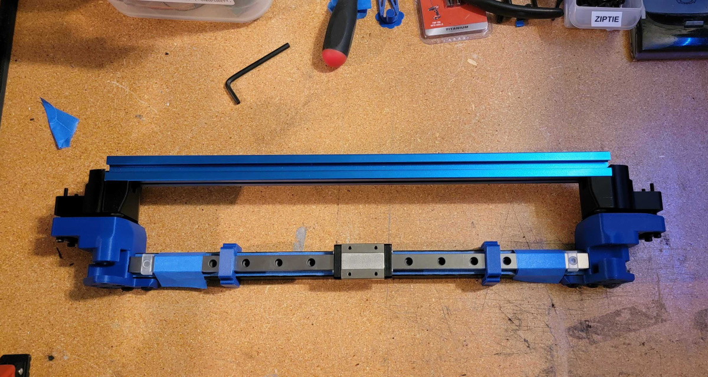

# Carbon Fiber X Extrusion for MGN12

    

## Overview
Everyone loves Carbon Fiber. It weighs 25% as much as your current X-Extrusion and it looks cool. Probably gives your printer +5 Horsepower.

Go full weight weenie and replace your idler bolts/pins with carbon fiber too. Carbon fiber everywhere!

## BOM
Required:
- 20x20x18mm Carbon Fiber Square Tube
    - ⚠️Do not buy pullstruded tube for this⚠️
    - [DroneBuildz (US)](https://dronebuildz.com/collections/flight-controller/products/carbon-fiber-square-tube-grcf-1000mm)
    - [AliExpress](https://www.aliexpress.com/item/32946654825.html)
- 6x M5 tnuts
    - [Amazon](https://www.amazon.com/gp/product/B07FPLZXTF)
- 8+ M3 Flanged Locknuts
    - [Amazon](https://www.amazon.com/gp/product/B07XXRLMBB/)
- 8+ M3x10 Socket Head Cap Screws (Rail mounting)
- 4x M5x12 Button Head Cap Screws (Top XY Joint)
- 2x M5x30 Button Head Cap Screws (Bottom XY Joint)

    

- Blue (Medium) Loctite

Optional:
- 2x M3 Heatset Inserts for Cable Chain mount
- 5mm OD Carbon Fiber Tube or Rod
    - 4x cut to 40mm

## Tools Required
- Mask or Respirator
    - Don't breathe in carbon fiber dust, please.
- Safety Goggles
- Drill Press
    - Don't use a hand drill.
- Drill Bits:
    - 'Small': 3.5mm OR 1/8"
    - 'Large': 6.5mm OR 1/4"
- Hex Drivers
    - 2.5mm for M3
    - 3.0mm for M5
- Saw
    - If you're going to use a hacksaw, a mitre box can help keep your cut straight.
    - A mitre saw is the best way to go, if you have a blade that will work.
- Fine Grit Sandpaper
- Blue Painters Tape

## Carbon Fiber Safety
- Do it outside if at all possible
- Always wear a mask and safety goggles
- Wear a long sleeved shirt and gloves to protect your skin

## Tips for Drilling/Cutting
- Use a fine/extrafine toothed saw blade.
- Use carbide tipped drill bits.
    - HSS bits will wear out quick.
- Run your drill press at high speed (3000-5000rpm) and cut slowly, using low pressure.
- Cover the area you are going to cut in blue painters tape to help avoid delamination.
- Use sandpaper to smooth out the edges of the cut.

## Results
The weight difference between a stock dual MGN9 300mm v2.4 X extrusion w/ Ti backer and the Carbon Fiber MGN12 with Pins Mod is almost 300g.

    

## Instructions

### Printing instructions
1. Normal Voron print settings. 
    - You can drop the infill percentage on the inserts if you want as the 4 perimeters are what take the load.
2. Print a set of Inserts
    - If you're going to use cable chains, be sure to print the correct insert with support for heatsets.
3. Print a set of XY joints.
    - Use the Pinned set for the Hartk mod or if you're going to use carbon fiber pins.
    - You can't reuse your existing ones as they have bits that are designed to go into the slot of a 2020 extrusion.
4. Print 2-3 [MGN12 rail positioning tools](https://github.com/VoronDesign/Voron-Trident/blob/main/STLs/Tools/MGN12_rail_guide_x2.stl).

### Insert Assembly
1. Slide an M5 tnut into each hole.
2. With an M5 bolt holding the tnut in place over the hole, use tools to spin the tnut 90 degrees.
3. (Optional) Insert the M3 heatsets if you are using them.

### XY Joint Holes
1. Cut your CF tube to size. For a 300mm sized 2.4/Trident, that is 380mm.
    - Unless you're very confident in your ability to cut square, cut it a little long and use a sanding block to get it to the correct length.
2. Use a straight edge to identify the flatest face.
    - Mark this face, it will be the one the rail is mounted to.
3. Apply blue painters tape to the top and bottom ends of the tube.
4. Find and mark the center of the tube on the top and bottom.
    - You can use your rail and the centering tools to do this.
    - TODO: Insert image.
5. Mark and measure 7.65mm and 23.15mm from both ends on the top of the tube.
6. Mark and measure 7.65mm from both ends on the bottom of the tube.
7. ⚠️Put on your mask! Don't inhale carbon dust, it is not good for you.⚠️
8. Using the 'small' drill bit in a drill press, drill pilot holes at your marked points.
9. Drill your final holes using the 'large' drill bit.
    - Using an oversized drill bit will give you wiggle room in case your measurements are a bit off.
    

    
    

10. (Optional) If using cable chains, use your insert as a template for where to drill the mounting holes.
    - Use the 'small' drill bit for these holes. You can use a slightly larger bit if you think you need wiggle room for mounting.

### Rail Holes
1. Install the inserts and attach your XY joints, temporarily. Do not install the idlers and bolts/pins.
2. Apply blue painters tape to the face of your tube.
3. Using the centering tools, set your MGN12 rail on the face of the tube, centered between the two sides.
4. Use blue painters tape to secure the rail to the tube, to stop it from moving side-to-side.
    

    
    

5. Either mark your holes or use the rail itself as a drill guide.
    - You only need a bolt in every other hole. If you start from each side, you'll end up with two side by side in the middle on a 350mm rail.
6. Drill your holes with the 'small' drill bit. No need for a pilot hole.
7. Clean up.
    - Remove rail
    - Remove XY Joints
    - Remove inserts
    - Remove all tape

### Attaching Rail
1. Using the centering tools, set your MGN12 rail on the face of the tube and align with the drilled holes.
2. Insert nuts into the Nut Holder and press them firmly into it.
    - Use pliers to fully seat the nuts into the holder, otherwise it will not fit into the tube.
    

    
    

3. Slide the Nut Holder and Spacer into the tube, aligning them with the drilled holes.
4. Using Blue Loctite, screw in M3x8 bolts and tighten.
5. Remove the spacer and press down on the nut holder. It should pop off the back of the nuts.
    - Using a hex driver or something flat may be needed to pop it off the last nut.
    - If you need to remove your rail, you will be able to use the nut holder and the spacer.
6. Repeat for the other side of the rail.

### Carbon Fiber Pins (TODO)
1. Cut pins to 40mm
2. ???
3. +5 Horsepower

### Mounting to Printer
1. Remove your current aluminum extrusion and XY joints.
2. Leave the bottom printed part on both ends of the extrusion.
3. Swap over your idler pulleys and mounting hardware.
4. Using your old extrusion, adjust the overall length of the new carbon fiber tube.
    - Put long M3 bolts through the MGN9 mounting holes on the new and old extrusions.
    - If they match up, then there is no adjustment needed.
    - If they don't, loosen the mounting bolts on the new extrusion and adjust.
    - If you're significantly off, you may have measured incorrectly somewhere along the lines. ⚰️
    

    
    

5. Mount onto rails in the printer.
    - Do the normal racking adjustments.
6. Hook everything else back up. Good job!

## Questions
Reach me in Voron's [Discord](https://discord.gg/xgXWctB) @aTinyShellScript#3121 if you have any questions.