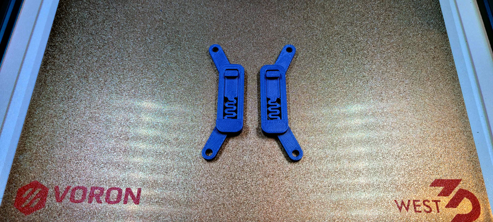
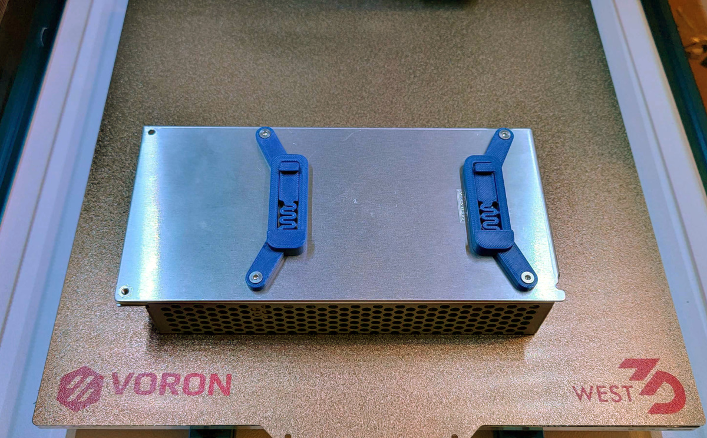

# MeanWell RS PSU Bracket

## Overview
DIN brackets for MeanWell RS series PSUs (bolt holes 80mm center-to-center), edited from [MarcPot's UHP PSU Bracket](https://github.com/VoronDesign/VoronUsers/tree/master/printer_mods/MarcPot/UHP_PSU_Bracket_Clip).

CAD file included.

## BOM
* 4x M3x8 FHCS 

   **OR**
* 4x M3x6 SHCS

## Printing instructions
Normal Voron print settings.

## Questions
Reach me in Voron's [Discord](https://discord.gg/xgXWctB) @aTinyShellScript#3121 if you have any questions.

## Images

