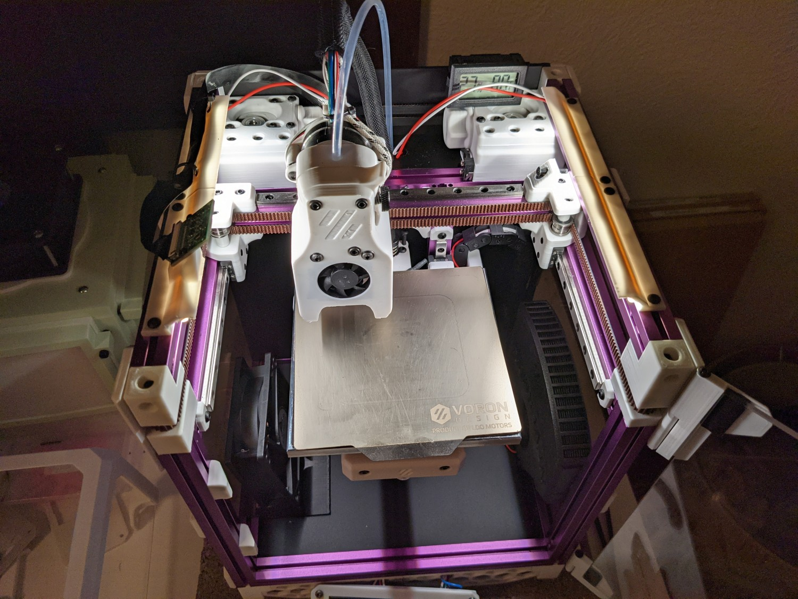
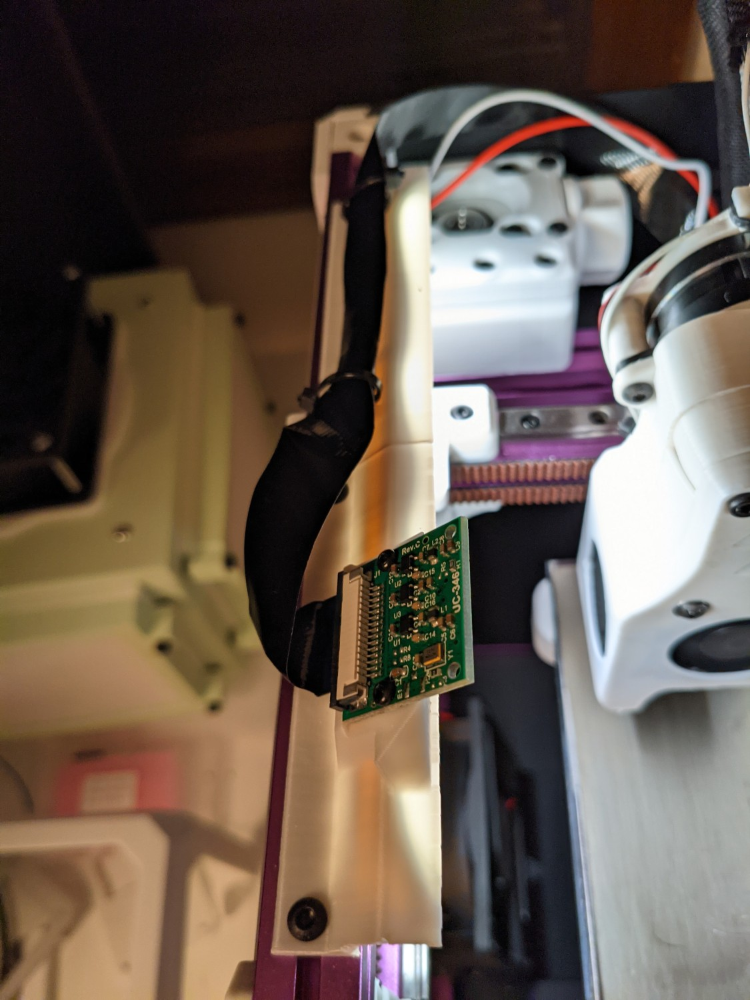
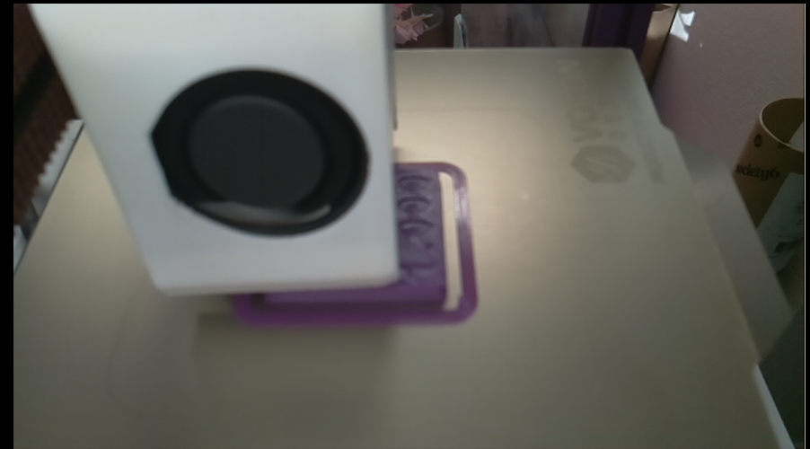

# Lights, Camera Voron

Mounts for LED strip lights and a Pi camera on the V0.1.

## Details

There are three parts: a normal rail for mounting just LED strips, a rail with a mount for a Picam, and a rail with two lugs for zip ties. Each rail is 80mm long, with the intention of using two rails on each side. If you only want to mount lights, print four of the normal rail. If you also want to mount a camera, print two of the normal rails, and one each of the camera and zip tie rails.

The rails work with 8mm wide LED strips.

Mounting the Picam using this mod is a tradeoff. It is in a relatively safe place, and provides an OK (but not great) view of printing. The camera covers most of the bed. Sometimes the mini Afterburner gets in the way of the view. Mounting the camera in the tophat would give a better view, but at the expense of needing to deal with the cable when removing the tophat. Here is an example view during a print:

## Assembly

To install the rails, you'll need:
- 8x M3 hex or square nuts
- 8x M3x8mm screws

To mount the Picam, you'll additionally need:
- 2x M2x6mm screws

Insert the M3 nuts into the top of the top extrusions. This is pretty easy to do even after the printer is totally assembled.

## Feedback

Feel free to contact me - I'm ademuri#2806 on the discord.

