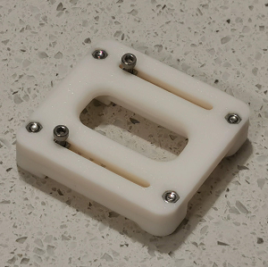
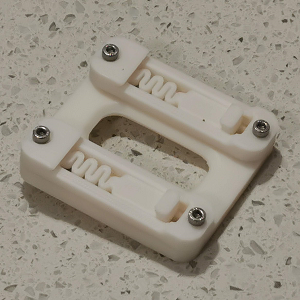
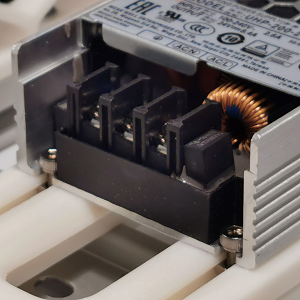
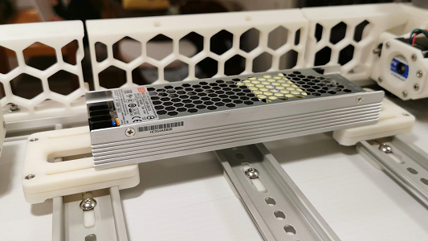

A Team Dropbear Production

# Voron 2.4 MeanWell UHP PSU mount for DIN rail

G'day, another nice thingy from down under. MeanWell UHP PSUs are great: nice, slim, compact, mains and DC on opposite sides... Well, but how to mount them on DIN rais? Alright, Dropbears to resque. Pick an adapter for your UHP (they have different width), print 2 of them and 4 of [rs25_psu_bracket_clip.stl](https://github.com/VoronDesign/Voron-2/blob/Voron2.4/STLs/VORON2.4/Electronics_Compartment/DIN_Brackets/rs25_psu_bracket_clip.stl). 

## Printing and plasic

Standard Voron part printing guidelines to follow: 0.4 nozzle, 0.2 layer height, etc.  
This part is not exposed to any significant heat, so you could probably use even PLA.

## Assembly

BOM:
* 8 x M3 hex nuts
* 8 x M3x12 SHCS screws
* 4 x M3 suare nuts
* 4 x M3x10 SHCS screws

Put square nuts in slide pockets, secure them with screws, then bolt down rs25 brackets, so square nuts are trapped.

## Photos

## Credits

- that russian guy (aeresov#9959)
