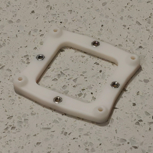
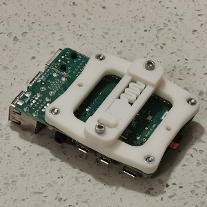
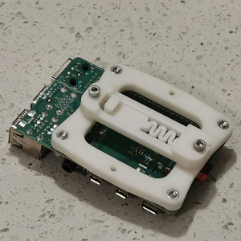
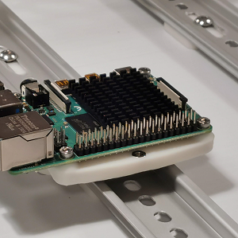

A Team Dropbear Production

# Voron 2.4 Raspberry Pi mount for DIN rail

G'day, another nice thingy from down under. Got non-standard electronics compartment? Some blocks there that don't allow spec placements? Don't have or don't like self-tapping screws? Or are you just up to better wiring and sturdier construction? Alright, Dropbears to resque. Here comes a rigid bracket for Raspberry Pi, that uses M3 bolts and nuts, and allows mounting along and across the rail. The bracket needs 1 of [rs25_psu_bracket_clip.stl](https://github.com/VoronDesign/Voron-2/blob/Voron2.4/STLs/VORON2.4/Electronics_Compartment/DIN_Brackets/rs25_psu_bracket_clip.stl). 

## Printing and plasic

Standard Voron part printing guidelines to follow: 0.4 nozzle, 0.2 layer height, etc.  
This part is not exposed to any significant heat, so you could probably use even PLA.

## Assembly

BOM:
* 6 x M3 hex nuts
* 6 x M3x12 SHCS screws

Pi has mount holes for M2.5 bolts, so putting M3s through might be a problem. Just enlarge these holes with 3.0mm or 3.2mm drill, you won't damage the Pi but will make your life easier.

## Photos

## Credits

- that russian guy (aeresov#9959)
