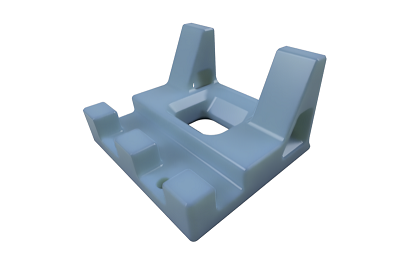
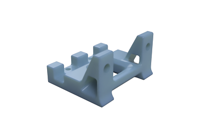

A Team Dropbear Production

# Voron 2.4 Trianglelab filament sensor bracket

G'day, another nice thingy from down under. Got TL filament sensor in your pile of parts? Bought it a year ago for 2.1 and too lazy to find a way to mount it so it plays well with spool holder? Upgraded to 2.4 and still have no clue? Alright, ask a mate to hold your beer, this is quick one: just print it and use instead of stock [bowen_retainer.stl](https://github.com/VoronDesign/Voron-2/blob/Voron2.4/STLs/VORON2.4/Spool_Management/bowen_retainer.stl). 

## Printing and plasic

Standard Voron part printing guidelines to follow: 0.4 nozzle, 0.2 layer height, etc.  
Any common plastic will do, this is outer part with no heat exposure.  
Well, sure, you can print it in PEEK if you're _that_ guy.

## Assembly

BOM:
* 2 x M3 t-nuts
* 4 x M3x12 SHCS screws
* 2 x M3 heat inserts (4mm will do)

Bolt your sensor to it, insert your PTFE tube to sensor's exit hole.  

Make Melbourne hipsters proud, do your wiring in braided sleeving and with fancy connectors. And have a flat white when you're done.  

-that russian guy (aeresov#9959)
