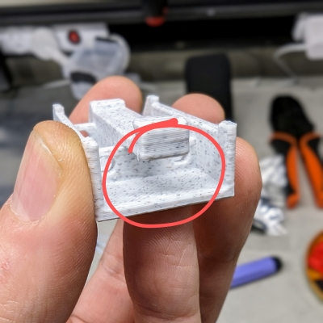

A Team Dropbear Production

# Ballpoint pen spring DIN clips

G'day from Down Under! Here are DIN clips utilizing common ballpoint pen springs (2 per clip). Easy to put on, easy to take off, no plastic fatique. Generic PCB clip is compatible with PCB brackets from Voron STLs. I've also added custom clips for common Voron PSUs, and heat inserts versions.

## Printing

Standard Voron part printing guidelines to follow: 0.4 nozzle, 0.2 layer height, etc.  
This part is not exposed to any significant heat, so you could probably use PLA.

## Assembly

### BOM
* 2 x M3x40 socket/button head screws
* 2 x common ballpoint pen springs
* M3x4 heat inserts if needed

### Printed parts
* one **carriage** part of desired type (generic PCB mount, dedicated PSU mount, tap or heat insert)
* two **shuttles**
* one **button**

### Steps
|<!-- -->|<!-- -->|
|:-------|:------:|
|remove built-in support with narrow nose pliers||
|align first shuttle||
|insert spring no need to make it straight just now||
|wiggle the spring by hex driver so it straightens||
|insert screw||
|gently wiggle the screw so it goes in||
|...and all the way through||
|same for second shuttle||
|get button piece||
|hold it by pressing with your finger, and drive screws into plastic||
|done||
|this is how it needs to end up inside||
|clip-on position||
|clip-off position||
|mount a bracket||
