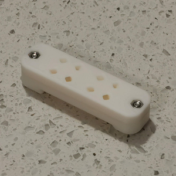
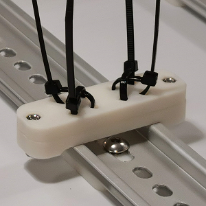

A Team Dropbear Production

# Voron 2.4 cable tie mount for DIN rail

G'day, another nice thingy from down under: a simple bracket that allows fixing your cables with standard 3.5mm plastic cable ties in various positions. 4 ties per bracket, 2x2 criss-cross, so you can make bends or straights. The bracket needs 1 of [rs25_psu_bracket_clip.stl](https://github.com/VoronDesign/Voron-2/blob/Voron2.4/STLs/VORON2.4/Electronics_Compartment/DIN_Brackets/rs25_psu_bracket_clip.stl). 

## Printing and plasic

Standard Voron part printing guidelines to follow: 0.4 nozzle, 0.2 layer height, etc.  
This part is not exposed to any significant heat, so you could probably use even PLA.

## Assembly

BOM:
* 2 x M3 hex nuts
* 2 x M3x12 SHCS screws
* standard 3.5mm cable ties

## Photos

## Credits

- that russian guy (aeresov#9959)
