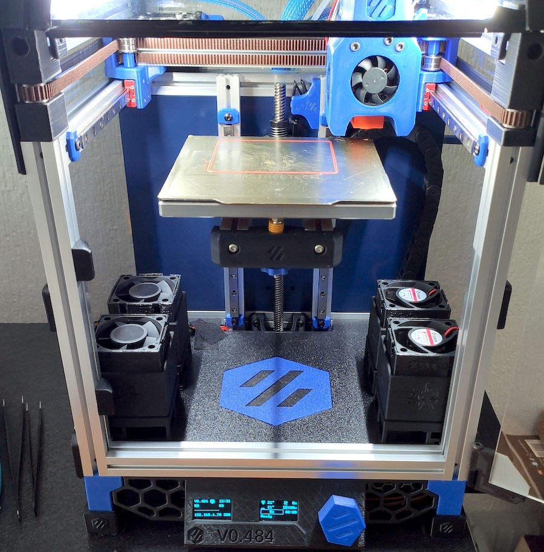
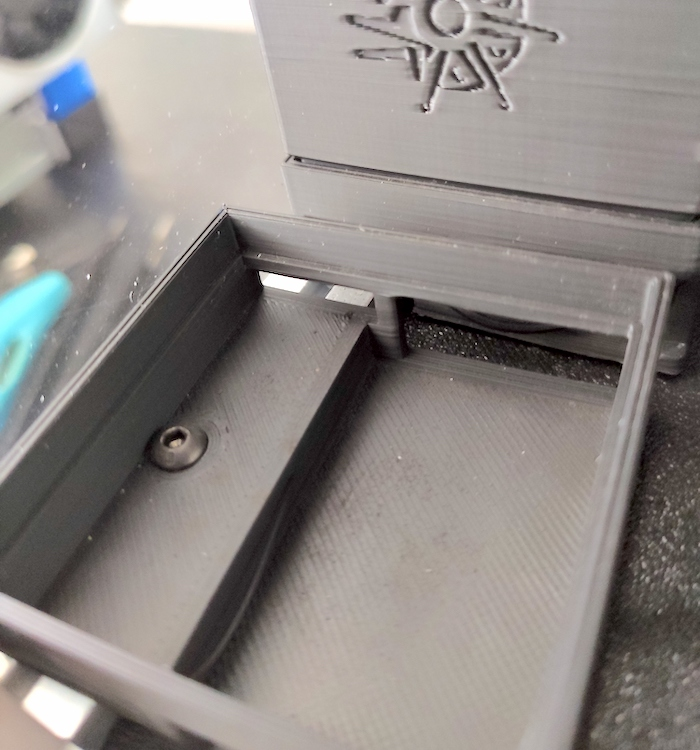
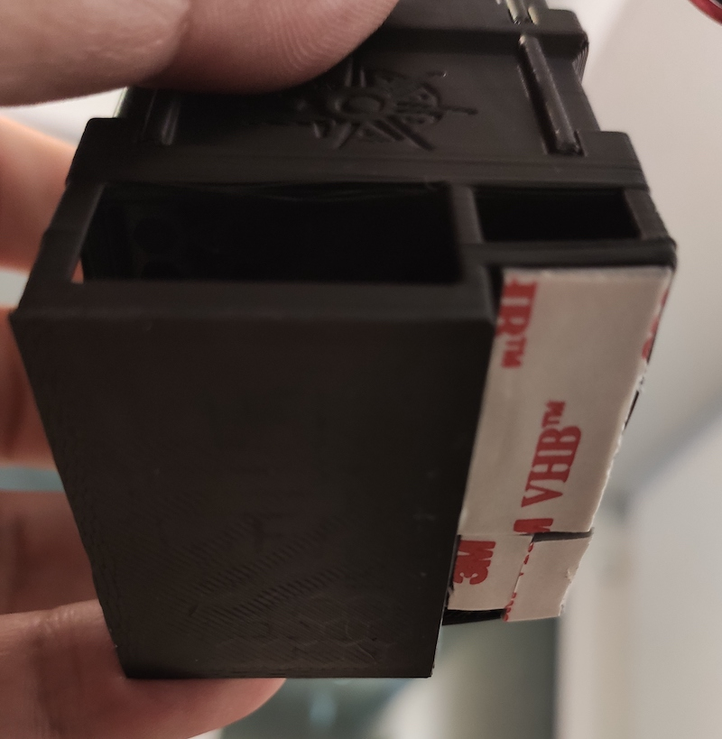
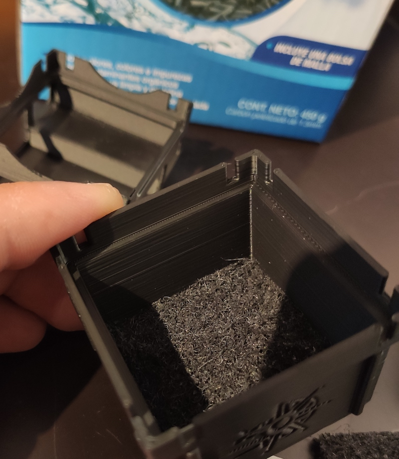
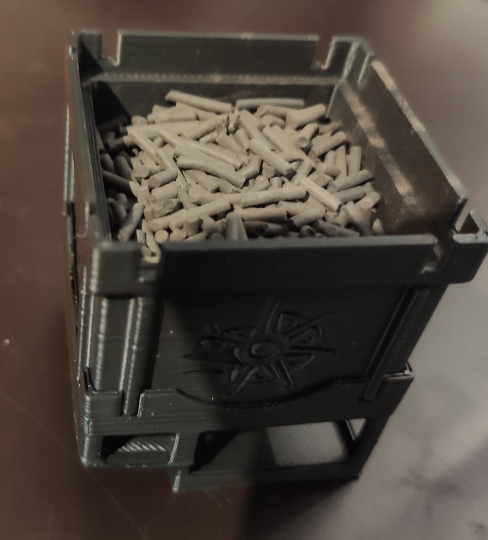
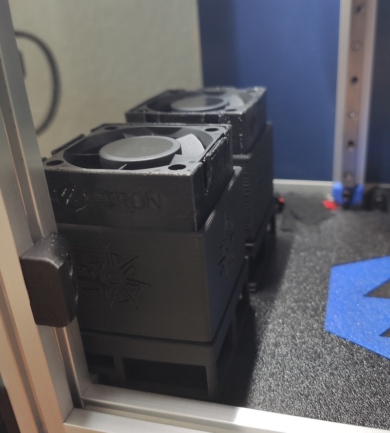
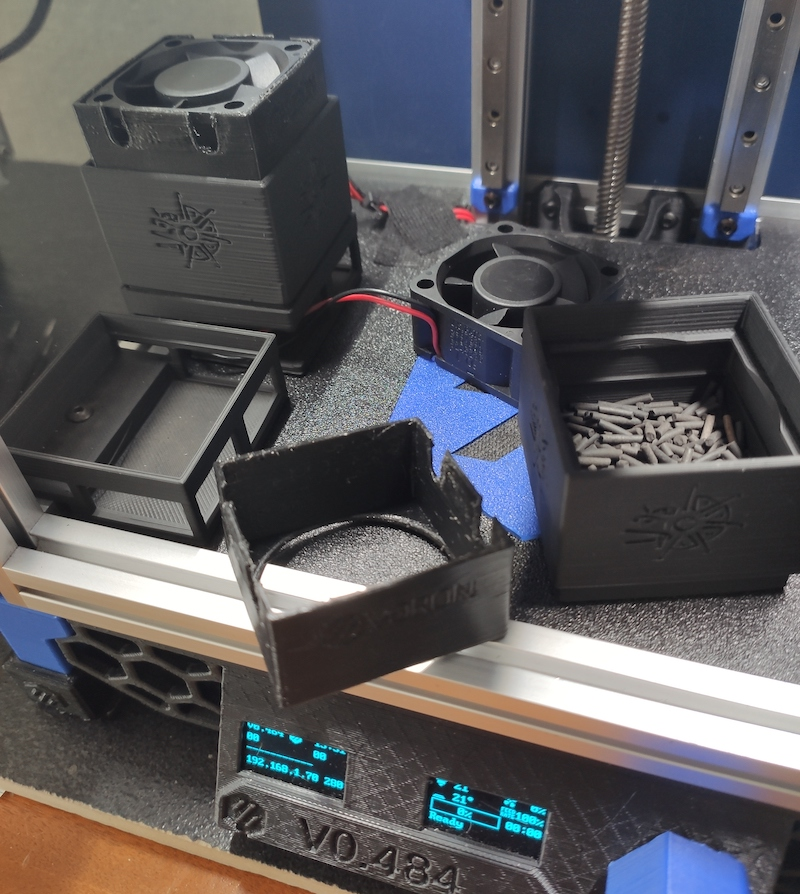
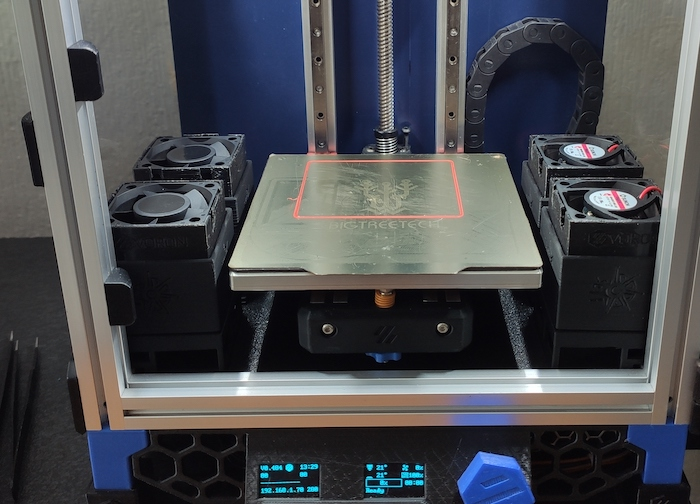

Ehecatl Air Filter
==============================

I like the Nevermore Micro air filter. 
You can look at it here: 
https://github.com/0ndsk4/VoronUsers/tree/0ndsk4/printer_mods/0ndsk4/Nevermore_Air_Filter/Nevermore_Micro

But wanted other features like:
- 40mm axial fan
- No additional hardware needed
- Fast and easy to print in V0

BOM
-------------
- 40x40x10mm or 40x40x20mm Fan
- Active Carbon
- A little piece of air filter material

Instructions
------------
- The middle and fan case stl's are provided with and without logos
- The base stl has supports built in, you can remove them by hand
- Fix the base to the deck panel with double sided tape or M3 screw.
- Prepare the middle filter by cutting and placing a 40mm square of your filter and add small quantity of active carbon you should change it when the filtering effect is lost.
- Insert your fan in its holder(be very careful with the cables), you can orient your fan pushing or pulling air it should work either direction
- I recommend printing the fan holder in TPE or TPU to absorb fan vibration.
- You'll have to figure out your wiring as each build is unique (be aware of your fan voltage)

Images
------

________________________________________________________
--------------------------------------------------------
________________________________________________________
--------------------------------------------------------

________________________________________________________
--------------------------------------------------------
Ehecatl God of Air and Wind
==================================
At the beginning the sun and moon were static in the sky until Ehecatl blew on them.

