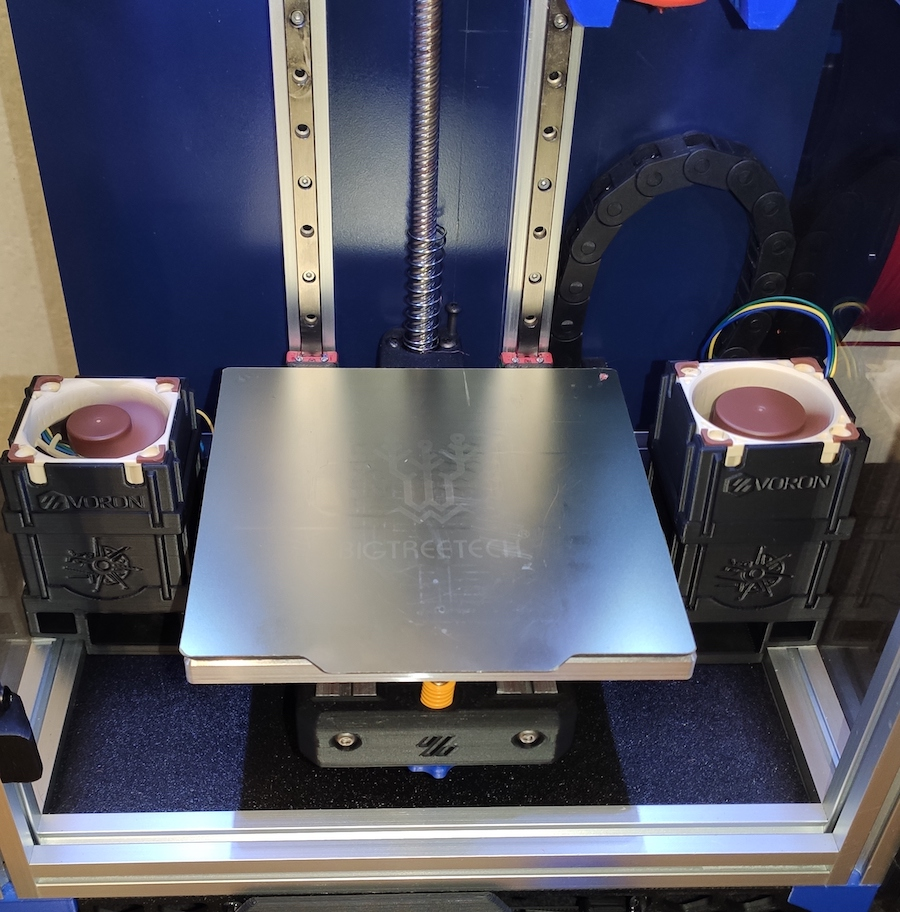
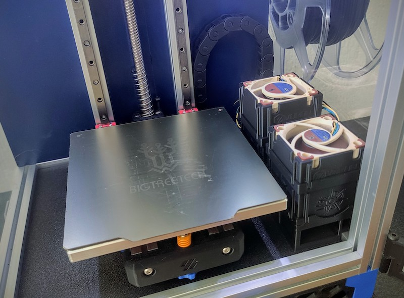
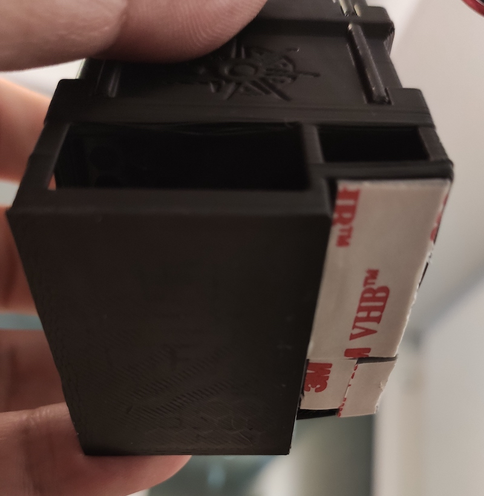
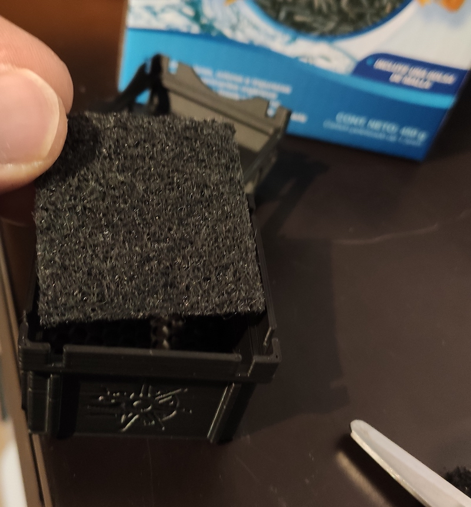
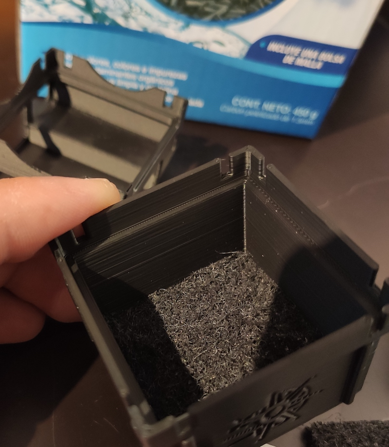
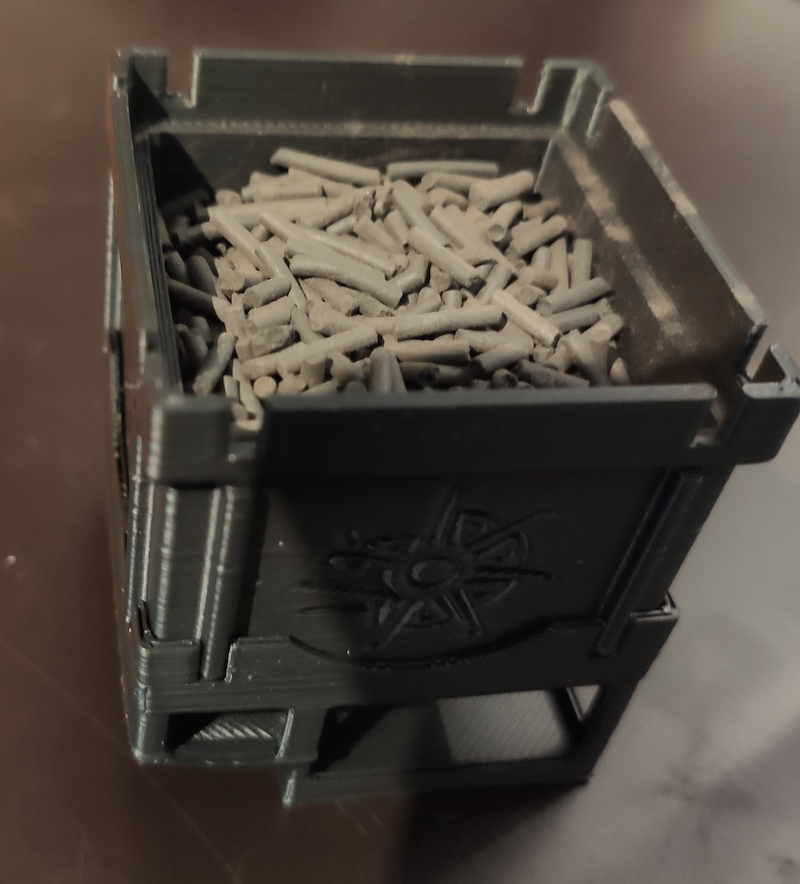
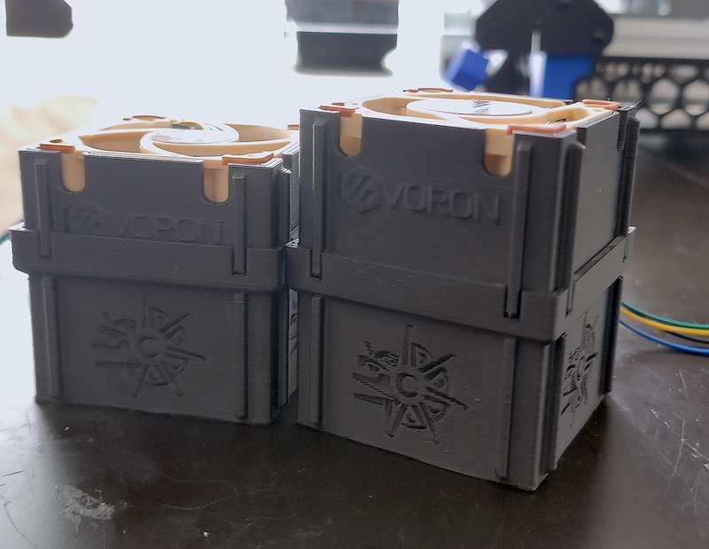
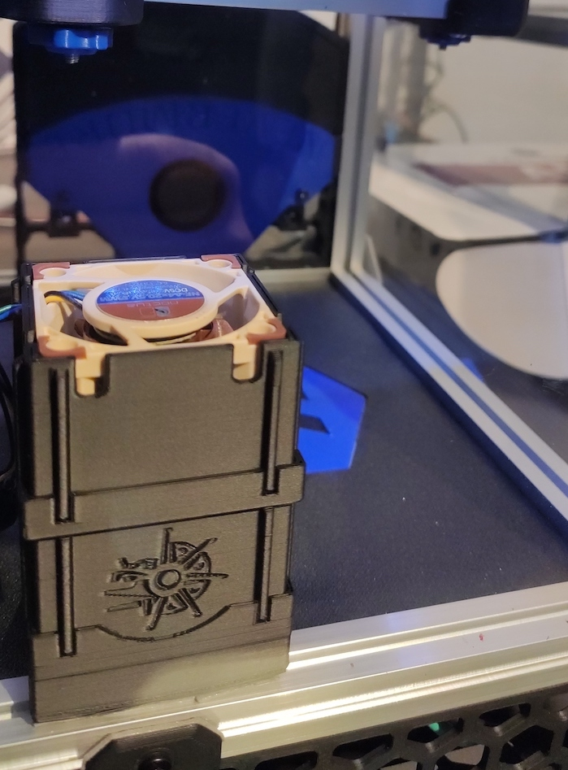

Ehecatl Air Filter
==============================

I like the Nevermore Micro air filter. 
You can look at it here: 
https://github.com/0ndsk4/VoronUsers/tree/0ndsk4/printer_mods/0ndsk4/Nevermore_Air_Filter/Nevermore_Micro

But wanted other features like:
- 40mm axial fan
- No additional hardware needed
- Fast and easy to print in V0

BOM
-------------
- 40x40x10mm or 40x40x20mm Fan
- Activated Carbon
- A little piece of air filter material

Instructions
------------
- The base stl has supports built in
- The middle and fan case stl's are provided with and without logos.
- The walls of the base are very thin try to assemble the thing slow and carefully
- You may crack one or two walls and still be good to go but don't breake the whole thing
- Fix the base to the deck panel with double sided tape or any other way
- Prepare the middle filter by cutting and placing a 40mm square of your filter and add small quantity of activated carbon you should change it when the filtering effect is lost.
- Insert your fan in its holder(be very careful with the cables), you can orient your fan pushing or pulling air it should work either direction (Will test it both ways and update this if I find one way is significant more efficient)
- You'll have to figure out your wiring as each build is unique (be aware of your fan voltage)

Images
------

________________________________________________________
--------------------------------------------------------
________________________________________________________
--------------------------------------------------------

________________________________________________________
--------------------------------------------------------
Ehecatl God of Air and Wind
==================================
At the beginning the sun and moon were static in the sky until Ehecatl blew on them.

