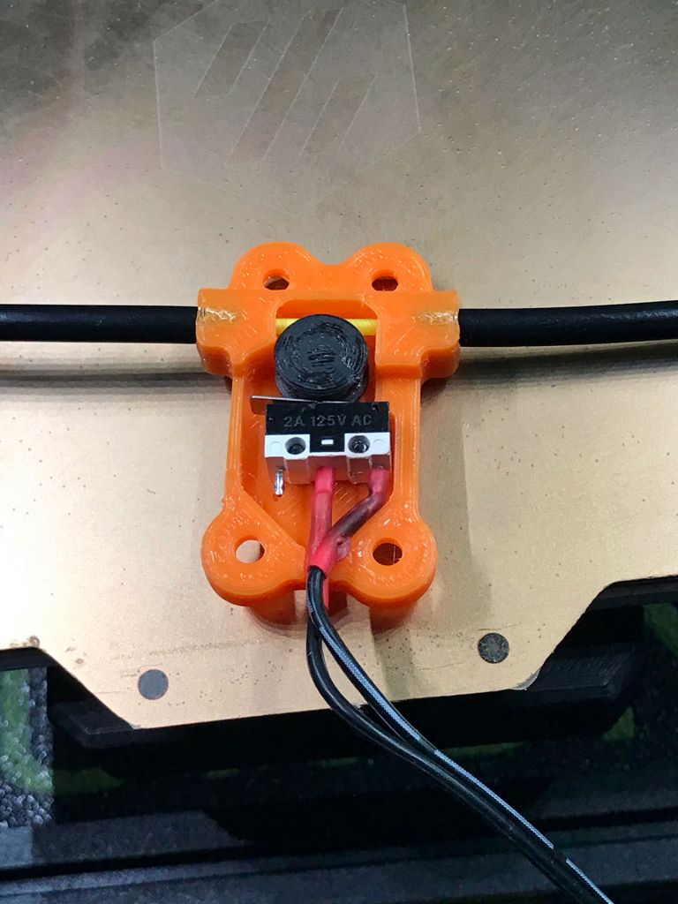

# FilamentDet
Voron themed filament detection.

I fancied making my own simple filament detection module, using spares from my Voron V0 build, and here it is..

BOM

4x M3 Nut

4x M3x6 bolt (SH/BH)

2x M2x10 Self Tapping Screws

1x Omron Mouse Button - Micro Switch

Bowden tube can be inserted to guide the filament in to the module, you might need to fettle this, as it maybe a bit tight and restrict the filament movement.
There should be very little friction if all goes well. 

The module works in either direction, it should be mounted away from the extrusion motor, as klipper buffers commands, so the further from the motor the better.

I printed with 0.4mm nozzle 0.2mm layer height, no supports need.

Print one of each STL.

