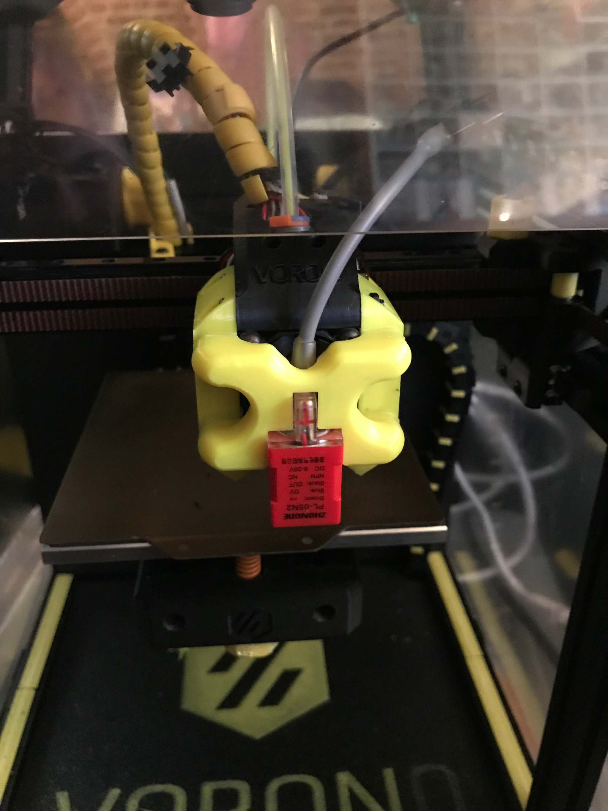

Mount for PL05N2 Sensor.

Designed for this model, but others may fit. https://www.aliexpress.com/item/32805983692.html

Print 1 of each STL.

Requires 8 x 6mmx3mm Round Neodymium Magnets.

This is designed for temporary installation to level bed and build bedmesh.

