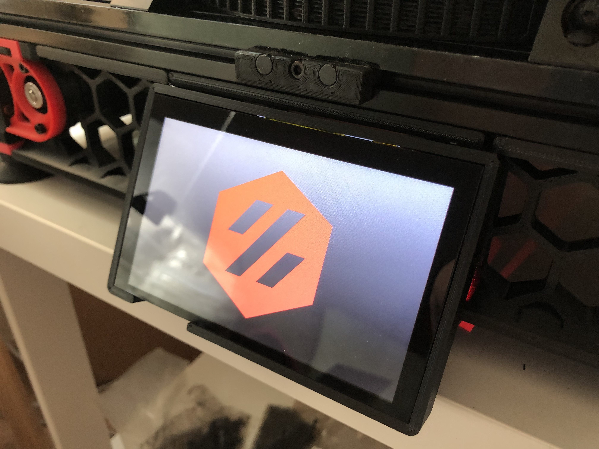
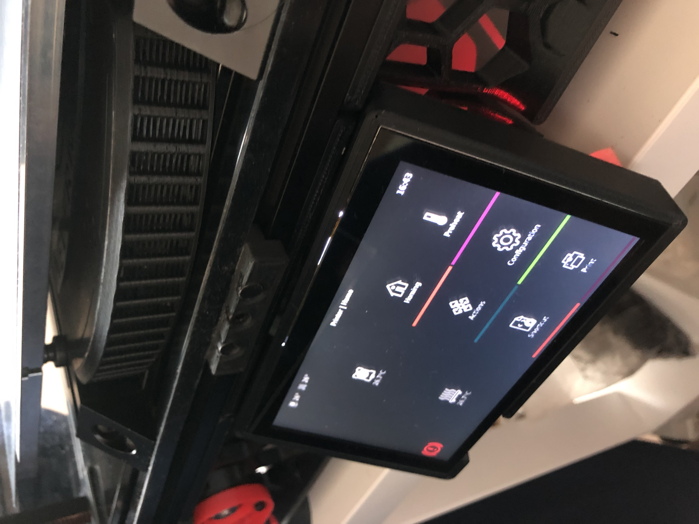
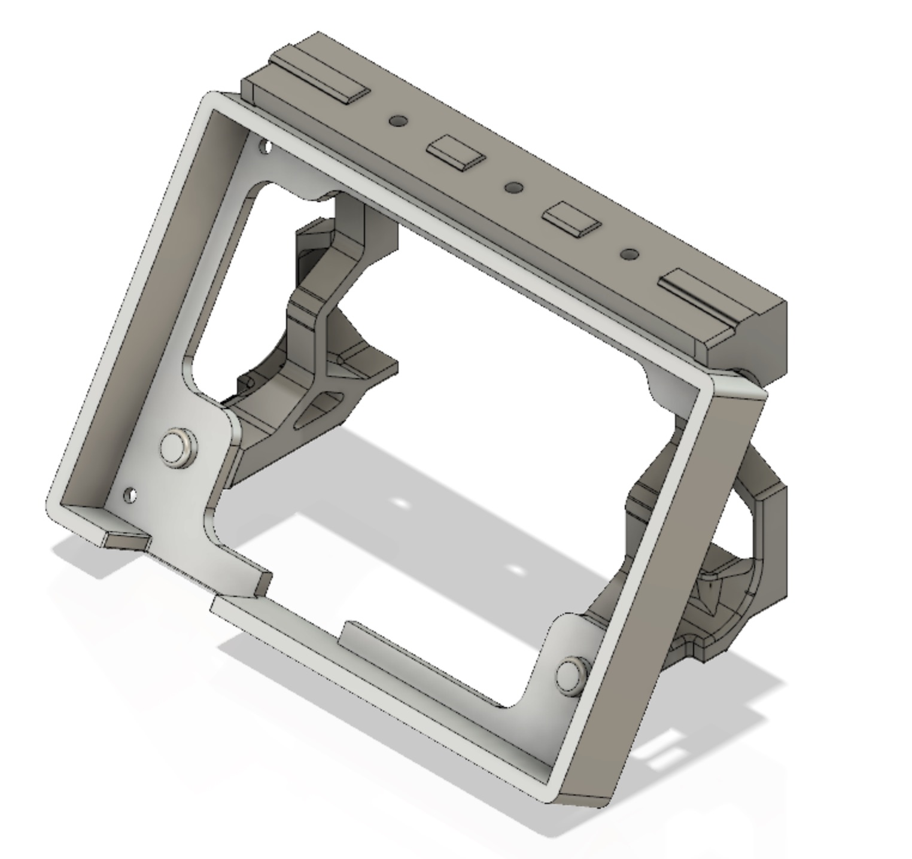

# BTT PITFT50 v2 Mount

This work is based on [sttts's Waveshare 5.5inch mount](../../sttts/Waveshare-5.5-inch-HDMI-AMOLED). BTT PITFT50 v2 has a different layout than v1, featuing a brightless thumbwheel, an orientation switch and a JST XH port for unknown function. This design provide accessibility to the thumbwheel and switch.

## BOM

- 4x M3x6mm
- 4x M2.5x4mm (included in the BTT PITFT50 v2)
- 500mm ~ 600mm Ribbon Flat Cable for Raspberry Pi Camera (depends on the position of the Raspberry Pi. The included one is too short)

## Print Settings

Standard Voron recommended print settings
