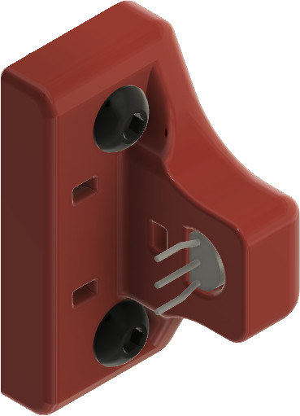
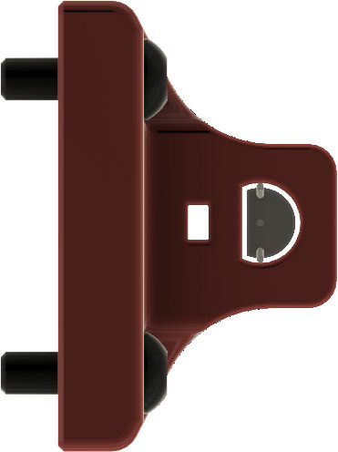
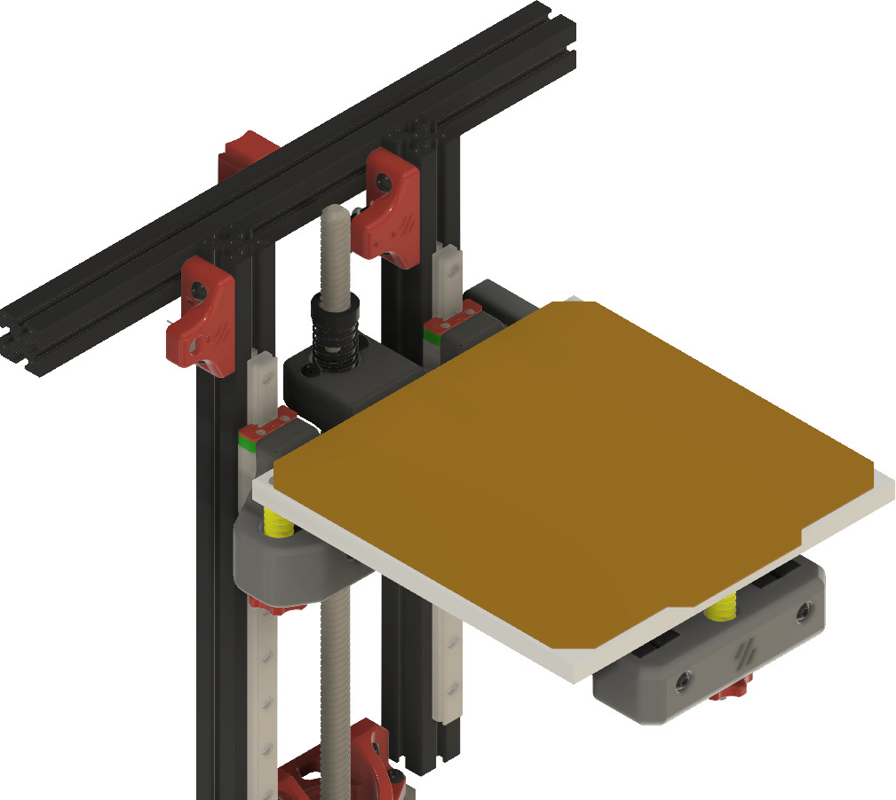
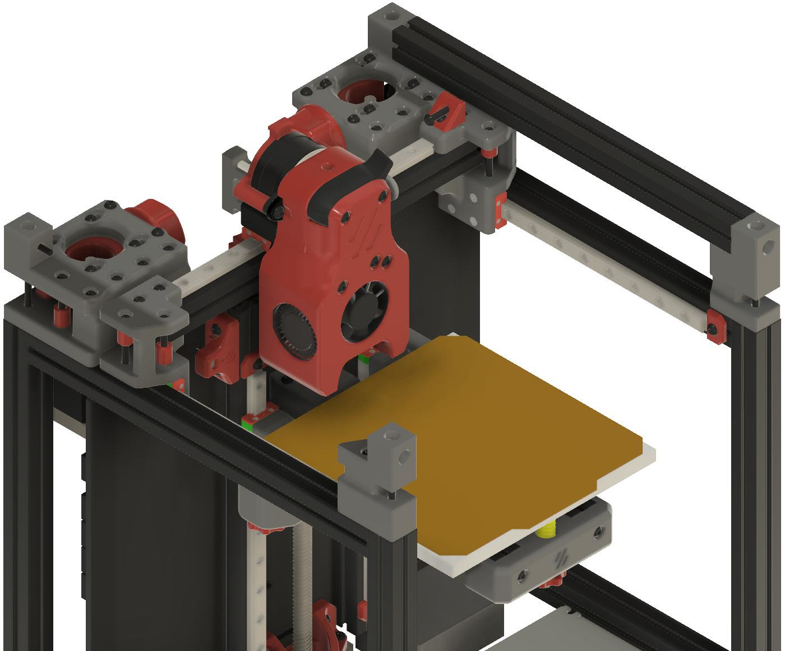
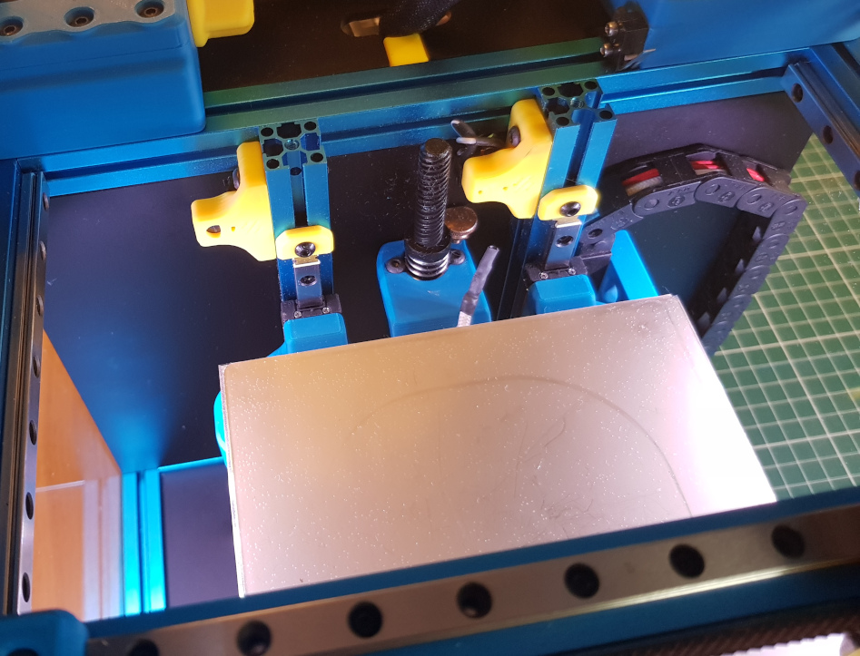
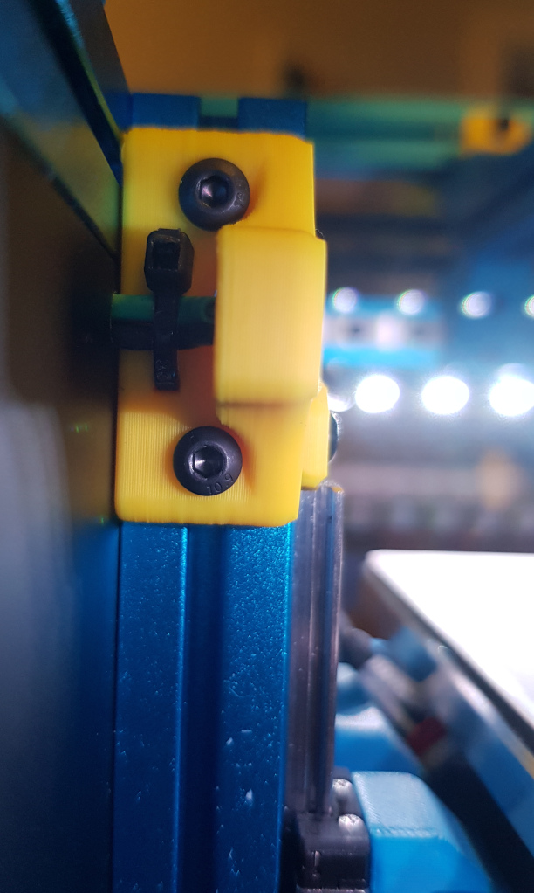
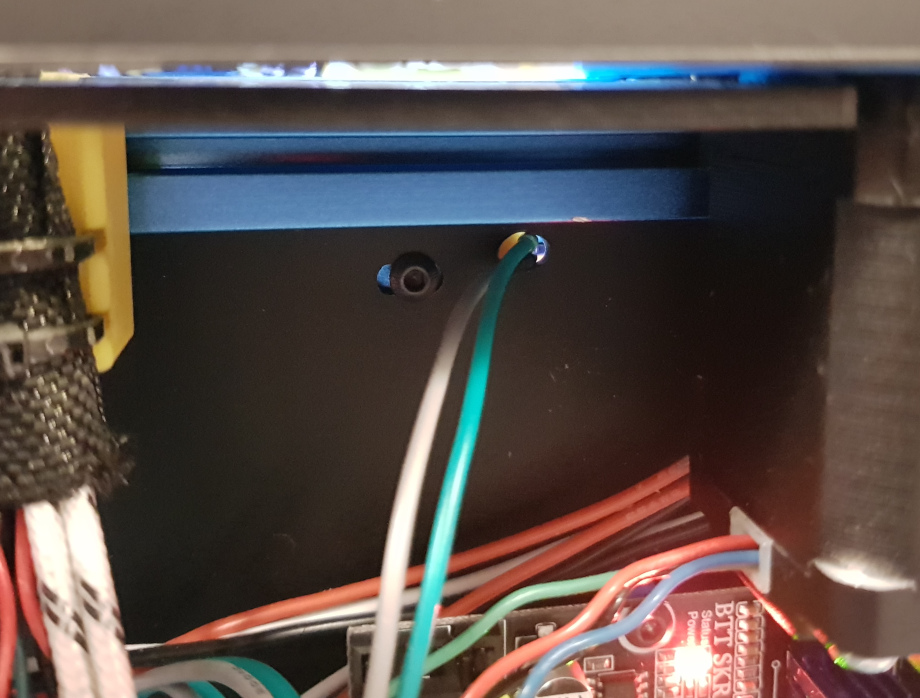
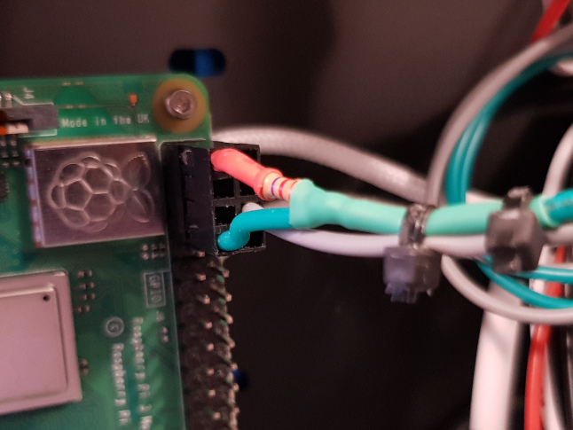

DS18B20 Mount
=============

Simple DS18B20 temperature sensor mount based on the z endstop mount.

BOM
---
- 1x DS18B20 / DS18B20-PAR
- 1x 4.7kohm resistor
- 2x M3x10 BHCS
- 2x M3 nuts
- 1x zip tie

Instructions
------------
- Drill hole in rear panel for wires
- Solder/connect sensor, wires, resistor and 4x2 dupont connector
- Position sensor in hole
- Bend sensor leads and secure with zip ties
- Secure mount in place similarly to z endstop mount
- Setup Raspberry PI for 1 wire (see https://www.circuitbasics.com/raspberry-pi-ds18b20-temperature-sensor-tutorial/ for a good tutorial)
- Setup sensor in Klipper
```
[temperature_sensor chamber]
sensor_type: DS18B20
serial_no: <insert serial no here>
sensor_mcu: rpi
```

Note: you can also position the mount on the inner side of the z axis rails which looks better, but also potentially block access to the z axis for later maintenance.

Images
------





Example setup using a DS18B20-PAR:




