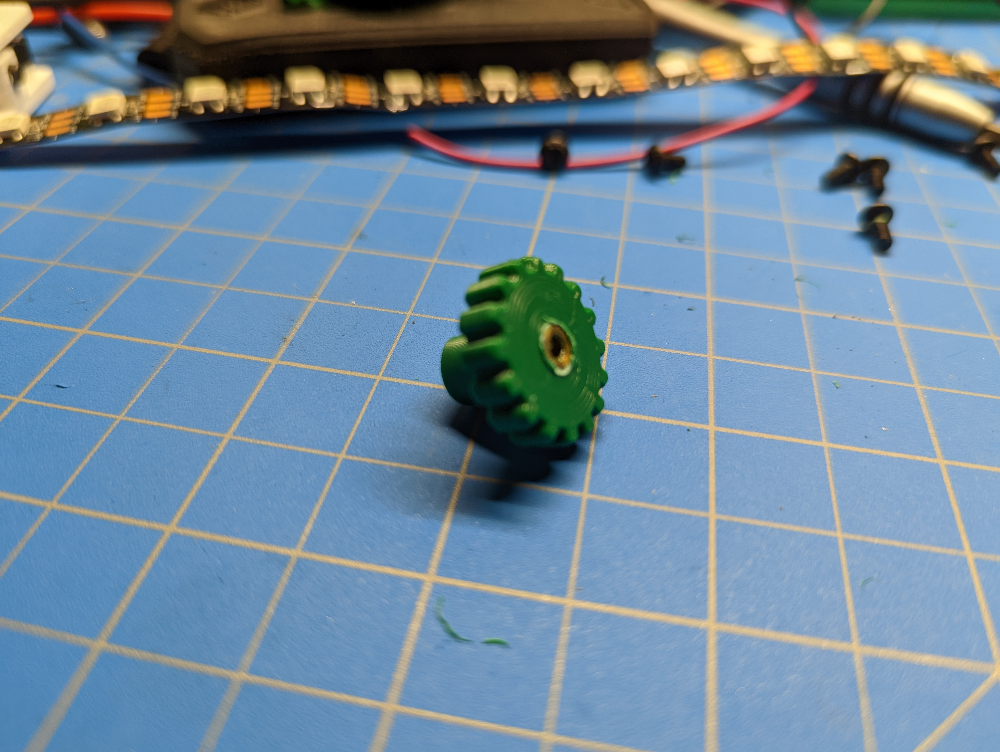
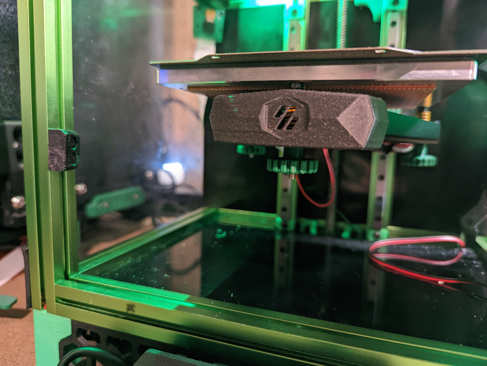

# Longer Thumb Nuts for Voron V0

After installing a Kirigami mount for my V0 bed, I found that the stock thumb nuts were
too short, which made them very hard to adjust. I have also never been particularly fond
of the shape of them and found them uncomfortable to adjust.

## Usage

1. Print it, the standard Voron settings worked fine for me.
1. Install 3mm heat set inserts to the bottom of the thumb nut (so that the tension will pull the heat set insert into the part, not out of it)
1. Replace your stock thumb nuts
1. Redo your bed leveling
