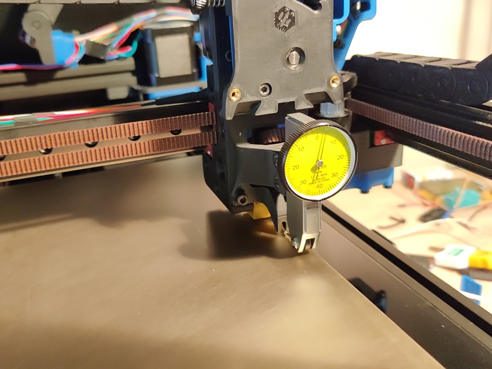
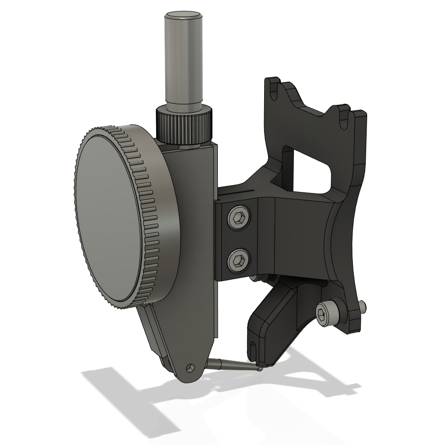

Dial test indicator mount for Afterburner
=========================================

This replaces the Afterburner toolhead with a dovetail mount for a dial test
indicator (such as a Mitutoyo 513-404, which this was modelled on). The
indicator point is ideally located at the same position as the nozzle (the
precise Y position may vary depending on the length of the tip). There is a
protrusion where the nozzle would be located, so that Z homing can be done
normally as though a nozzle were present.

This can be used, for instance, to verify whether a mesh reflects the true
form of the bed surface: sweeping the bed with the mesh enabled would ideally
show no movement on the indicator.

Required hardware
-----------------

- M3x8 SHCS (4x)
- M3 hex nut (2x)

Images
------

