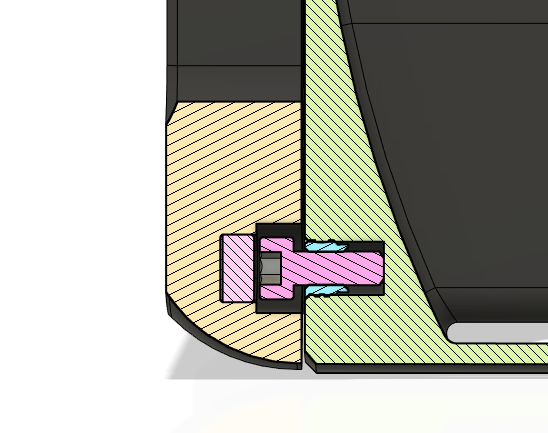
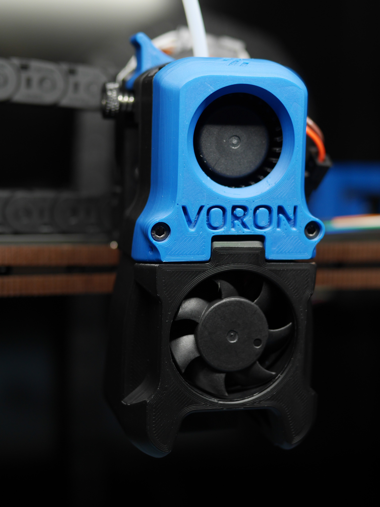
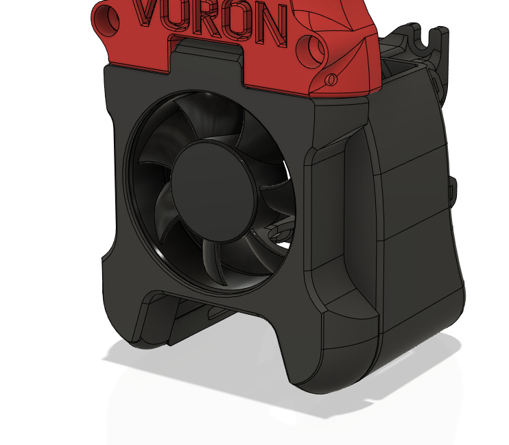
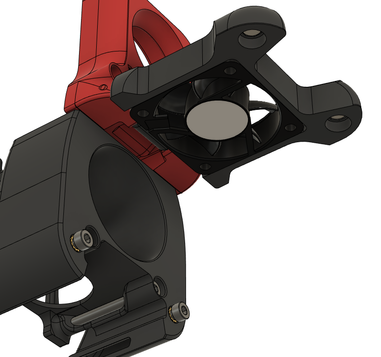

Magnetic hotend fan cover for Afterburner
=========================================

This replaces the screw-mounted hotend fan cover with one that is held
by magnets, for a clean front face and easier access to the toolhead. Works
with an unmodified toolhead.

Inspired by ModCables101's magnet mod.

Required hardware
-----------------

- 6x3mm round magnet (2x)
- M3x8 SHCS — steel, not stainless (2x)

Instructions
------------

Press the magnets into the new cover. Screw the M3x8 screws into the toolhead
until they bottom out; the heads should protrude 4mm from the surface.

Images
------

