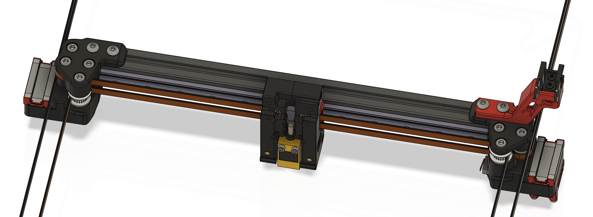
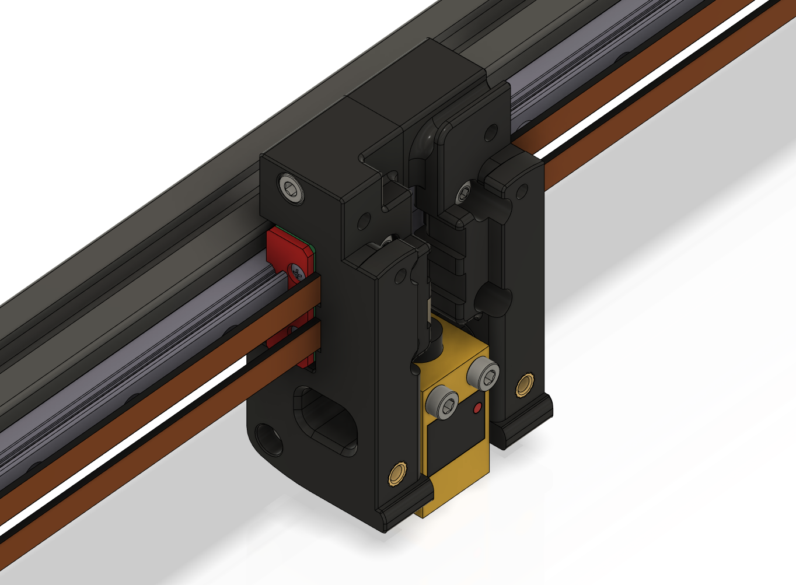
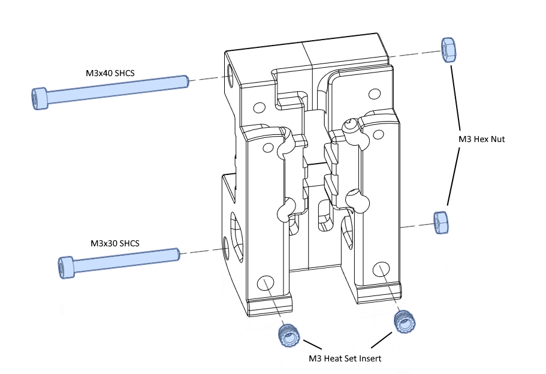
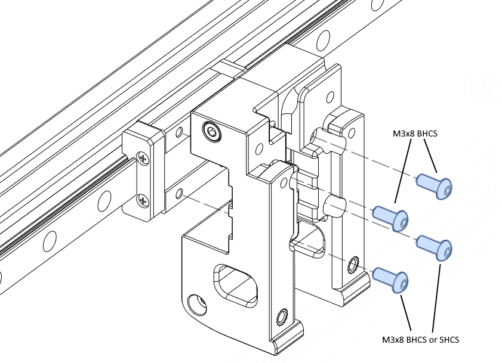
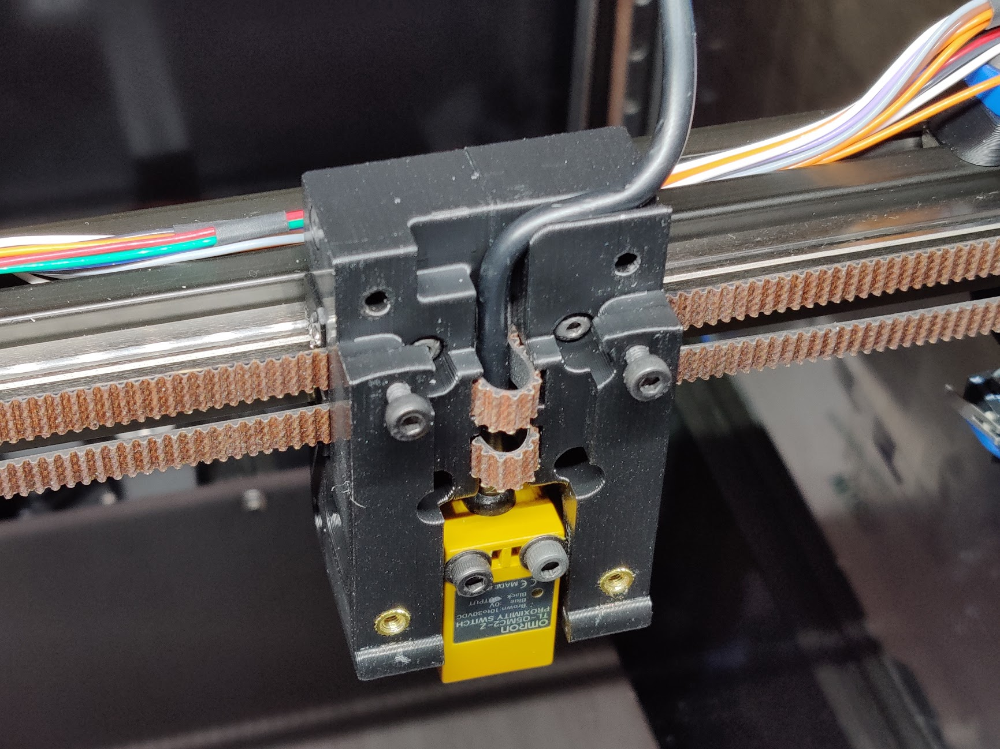

MGN12 X axis
============

This replaces the dual MGN9H rails on the V2.4 X axis with a single MGN12H
rail.  The belt is directly clamped to the MGN12 block by the carriage.

The stock PL-08N probe _might_ be too long to fit.  Recommended alternatives
are listed below.

As an option, the `x_carriage_frame_right_endstop.stl` allows mounting
the X endstop switch on the carriage, which is useful on an umbilical cable
setup.

Thanks to joshmurrah, hartk, and everyone else who helped out in one way or
another.

Required hardware
-----------------

In addition to things you can reuse from the stock build, these items are
required:
- 1x MGN12 linear rail with MGN12H carriage (same length as the original MGN9
  rails)
- 1x M3x40 SHCS
- 4x M3x8 __BHCS__ (or 2x BHCS and 2x SHCS)

Recommended probes:
- Omron TL-Q5MC2 (use M3x25 or M3x30 screws)
- Panasonic GL-18HB/18HLB (use M3x25 or M3x30 screws)
- Panasonic GX-H15B/HL15B (use the 9mm probe bracket, and M3x16 or M3x20 screws)

Instructions
------------

Assembly is similar to stock V2.4, see the assembly images below.

The belts are clamped between the carriage and the MGN12H block.  This
procedure worked for me:
1. Loosely fasten the carriage to the MGN12H block using the M3x8 screws.
2. Push the belts in on the left side, until they are just visible in the
   middle.  Tighten the screws on the left side a little bit, to secure the
   belt ends.
3. Push the belts in on the right side as far as you can, and pull them out
   through the middle.
4. Tighten all screws, while making sure that all belts are firmly held in the
   clamp teeth.
5. You may wrap the extra length of belt around the probe cable, as in the
   photo below.

Please check the Z endstop position after assembly as it may have changed
slightly.

Images
------

Changelog
---------

### 2021-07-26
- Fixed magnet position for Hall effect endstop. Both halves need to be
  reprinted.

### 2021-03-28
- Added option for mounting X endstop on the carriage.
- Updated readme to note that stock PL-08N probes _might_ fit.

### 2021-03-21
- Initial release
