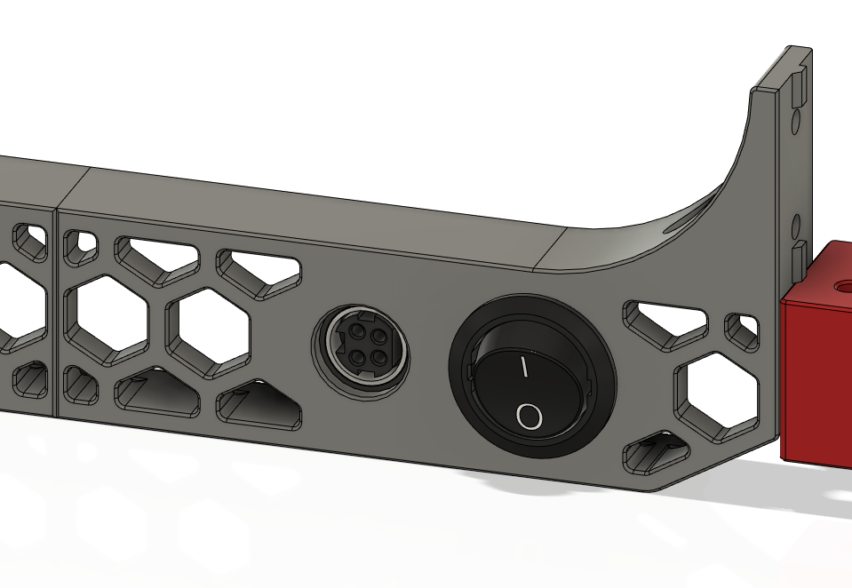
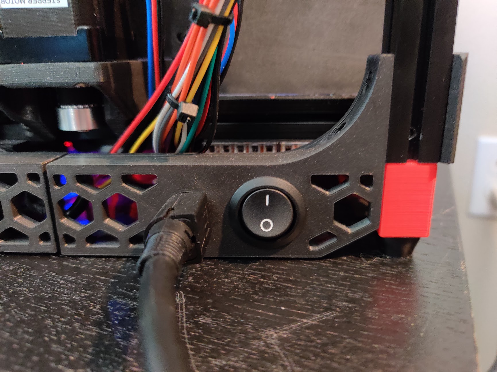
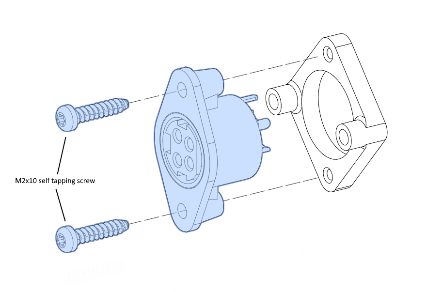
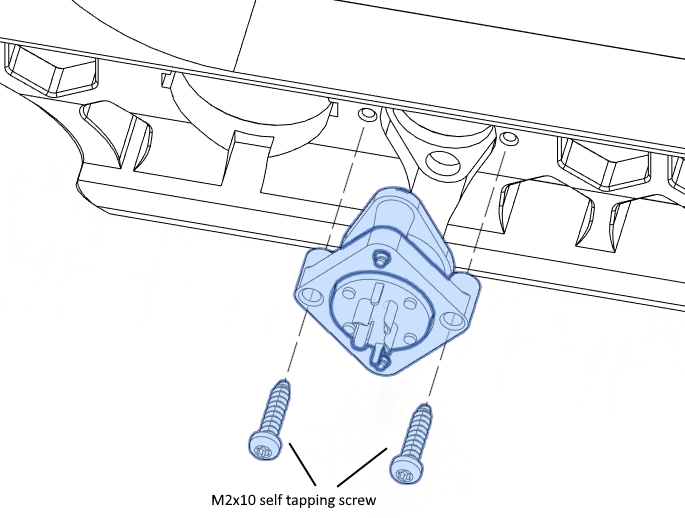
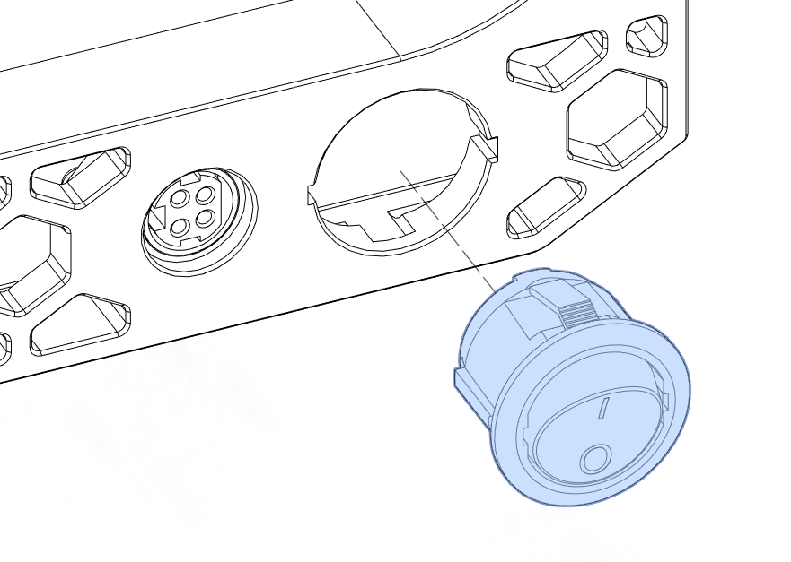
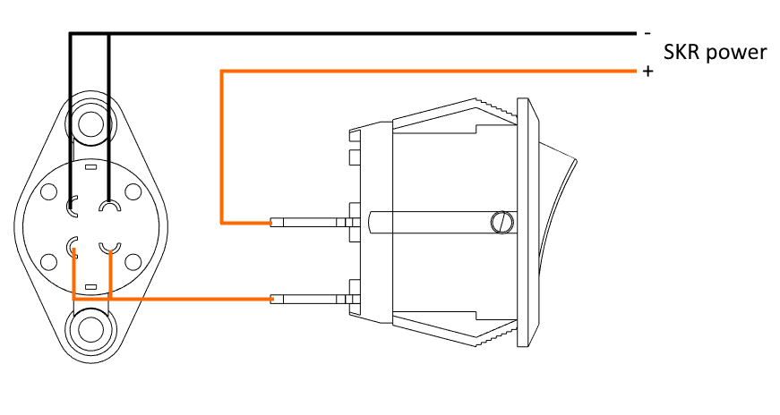

Voron 0 DC inlet
============

Adds a skirt-mounted inlet and switch for an external DC power supply, to
allow using a DC bed.  Options are provided for rear or side mounting.

BOM
---

- Kycon KPJX-PM-4S connector
  [(Digi-Key)](https://www.digikey.com/en/products/detail/kycon-inc/KPJX-PM-4S/9990081)
- Mean Well GST160A24-R7B power supply
  [(Digi-Key)](https://www.digikey.com/en/products/detail/mean-well-usa-inc/GST160A24-R7B/7703602)
- Power switch, 20mm round, rated for at least 7A at 24VDC [(Digi-Key)](https://www.digikey.com/en/products/detail/w-rth-elektronik/471002268142/9950821)
- 2x quick disconnect terminal for power switch [(Digi-Key)](https://www.digikey.com/en/products/detail/te-connectivity-amp-connectors/2-520194-2/289254)
- 24V 60W bed heater
  [(Keenovo)](https://keenovo.store/collections/standard-keenovo-silicone-heaters/products/keenovo-square-silicone-heater-3d-printer-build-plate-heatbed-heating-pad?variant=33194097803404)
- 4x M2x10 self tapping screw
- (For rear skirt only) 4x M3x6 BHCS + 4x M3 hex nut

With a 24V bed the SSR is not used, and the bed heater is directly connected
to the bed heater output on the controller.  I suggest using a SKR Mini E3
V2.0, which can control 2 heaters and 2 fans (unlike V1.2, which has only 3
controllable outputs).

Instructions
------------

For rear mounting, print both `skirt_rear` files and `inlet_bracket.stl`.
Mirror the skirt pieces if you want the inlet on the right side.  Each piece
mounts to the rear vertical extrusions with two M3x6 screws.  The rear deck
panel must be removed.  Temporarily remove the rear panel and rear feet to
access the extrusion slots.

For side mounting, print `skirt_side_with_inlet.stl` and `inlet_bracket.stl`.
It replaces an existing skirt piece; mirror it in your slicer if desired.

Inlet and switch mounting steps are shown below.  It is suggested to solder
wires to the inlet before assembly.  Pay particular attention to the order of
the inlet pins, and confirm with a multimeter.

Images
------

