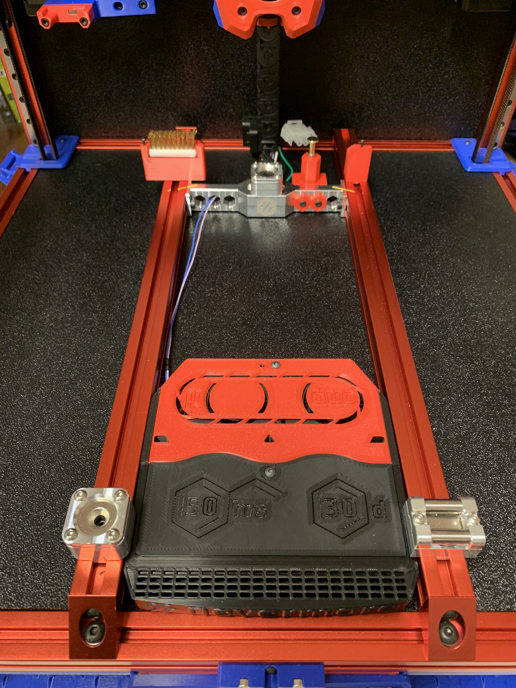
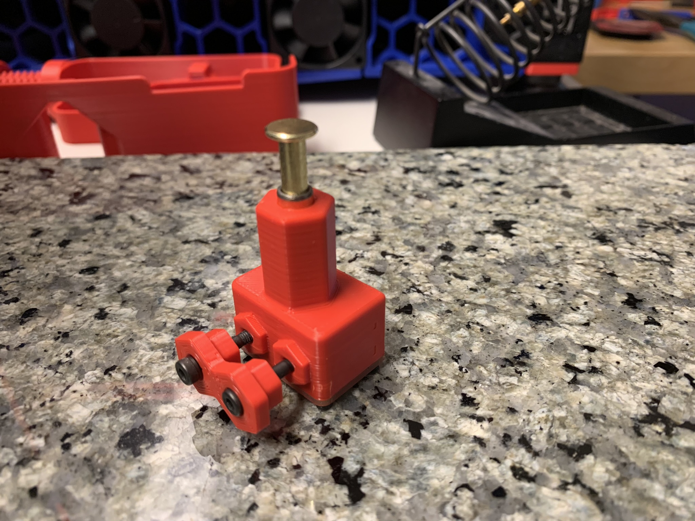
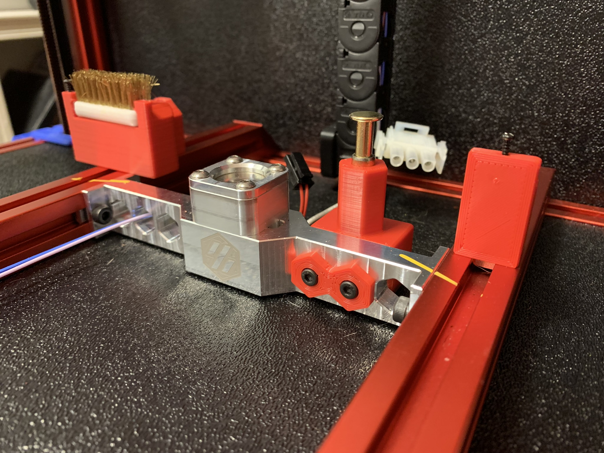
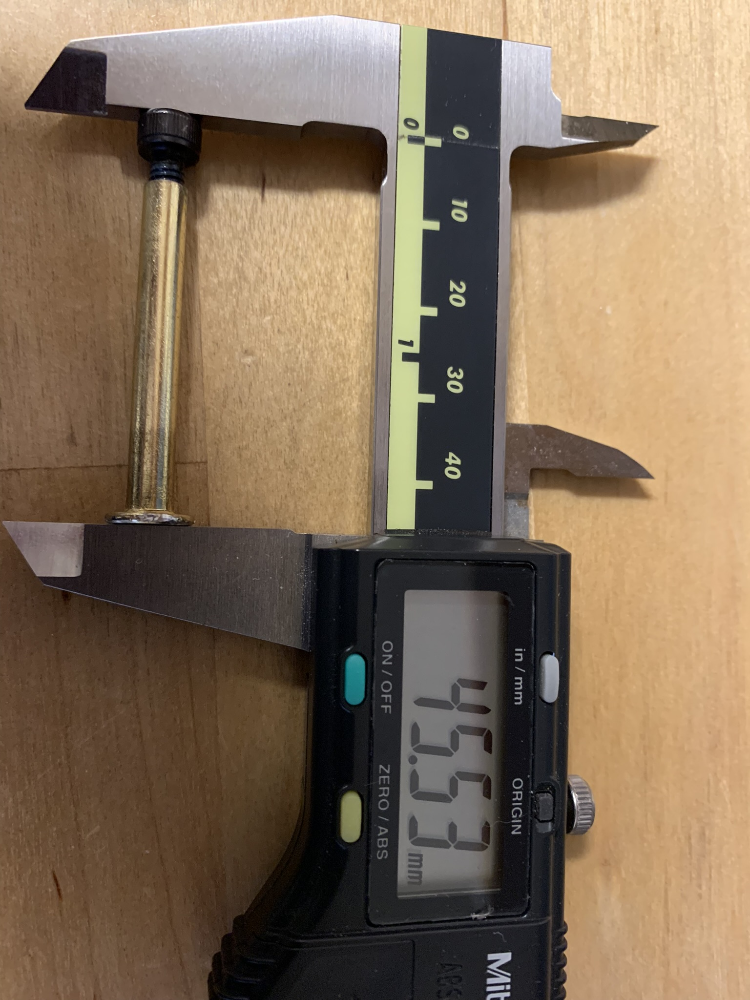
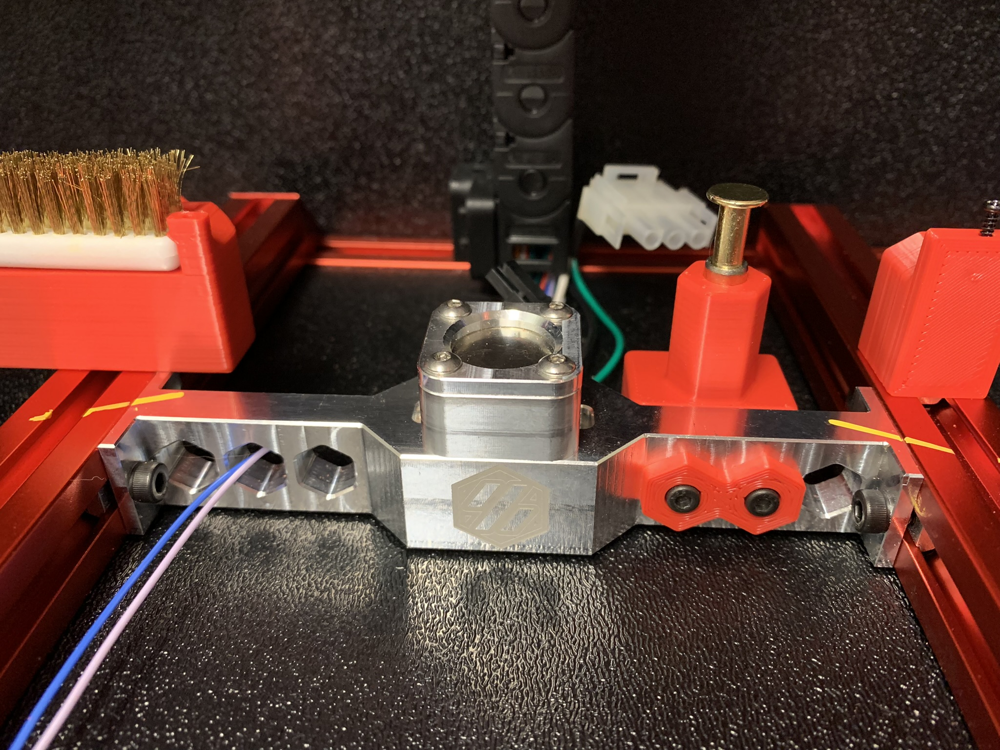

# MRW Adapted SexBolt Z endstop 

The [standard method](https://cdn.shopify.com/s/files/1/0608/5135/5901/files/My_observation_of_Mandala_Rose_Works_Voron_pre-production-kinematics.pdf?v=1639838120) of mounting a Mandala Rose Works [Kinematic Bed Mount](https://mandalaroseworks.com/products/matched-height-kinematic-kit?variant=42044335685885) to a 2.4 places a single center mount at the front of the bed.  This placement interferes with a front under-bed mounted [Nevermore Micro V5](https://github.com/nevermore3d/Nevermore_Micro) carbon filter.

An alternative arrangement places the two rail bed mounts at the front and the [Kinematic Center Brace](https://mandalaroseworks.com/products/kinematic-center-brace-for-voron-2-4?variant=42450938233085)
at the rear.  This maintains front access to the Nevermore filter.

Hartk1213's Sexbolt mod is too short for the additional height of the kinematic bed mounts (approx 17mm higher).  The extrusion mounting location would also interfere with the center brace.  This mod lengthens the sexbolt body, moves the mounting location to the center brace, and adds hex nubs to index the body to the center brace.

##

### BOM
#### From the base Sexbolt kit
|Size|Qty|Link|
|---|---|---|			
|M2x8 Self Tapping|4|[Amazon - M2x8 SHCS Self Tapping](https://www.amazon.com/dp/B00YBMRAH4)|		
|Z endstop PCB | 1 | [Formosissima - Z endstop PCB](https://deepfriedhero.in/products/z-endstop-pcb-for-voron-v2-4)|

#### Parts needed for the lengthened sexbolt
|Size|Qty|Link|
|---|---|---|			
|M5x8 SHCS|1|[Bolt Depot - M5x8 SHCS](https://www.boltdepot.com/Product-Details.aspx?product=6518)|
|M5x40mm Binding Screw|1|[Amazon - Binding Screw](https://www.amazon.com/dp/B07GSQGZQX)|
|5x7x8 Sleeve Bearing|3|[Amazon - Sleeve Bearing](https://www.amazon.com/dp/B07JLVRYKT)|
|M3x30 SHCS|2|[Bolt Depot - M3x3 SHCS](https://www.boltdepot.com/Product-Details.aspx?product=6518)|
|M3x5x4 Heatset Insert|2||

##

Assemble the sexbolt kit as usual, with an additional sleeve bearing and the replacement M5x8 bolt and longer M5x40mm Binding Screw.  The assembled lenth of binding screw and M5 bolt was 45.5mm.

Add heatset inserts to the back of the body.  Secure the sexbolt body to the MRW center brace with the hex backer and two M3x30 SHCS screws.  The bed to endstop gap can be adjusted by moving the center brace front to rear.

## Credits
This mod was derived from the [Sexbolt Mod](https://github.com/VoronDesign/VoronUsers/tree/master/printer_mods/hartk1213/Voron2.4_SexBolt_ZEndstop) by hartk and a mounting location concept from Discord user silicide. 

