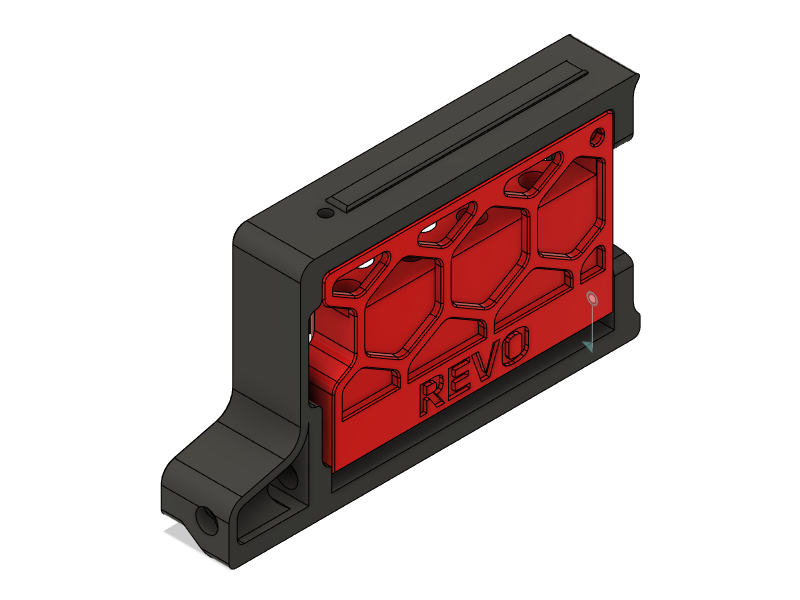
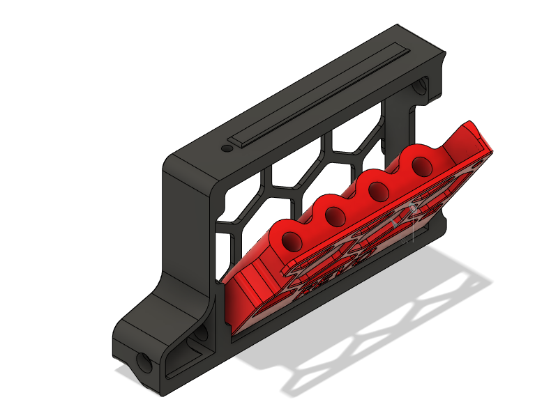
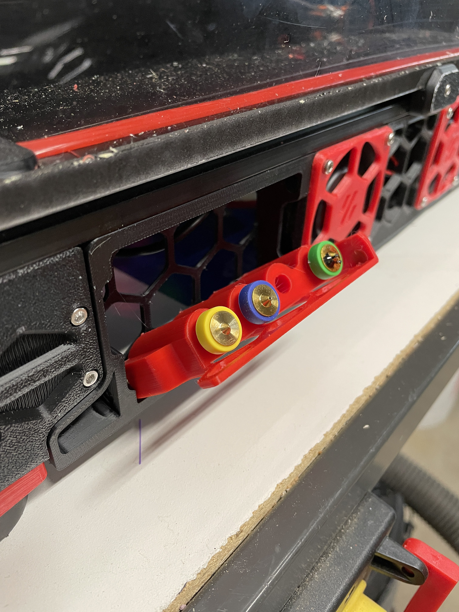
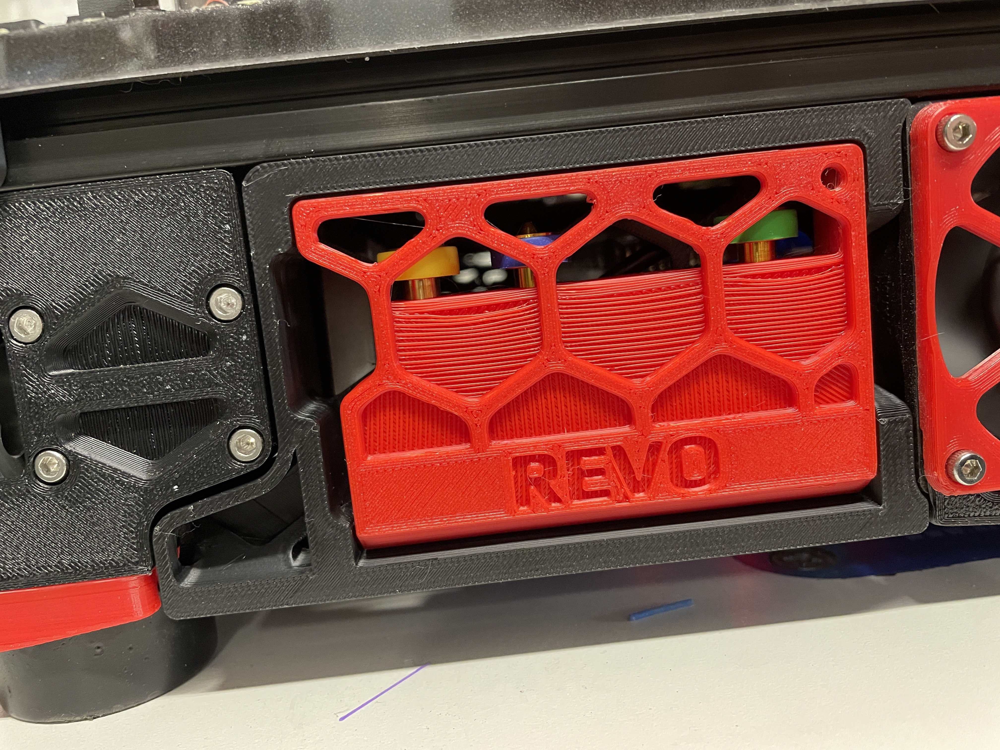

# Revo Nozzle Holder v2.4 350mm
Remix of [Andre's](../../Andre/Revo_Nozzle_Skirt_Trident) skirt-mounted nozzle holder to fit Voron 2.4 350mm printers, the BOM and installation steps are the same.

This will fit up to 4 nozzles, and uses the '300mm' part from Andre's design, unmodified (even though this uses the 300mm part from the Trident, it will only fit the 350mm v2 due to differences in skirt design).

# Bill Of Materials

- 2x 6mm x 3mm Round Magnet
- 2x M3 Heat-set insert
- 2x M3x8 BHCS (SHCS will work as well)

# Instructions

- Print skirt and nozzle holder parts (the skirt piece will be placed in the right-front position of the printer).
- Install the 2 heat-set inserts into the ends of nozzle-holder part.
- Install 1 magnet in the skirt, and 1 in the nozzle-holder such that they attract each other when the door is installed.
- Insert the nozzle holder into the skirt and fasten with 2 M3x8 BHCS
- Remove the stock skirt piece from your v2.4 and install the new one in its place (Note, you will likely need an angled hex driver or ball-end driver to install the skirt bolt with the nozzle tray installed).
