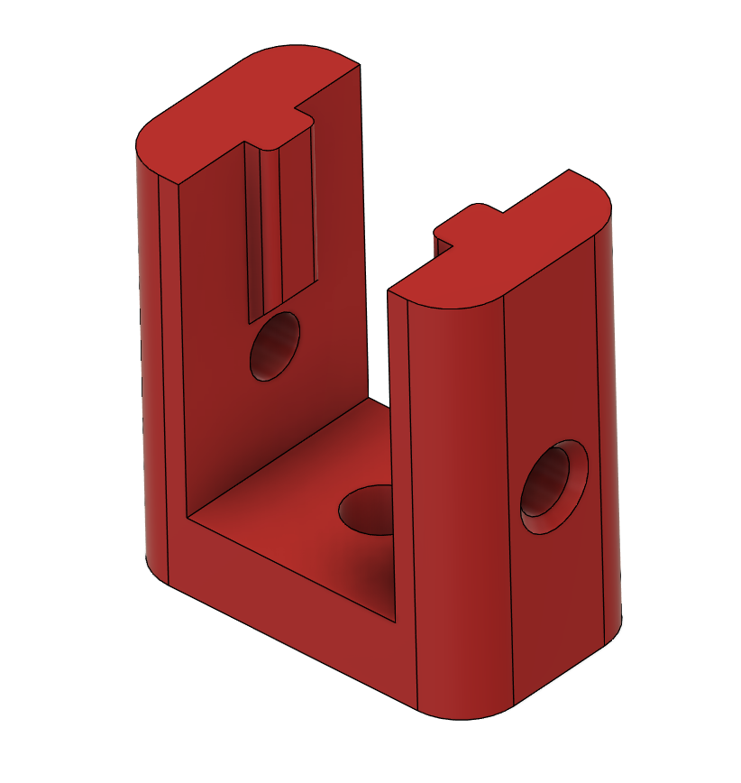

Small jig to drill the blind holes in your 2020 extrusions.

Secure it with a bolt on the top, M5 for most extrusions, M6 for Type-B (Bosch) extrusions.
Most extrusions need the 6mm files, unless you also print the 5mm files for your Voron, then pick that one.

