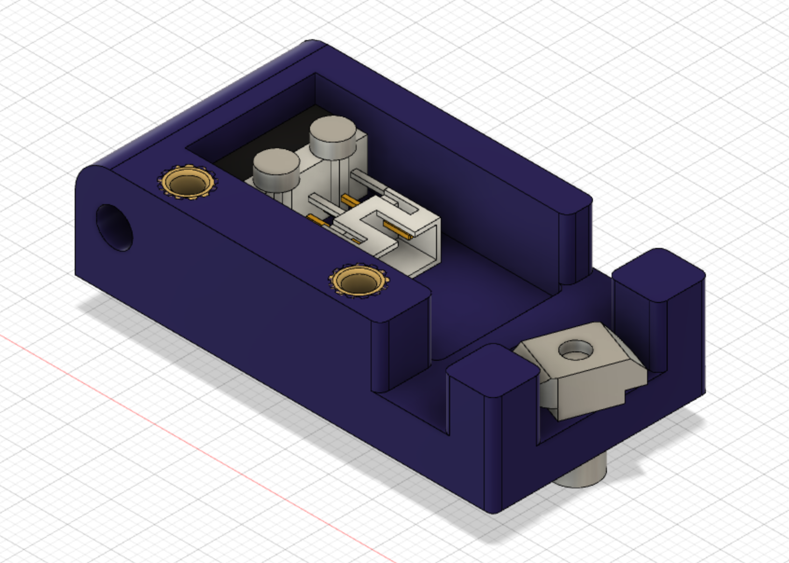
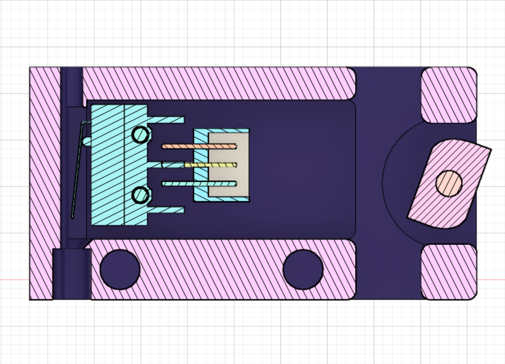
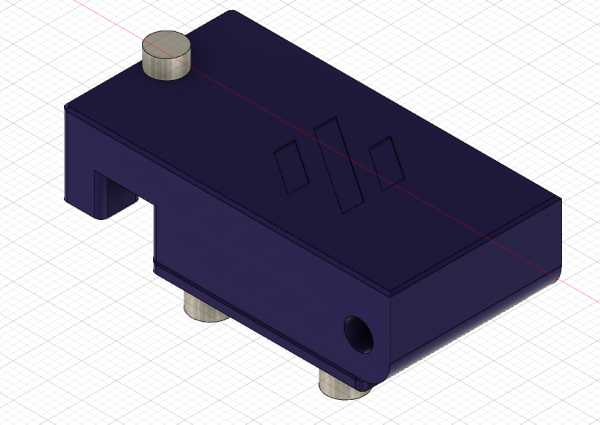

# Filament Runout Sensor

This mod replaces the stock bowden retainer with one of a similar profile that hides a runout sensor inside. 

## BOM
   | Material | Quantity |
   |----------|----------|
   | KW10 Microswitch | 1 |
   | M2x8 SHCS | 2 |
   | M3x8 SHCS | 3 |
   | M3 Threaded Inserts | 2 |
   | M3 Hammerhead T Nut | 1 |
   | JST 2 OR 3 Pin Housings | 1 | 
   | JST Contacts | 2 |
   | Glue (CA or Hot) | | 
   | Solder | |   
 
   
### Note: 

The KW10 microswitch can likely be swapped out for an Omron D2F-5L switch or other equivalents but this hasn't been tested. 

Optionally, wires could be soldered directly to the microswitch negating the need for the JST terminal. 

Also two of the M3x8 and the threaded inserts are not required if you do not want to fit a cover over the switch.  
 

## Assembly

Choose the appropriate housing for your printer, either left or right hand (LH or RH) depending on which side you run the reverse bowden to. Print using standard Voron print settings. 

If you want to use the housing cover use a soldering iron to insert the threaded inserts into the locations as shown above. 

Insert the switch into the housing with the lever opening facing the wider of the openings on the housing sides. Use the M2x8 to fix it in place. The switch should have clearance to fully open inside. 

Place the JST terminal inside close to the switch and affixing with glue, bridge the the terminals of the switch and JST with solder in the NO position. 

Create a cable to connect the switch to your controller board. 

Fit the cover and attach the sensor to your printer using the M3x8 SHCS and the Hammerhead T Nut. 

Insert the reverse bowden into the opening on the housing. 

 
 

## Klipper Configuration

Add the file 'filament_runout.cfg' to your config directory via your GUI and add the line ``[include filament_runout.cfg]`` into your 'printer.cfg' file. 
This configuration assumes the use of dual SKR1.3, you may need to change the pin called out by ``switch_pin:`` depending on your setup. 

If you do not have a M600 macro configured for klipper, change the line ``pause_on_runout:`` to ``true`` and remove the ``runout_gcode:`` section.
