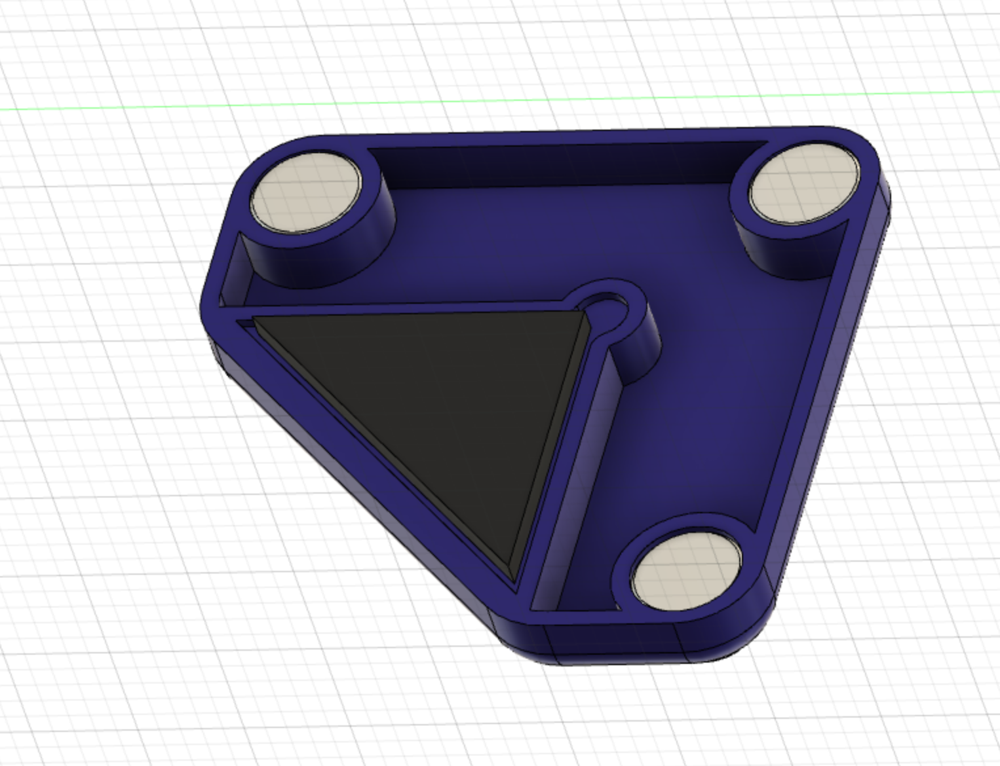

# Magnetic Panels

This mod allows for the easy removal of the panels on a V2, ideal for switching between ABS and PLA printing. This mod assumes a panel depth of 6mm, either from a 6mm panel or a 3mm panel + 3mm foam tape. It will not hold the panels against the frame without this thickness. 

## BOM (for top and side panels)

   | Material | Quantity |
   |----------|----------|
   | 6x3 Magnets | 72 |
   | M3x8 SHCS | 24 |
   | M3 Roll In or Hammerhead T Nuts | 24|
   | VHB Tape | |   
  
  
To reduce the number of magnets required, it is possible to install just two or even one per printed part. This has not been tested and the hold strength unknown.

### Assembly

#### Mount Assembly 

Pressfit the magnets into the housing. Use the M3x8 SHCS and T Nuts to secure mounts to the frame. 

It is easiest to install using the regular panel clips to hold the panel in position, this allows the mounts to be positioned with some clearance to the panel allowing smoother attachment of the system following installation. To make full use of this added convenience, fully complete installation of a single clip before repeating the procedure for the remainder on each panel.  
 

#### Cap Assembly

Pressfit the magnets into the housing ensuring the poles are aligned between the mount and cap. Apply the triangular section of VHB tape and with the panel in position on the frame lower the magnet side into position before pressing the tape firmly against the panel. 
 

The panel can now be pulled straight off the frame for removal, before being replaced with as much ease. 
