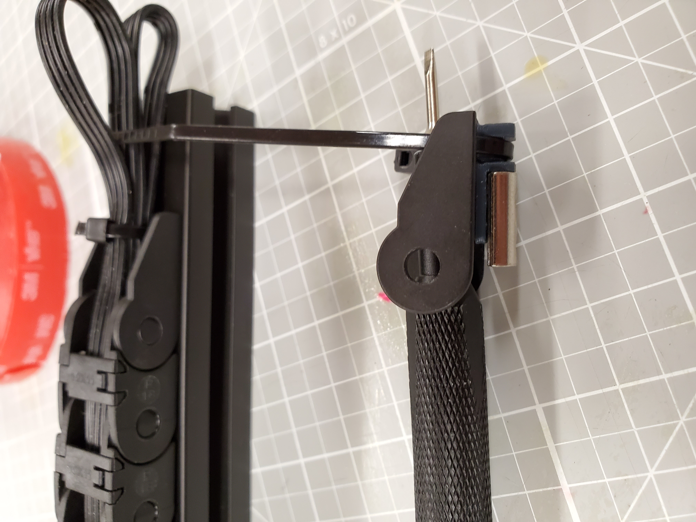

This is a mount for the Befenybay (and maybe other) 10mm x 11mm Drag Chain from Amazon found here https://www.amazon.com/gp/product/B07QLGWQ1L (10mmx11mm-Outside Open).

These are to replace the similar parts of the Zip Chain installation.

The Top_Anchor may need to be mirrored depending on the application.  One half has smaller holes that you will screw into and the other will have clearance holes for M3.

The extrusion mount for the triangular hole pattern chain end of the Befenybay (and maybe other) 10mm x 11mm Drag Chain from Amazon found here https://www.amazon.com/gp/product/B07QLGWQ1L (10mmx11mm-Outside Open).

These are to replace the similar parts of the Zip Chain installation.

To install use a M3x6 BHCS, T-nut, and zip-tie.

The easiest way to begin is to remove the end from the chain.

Insert the zip-tie through the hole pair leaving the head touching the vertical wall and put a screw into the single hole.  Loop the zip-tie around the mount and push the screw through the mount hole.  Slide into the short end of a T-nut to center the hole and push down the zip-tie end of the mount to shape the zip-tie.  Begin screwing and slide into final position then fully tighten the screw.  Attach the drag chain and zip-tie down the cable bundle.