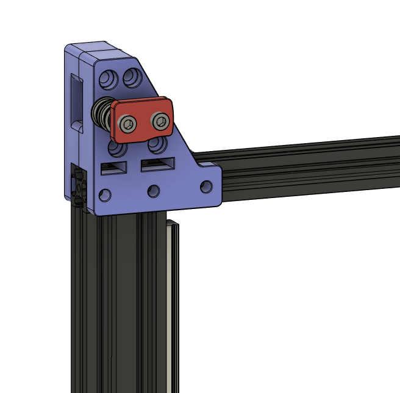
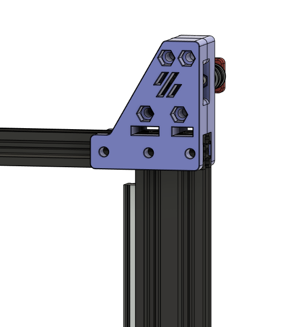

I loved the Ender 3 to Switchwire conversions that Gizzle and Triano did, but I didn't like the idea of losing z-height, so I created this mod.
These parts are to extend the usable z-height of the printer back up around 250mm (I get 247mm with it on my own printer).  I re-used the upper Z parts Gizzle designed, and am including those here as well so you have everything you need in this repository.

I also designed a bowden guide that will let you route your bowden tube between the belts and the upper cross member of the printer as seen in the picture below.  This works really well with a bowden setup, like the dual M4 extruders I use.

You will need a base conversion for your Ender 3 in addition to these files.  You can find Gizzle's Ender 3 conversion in the VoronUsers github page.

