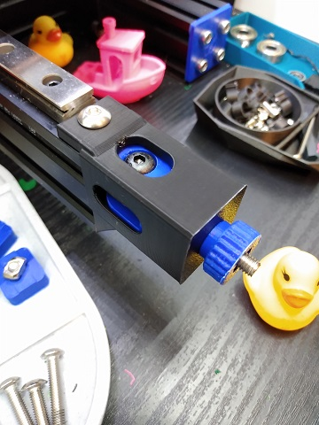
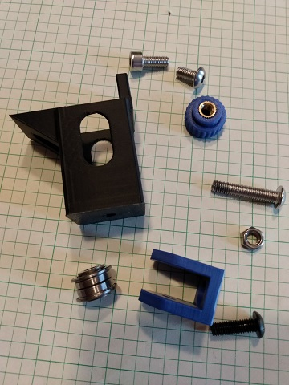
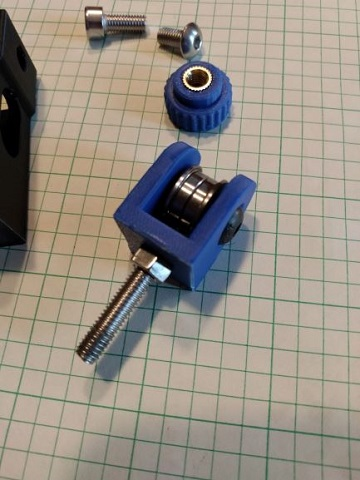
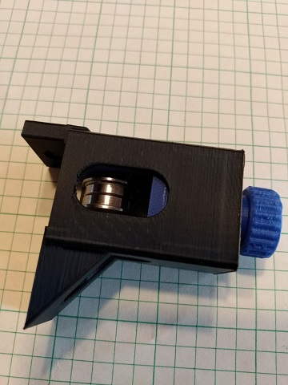

This mod adds a y-tensioner to the Gizzle Ender 3 conversion.

You will need a base conversion for your Ender 3 in addition to these files.  You can find [Gizzle's Ender 3 conversion](../../Gizzle/ender-3_(pro)_switchwire) in the VoronUsers github page.

HARDWARE: 
  m5x30 BHCS,
  m5x16 BHCS,
  m5x10 BHCS,
  m5x12 SHCS,
  m5 Nut (x2 optional),
  m5 Heatset (optional)

