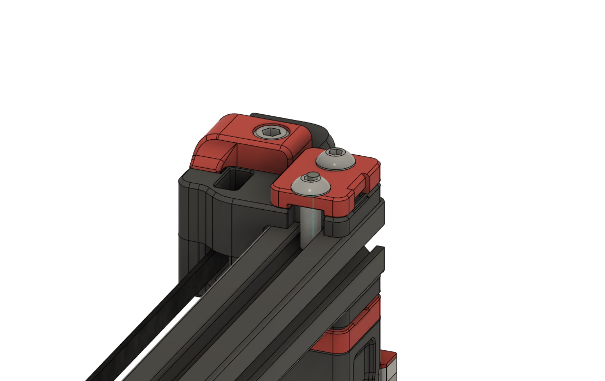
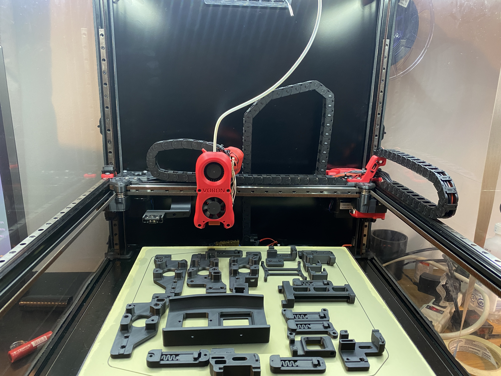
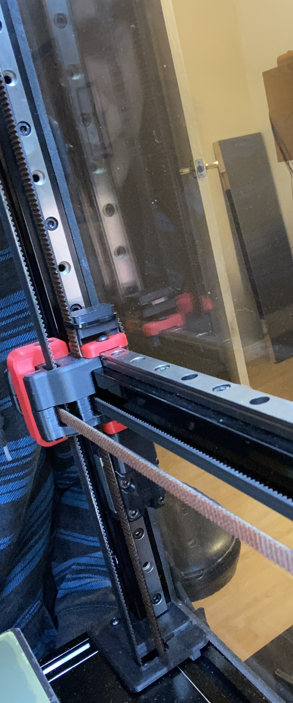

# MGN9 Extrusion Backer Mod

A mod to allow the installation of full length MGN9 rails on top of Y extrusions to combat thermal expansion on a V2.4.  This is based on the discovery of bimetallic flexing caused by thermal expansion, by whoppingpochard, detailed here: [Extrusion Backers](../../whoppingpochard/extrusion_backers)

If the stock X rails are replaced with a single MGN12 rail ([MGN12 Mod](../../arkeet/mgn12)), that leaves two free MGN9 rails which can be used as backers for the Y extrusions.  They do not fit stock as the spacing on top of the extrusion is smaller than on the bottom.  This permits their installation without the need to cut them down.

Includes new Front Idler Uppers, new belt clips and a taller XY Cable Bridge. 

