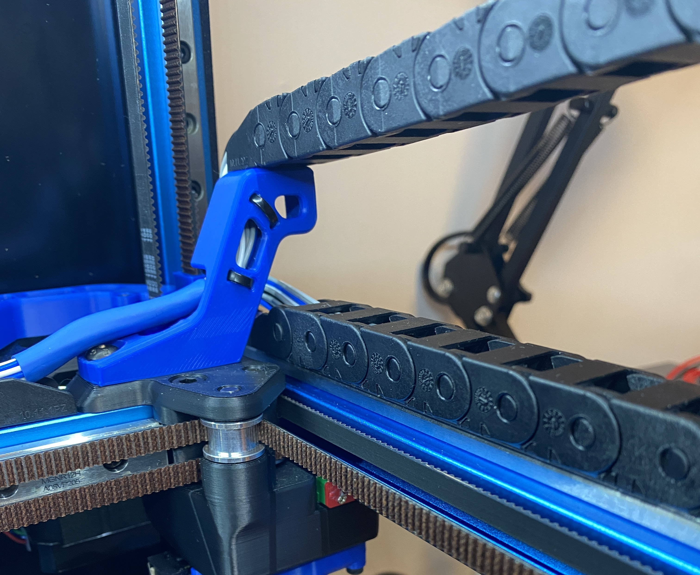
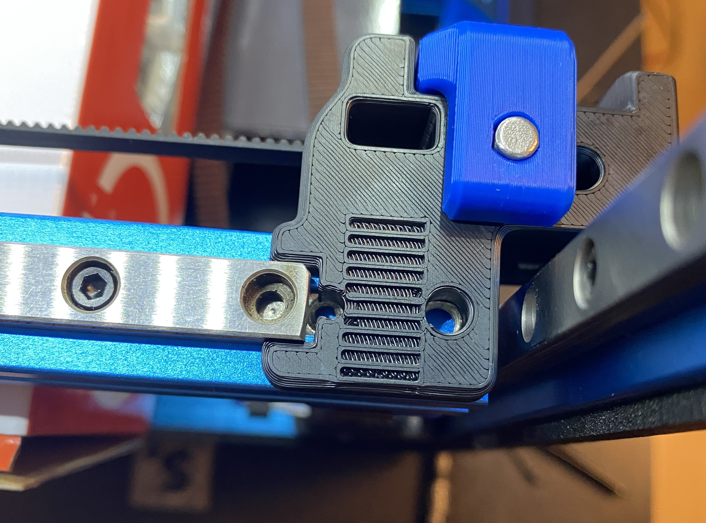
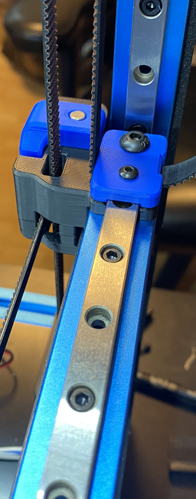
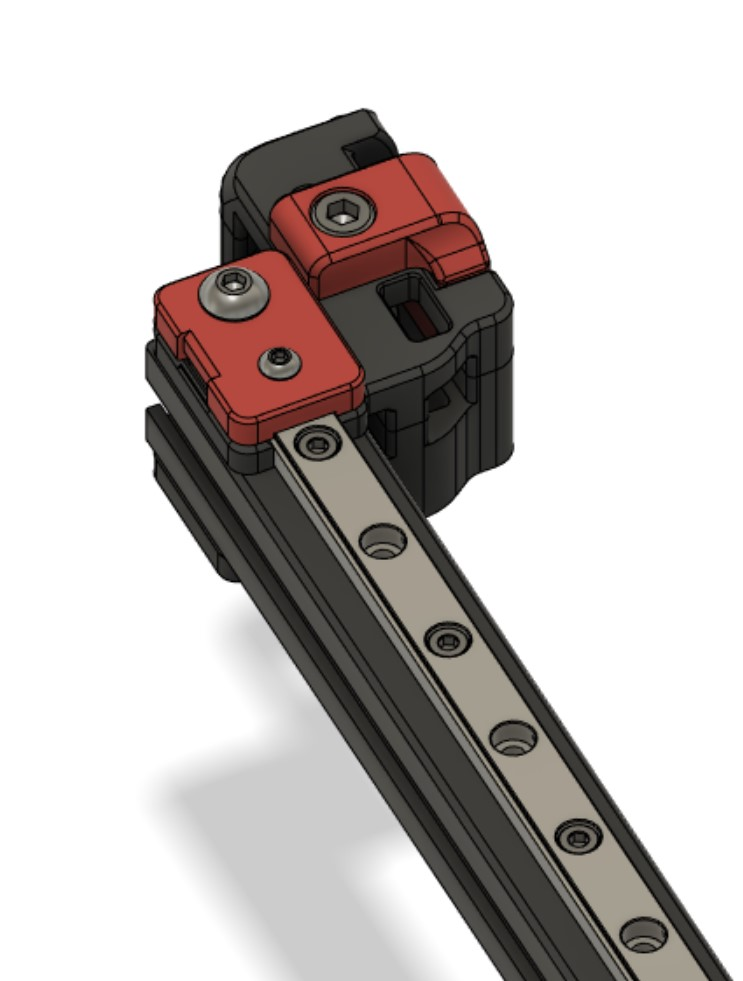
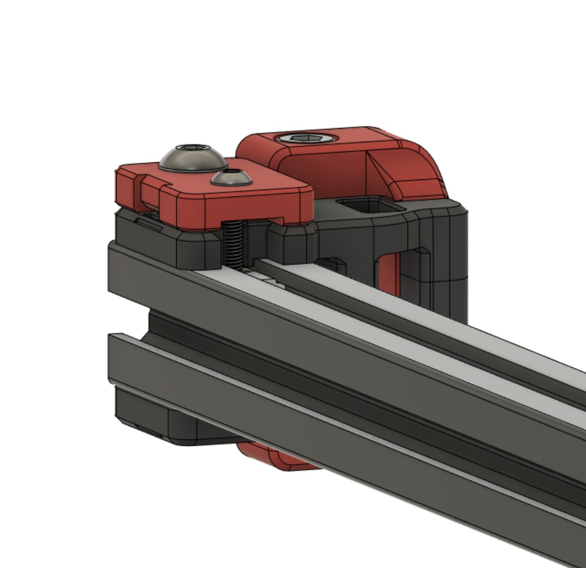

# MGN9 Extrusion Backer Mod

Updated For 2.4R2.  Old files have been moved to separate folder.

A mod to allow the installation of full length MGN9 rails on top of Y extrusions to combat thermal expansion on a V2.4.  This is based on the discovery of bimetallic flexing caused by thermal expansion, by whoppingpochard, detailed here: [Extrusion Backers](../../whoppingpochard/extrusion_backers)

If the 2.4r1 stock X rails are replaced with a single MGN12 rail, that leaves two free MGN9 rails which can be used as backers for the Y extrusions.  They do not fit stock as the spacing on top of the extrusion is smaller than on the bottom.  This permits their installation without the need to cut them.

Bimetallic flexing of the X extrusion in the Z direction is resolved with the use of the single MGN12 rail on the front of the X extrusion.

MGN9 rails as backers provide near perfect compensation for thermal flexing along the Y axis because they exactly match the characteristics of the lower rails.  This makes them an excellent choice as backers for Y rails.  

Includes new Front Idler Uppers, new belt clips and a taller XY Cable Bridge to account for the additional height of the linear rail on the right hand Y extrusion.

## BOM
```
2 MGN9 Linear Rails with carriages removed that match the length of the existing rails.
20 M3-8
22 M3 T-nuts
2 M3-16 BHCS (or SHCS)
```










