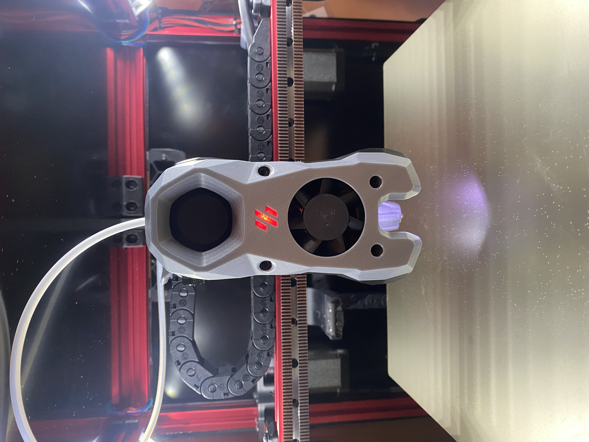

# Stealthburner Rapido UHF

A mod that stretches the Stealthburner Front and Rapido Toolhead Front for use with a Rapido UHF configuration. It moves the lighting and cooling to Stealthburner stock locations relative to new nozzle location. Designed from SB RC1 using [this version.](https://github.com/VoronDesign/Voron-Stealthburner/tree/e6cc7d7b1d68a9c1707e0b089f6d283f2d530d41)

No additional parts required. Assembly is as per Voron Stealthburner manual.  You may need to increase the length of one of the LED wire legs.  

