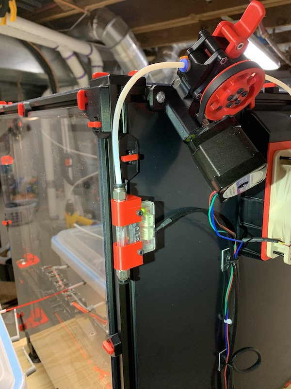

# cadriel Voron-Mods
 
## triangle_lab_filament_sensor_mount
These are modelled off the original designs in the mobius repository. I've reduced their footprint, and added additional plastic to better support the mounts in the extrusions. Prior to this change, I found they were leaning in.

They're also modelled to support the common bowden fittings in use.

Any nut combination should work. M3x20mm.

