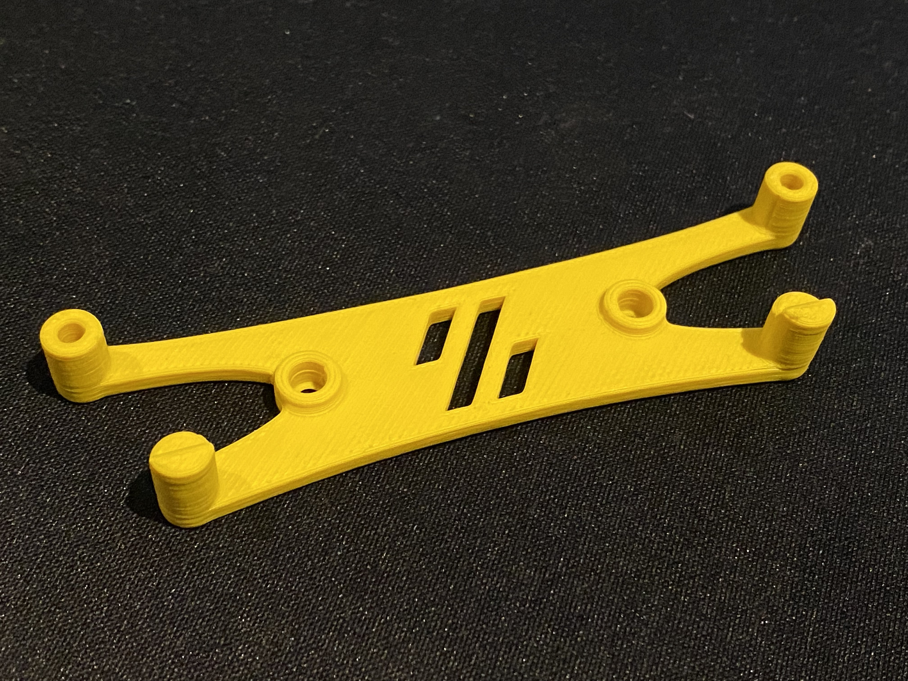
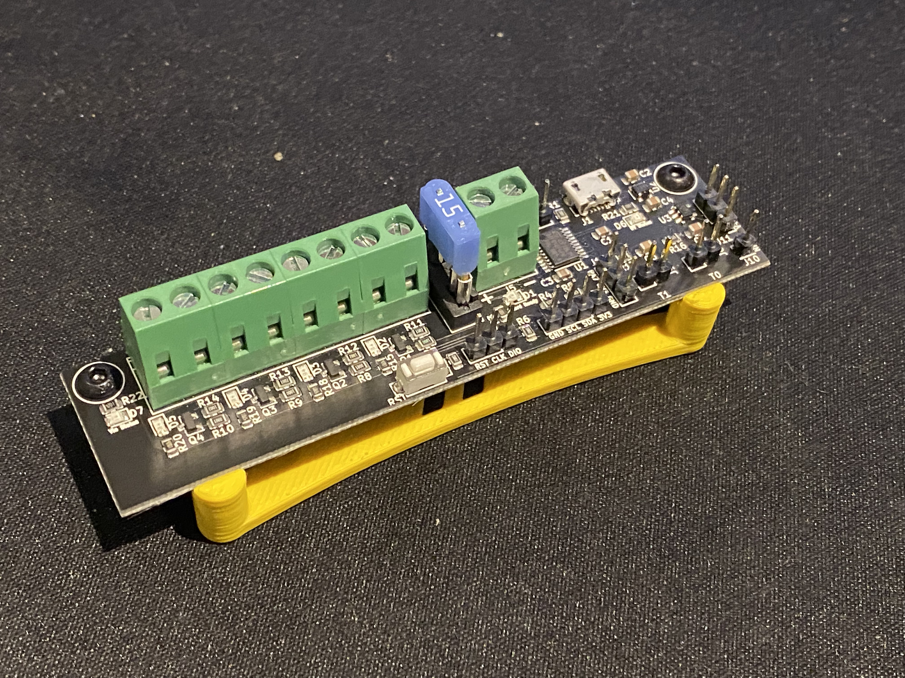
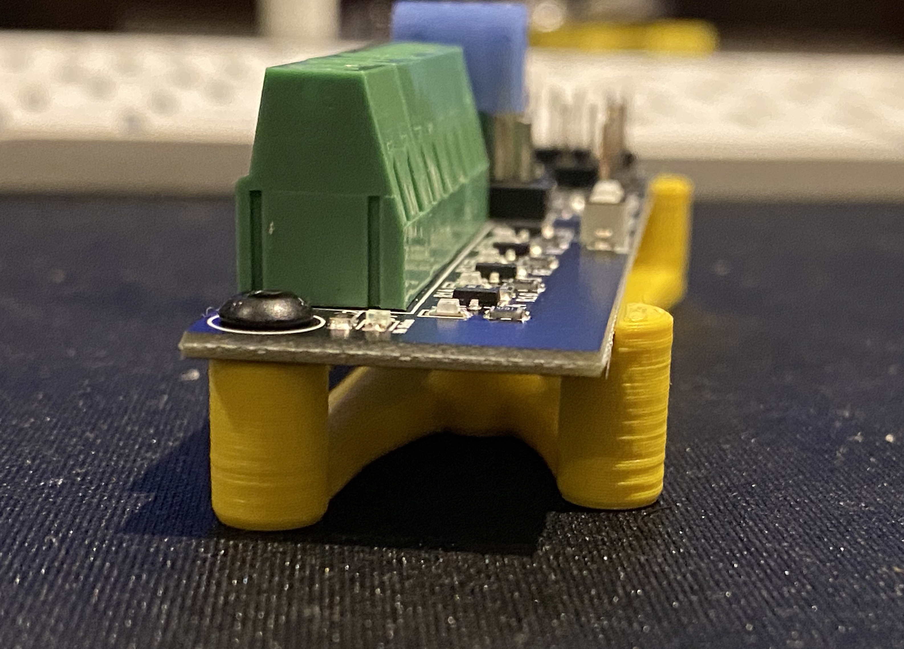

# Klipper Expansion Board Holder

`klipper_expansion_board_holder.stl` tries to follow the design language of the holders for the Raspberry Pi and the SKR Mini 2.0 boards available as part of the V0.1 build

