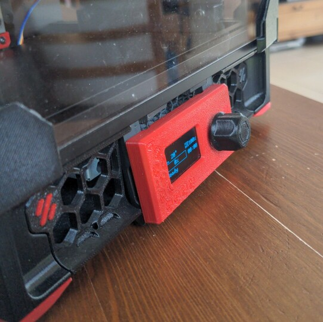
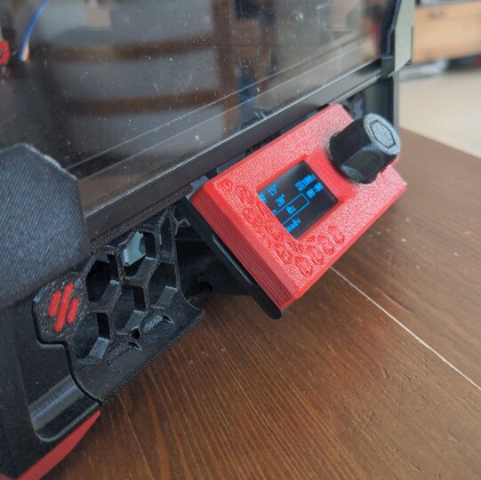
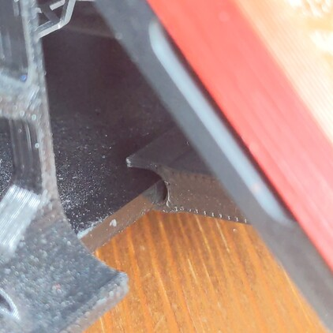
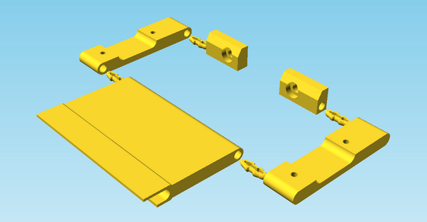
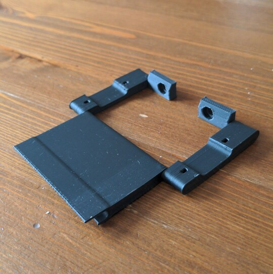
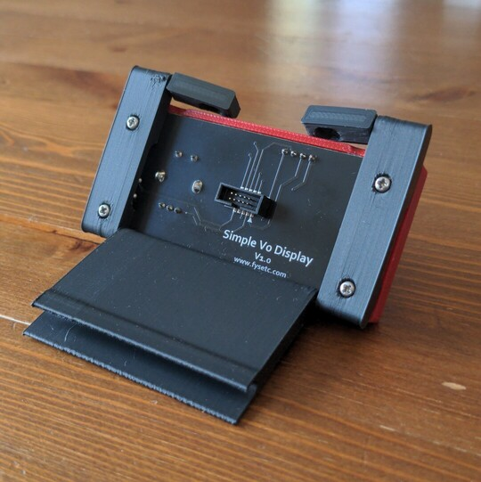

# Foldable Display Mount for v0

The v0 barely fits in my travel backpack because the display sticks
out a bit.  However, with this mod, I can fold the display, which
allows me to transport my printer safely without worrying about
damaging the display.  When I need to use the printer, I can easily
unfold the display for convenience.

## Assembly instructions

This mod is designed for easy assembly without the need for additional
hardware.  All parts, including the hinges, are 3D printed.

When the pieces are first put together, they feel a very loose.  Don’t
worry! Once you attach them to the frame and the display, they will
fit together perfectly with just enough looseness to allow for
folding.

The following pictures demonstrate how to assemble all the parts:

## Printing

All STL files are positioned in the correct orientation for printing.
The file [all\_in\_one.stl](STL/all_in_one.stl) includes all the
necessary parts arranged on a single build plate.  You can use the
standard Voron print settings for printing.

