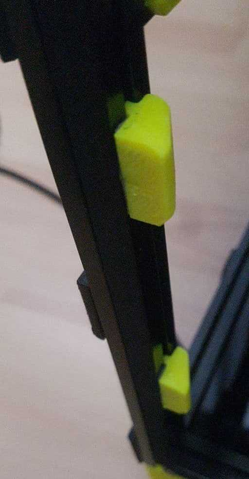

So I smoothbrained during assembly and forgot to drop the 4 nuts for the door latches during the assembly.

I did not want to take apart the whole belt path just to add a couple nuts so I redesigned the latch so I can tape it on using VHB, works alright so far.

