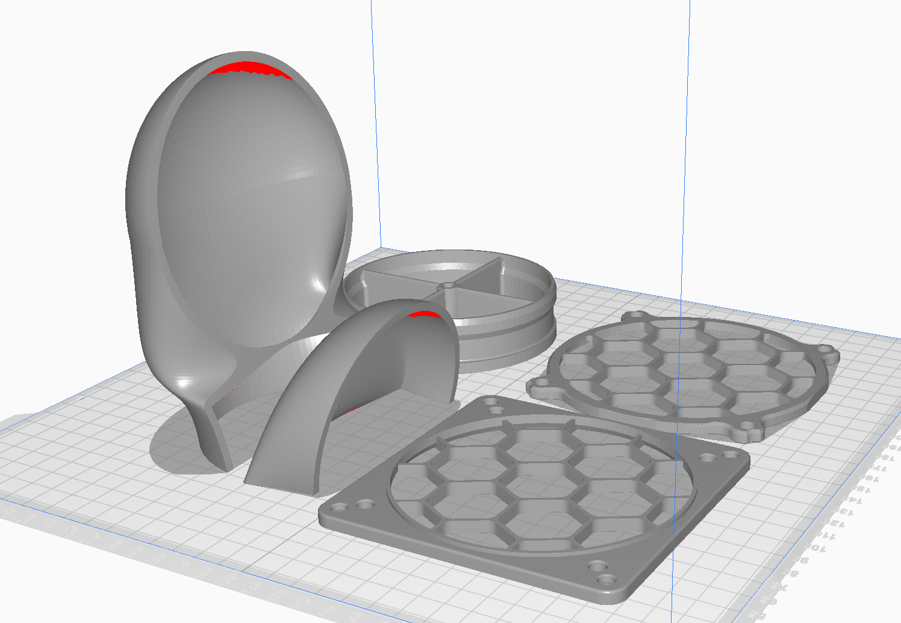
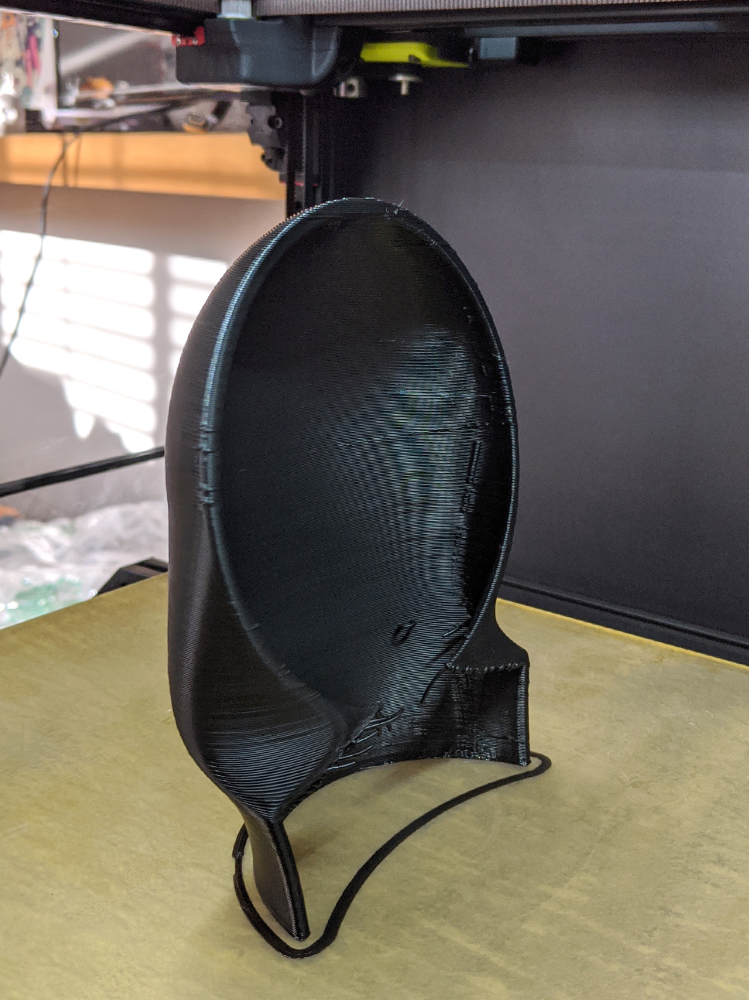

# Low Profile Exhaust Duct Adapter

This adapter allows you to fit 4" flexable dryer duct to your 120mm exhaust fan with minimal rear protrusion. It is quick release held on with magnets.

Part needs to be assumbled with super glue, also requires minimum 8 6x4mm disk magnets for the quick release. Multiple thinner magents can also be used if stacked together for additional pull strength.
Holes for magnets should be a press fit if printed with .4mm nozzle, I printed mine with .8 and they needed to be reamed for a good fit. 

You will also need to replace the 4x fan screws with longer M3x35 SHCS. 

I was able to print everything standing upright without supports with 0.8mm Volcano, some steep overhangs on rear body will be ugly, but those parts can be trimmed off since it is a glue surface and not visible when assembled. 

