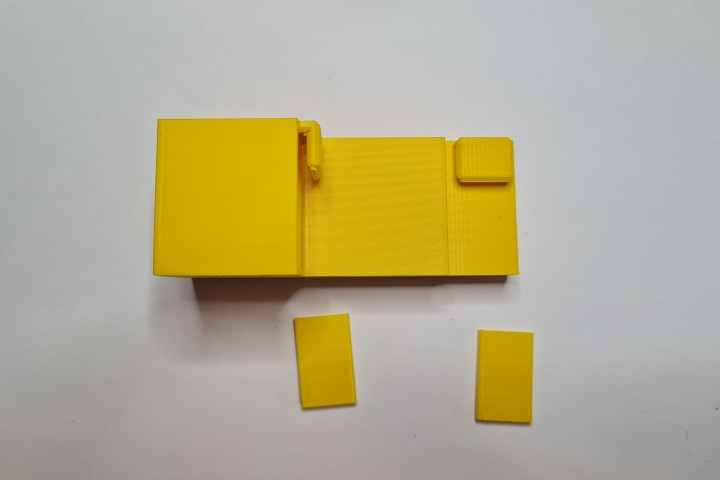

# Nozzle Wiper
This is a nozzle purge and wipe mod for the Voron V0.1. It is based on the [SlideSwipe](https://github.com/chestwood96/SlideSwipe) magnetic probe by [chestwood96](https://github.com/chestwood96).

It uses a snap in frame clip, that doesn't require screws, to attach a servo
that extends a bucket and brush over the build plate for the hotend nozzle to
clean it of filament debris for cleaner prints.


## Goals:

- Servo used to extend system over the print bed
- Bucket and brush to clean nozzle
- Snap in frame clip that does not need screws
- Klipper macros to control the entire process

These have all been implemented in this public release.

## Printing:

- Use the Voron defaults and print in ABS or better
- The parts are orientated correctly in the STLs
- There is a single All In One STL that fits onto the v0.1 build plate to make life easier

## BOM:

- 1x Micro Servo 9G Servo Motor (SG90/MG90)
- 2x M3x8mm BHCS (for servo mount)
- 2x M3x6mm BHCS (for brush holder mount)
- 2x M2x10mm self tapping screws (optional: for snap in frame clip)
- 1x Nozzle cleaning brush in Copper
- 3x OD 4mm, length 16mm, PTFE tube
- 1x OD 4mm, length 7mm, PTFE tube

## Hardware:

Brush:
https://www.amazon.co.uk/gp/product/B08H8SXBKM
https://www.aliexpress.com/item/4000801101276.html

Servo:
https://www.amazon.co.uk/gp/product/B0972M7JN1
https://www.aliexpress.com/item/1005001956791642.html

## Assembly:


### Step 1 - Set Servo


Take the servo and attach a single arm to the top. Slowly and gently rotate the rotor clockwise until it hits its limit. Remove the arm and replace it on the servo so that it is positioned slightly more than 90 degrees clockwise as shown in the picture above.

This sets the servo arm to its 0 position. Use the smallest screw in the servo packaging to affix the arm to the servo in that position.

### Step 2 - Parts Preparation



Remove the support tabs from the bucket.


Cut down the brush head so that it matches the internal width of the brush holder. It's soft plastic so can be cut with a craft knife or a pair of angle cutters.

Cut the PTFE tube into 3 lots of 16mm and 1 lot of 7mm. These will act as the hinges.

### Step 3 - Fit Servo to Mount


Push the cable connector through the slot provided in the servo mount as this will run on the inside of the extrusion. Fit the servo into the mount and fix in place with 2 M3x8mm screws. You may need to fettle the plastic around the hole for the top of the servo for it to fit. Note the correct orientation of the servo.

### Step 4 - Servo Section Assembly


Place 1 of the 16mm pieces and the 7mm piece of PTFE tubing into the sections as shown above. Place the section with the space for the servo arm first and then the double ended section behind it. Carefully seat the PTFE tubes into the servo mount and fix in place with the angled part shown to the top of the mount:


### Step 5 - Brush Section Assembly


Place the remaining pieces of 16mm PTFE tubing into the ends of the fitted sections and then fix onto the brush holder using the remaining 2 M3x6mm screws.


Fit the brush head into the brush holder:


### Step 6 - Motion

Slowly and carefully, manually extend and straighten the arm to ensure a full range of motion:


### Step 7 - Wiring

Before permanently mounting the nozzle wiper to the printer test whether it works as expected by wiring the servo to the MCU from outside of the printer.

- Red wire    = +5v
- Brown wire  = GND
- Orange wire = signal pin

There are various choices for connecting the servo to the MCU. Here will will refer to the BTT SKR Mini E3 V2.0.

Always turn off the printer before connecting or removing anything to or from the MCU.

The simplest is to connect to the Neopixel or E0-STOP connector if it is not in use as it provides all 3 required connections. Alternatively, a [Klipper Expander](https://github.com/timmit99/Klipper-Expander) can be used if there are no free pins.

Remember, do not fit the arm to the printer at this point.

### Step 8 - Klipper

Upload the nozzlewiper.cfg file to your klipper configuration directory on the raspberry pi. If using Mainsail you can do this in MACHINE > Upload File.

Now edit printer.cfg and add an include line to the Macro section of your configuration:

```[include nozzlewiper.cfg]```

### Step 8 - Servo Testing

Modify nozzlewiper.cfg "[servo wipeServo]" and set the correct pin that you attached the single wire for the servo to. For example, PA8 would be on the Neopixel, PC15 would be the E0-STOP.

Now power on the printer. Once it has fully booted, you should see a list of new macros available all prefixed with "NW".

Holding the nozzle wiper firmly in the hand by the extrusion mount, run the "NW DEPLOY" macro. The arm should extend 90 degrees. Then run the "NW RETRACT" macro and the arm should move to an almost straight position. It will not be completely straight as this helps prevent the arm+bucket from hitting the printers side panel.

Shutdown the printer.

### Step 9 - Installation and Wiring


Fit the Nozzle Wiper arm to the left extrusion. This uses a push fit method. Line the mount up with the logo side to the extrusion. Feed the cable up into the groove on the inner section of extrusion and push the logo side into the extrusion and the push the other side into the inner section of extrusion. It should snap into place. You should be just about able to move the arm up and down in the extrusion.


If it is too loose, there are two holes in the logo side of the mount where you can insert 2 x M2x10mm self tapping screws. Inserting the screws here will expand the mount inside the rail to hold it in place. If you then need to move the arm up and down you will have to remove the self tapping screws completely.

You can route the cable up the extrusion and along the bottom of the Y axis. The cable should just fit through into the electronics bay, but you will likely need to remove the DuPont connector by lifting the taps to free the pins. You can then push the cable through and wire it to your MCU.

### Step 10 - Klipper Configuration

Follow the steps in the nozzlewiper.cfg file to configure the nozzle wiper setup.

## Changelog:

- 2022-05-04 First release
- 2022-07-11 Added STEP CAD
- 2022-07-25 Improved printability of STL parts
