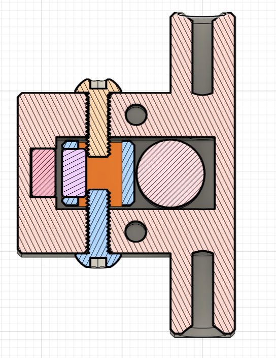
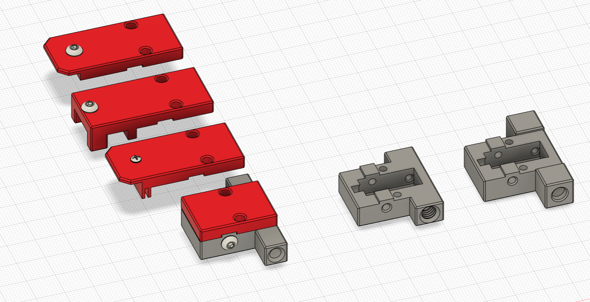
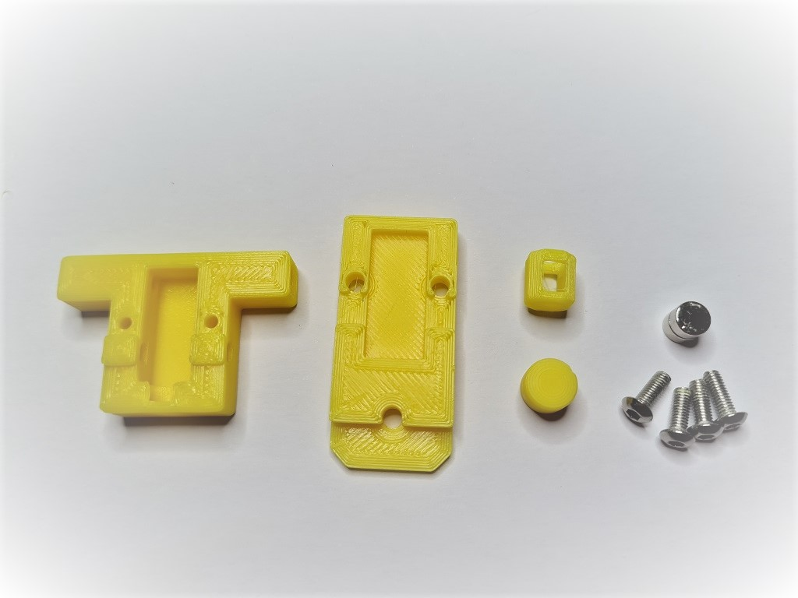
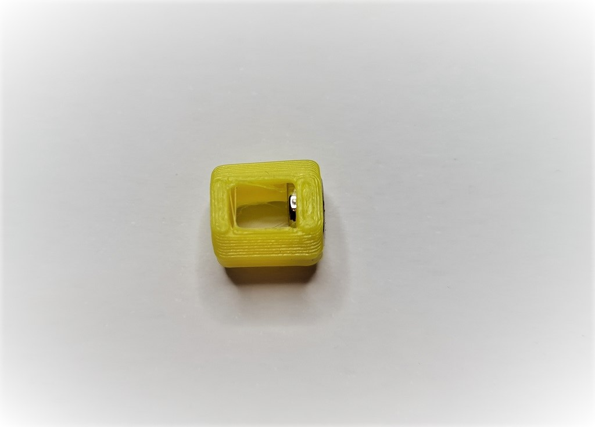
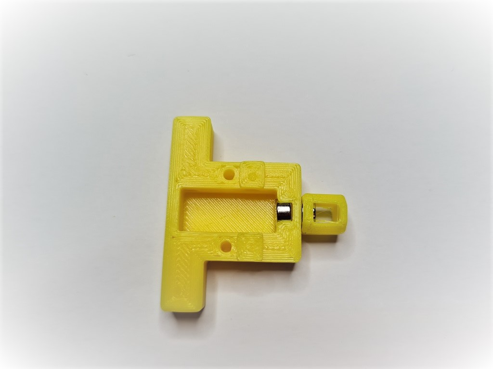
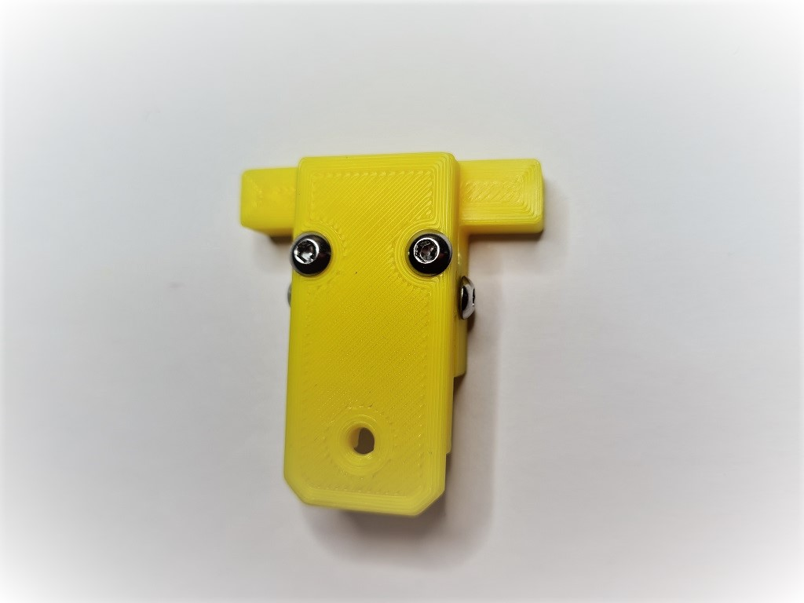
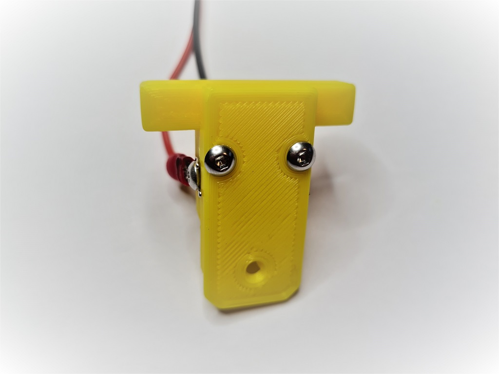
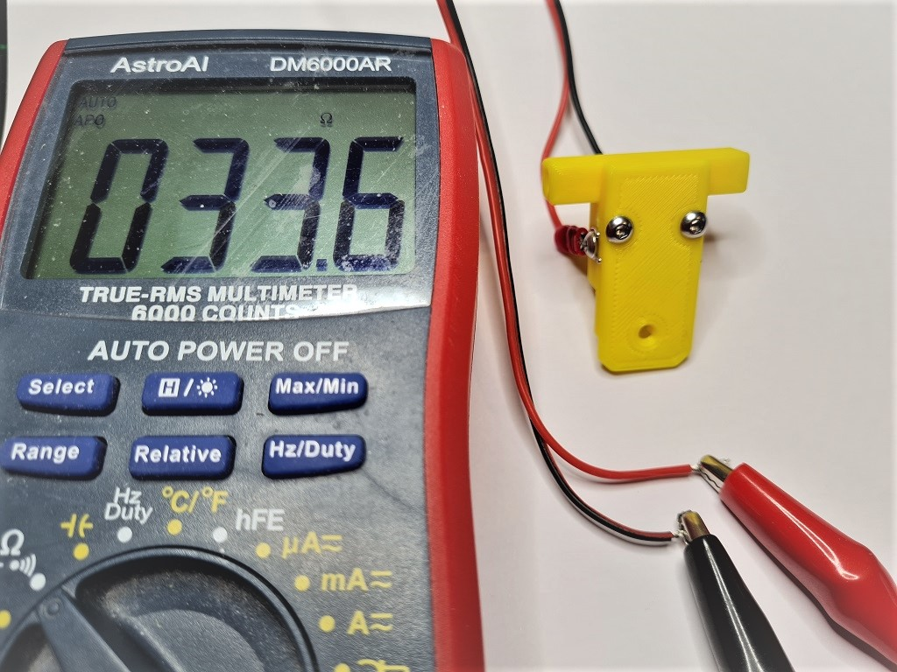
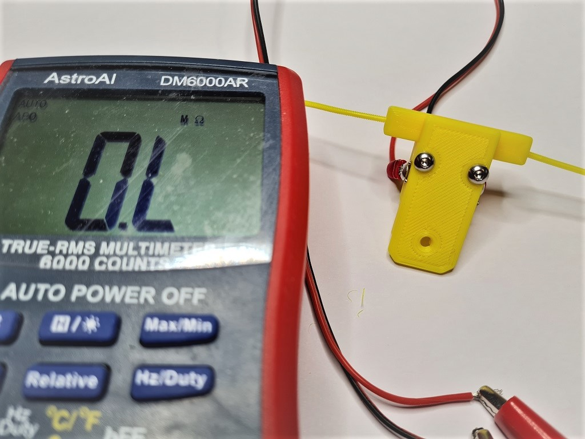

# Runout UnKlicky Sensor

The Runout UnKlicky Sensor is a filament runout sensor that can be used to pause a print if printing filament breaks, runs out or otherwise is no longer present in the sensor.

The design uses magnets as the switch, making it easy and cheap to source BOM components.

## Printing:

Components:

- 1x Pin.stl
- 1x Roller.stl
- 1x Base.stl (different options are available[*])
- 1x Top.stl (different options are available[*])

Printer:

- Use the Voron defaults and print in ABS or better
- The parts are orientated correctly in the STLs

### [*]Base and Top:

There are 3 bases and 4 tops to choose from:

Bases:

- Base.stl is the standard base with push in holes for the PTFE tubes
- Base_PC4-M6.stl which allows the use of PC4-M6 connectors for the PTFE tubes
- Base_Collet.stl which allows the use of [E3D M4 collets](https://e3d-online.com/products/embedded-bowden-collet-for-metal-1-75mm)

Tops:

- Top.stl is the standard top with no mounting options
- Top_2020.stl provides mounting to 2020 extrusions using a t-nut
- Top_1515.stl provides mounting to 1515 extrusions using an inserted nut
- Top_1515_NoNut** provides mounting to 1515 extrusions if you have no inserted nuts available

[**] The Top_1515_NoNut can be used if you don't have any free nuts. It snaps into the extrusion. If it moves or slips, you can use a M2x10mm self-tapping screw to secure the sensor to the extrusion. Do note that the screw can scratch the inside the extrusion if that might bother you.

## BOM:

- 5x M3x8mm SHCS/BHCS (2x for the wired screws, 2x for the top/base, 1x for 2020 extrusion mount)
- 2x 6x3mm neodymium magnets (for the switch)
- 1x M2x10mm (optional for 1515 extrusion mount)
- 1x M3 Hammer T-Nut (for 2020 extrusion mount)
- 2x fork connectors (optional - for attaching wires)

## Assembly:

Parts used:

Insert one of the magnets into the pin, push it in fully so that it shows in the groove gap:

Insert the corresponding pin into the base and make sure that they attract from the outside as shown:

Insert the pin into the base with the pin grooves to the sides for the screws to enter. The pin should be pushed down to the bottom by the magnet in the base. Push the pin right up to the base magnet and screw in the screws to either side of the pin:

Place the top on the base and secure with two screws:

Attach cables to each screw that goes into the pin. There is no polarity and no voltage so it doesn't matter how they are connected. I used fork connectors for ease of use. Make sure the pin screws are screwed in tightly:

Hook up the wires to a multimeter and put it on it's continuity test. It should show resistance (and/or beep) when there's no filament in the sensor:

It should show no resistance (and/or remain silent) if you fully insert some filament into the sensor. Feed the filament through a few times from each side to ensure that you do not see any resistance when filament is present, and that you do see resistance when there is none:

## Wiring:

Wire to an end-stop or similar pin. Do _not_ connect to voltage, _only_ to pin and GND. For example, with the BTT SKR MINI V2.0 you could use the E-STOP pin (PC15) and GND. For the BTT SKR Pico you could also use the E-STOP pin (gpio16) and GND.

## Klipper:

A simple configuration is available in this repo. Upload and include runoutunklicky.cfg in your printer.cfg and change the PIN definition to the one you chose on your MCU. The config file contains what is required to use a runout sensor, but it will only literally pause the machine and resume when prompted. To have the toolhead parked away from the print to an accessible place to change filament, implement one of the following examples in your klipper configuration:

- [AndrewEllis93](https://github.com/AndrewEllis93/Print-Tuning-Guide/blob/main/articles/useful_macros.md#my-pauseresume-macros-for-runouts-filament-swaps-and-manual-pauses)
- [Mainsail](https://docs.mainsail.xyz/configuration#pause-resume-cancel)

Test by inserting and removing filament. If it shows incorrectly in klipper add a ! in front of the PIN definition and test again.

## Credits:

Thanks to:

- [chestwood96](https://github.com/chestwood96) for inspiration from the UnKlicky probe for [SlideSwipe](https://github.com/chestwood96/SlideSwipe)
- [majarspeed](https://github.com/majarspeed/Unklicky) for the Unklicky probe
- [jlsa1](https://github.com/jlas1/Klicky-Probe/tree/main/Probes) for the Klicky and Unklicky probes
- [al3ph](https://github.com/VoronDesign/VoronUsers/tree/master/printer_mods/al3ph/filament_runout) for the "spinner" concept
